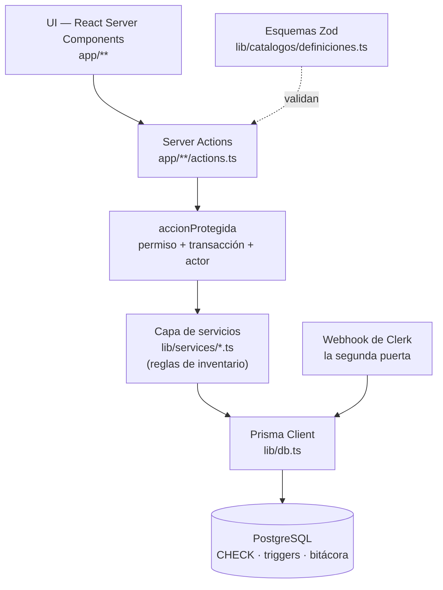

# BodeGasosur — Arquitectura

Sistema de control de inventario para las bodegas del grupo gasolinero **Gasosur**.

## 1. Contexto

El área de Compras necesita trazabilidad completa del material: qué entra, qué sale,
hacia qué estación va, quién lo autoriza, quién lo entrega, cuándo, en qué cantidad,
a qué costo unitario, a qué área se destina y con qué observaciones.

## 2. Decisiones tomadas

| Decisión        | Elección                                                                   | Implicación                                                                                              |
| --------------- | -------------------------------------------------------------------------- | -------------------------------------------------------------------------------------------------------- |
| Stack           | Next.js (App Router) + TypeScript + Prisma + PostgreSQL                    | Un solo repo, un solo lenguaje, despliegue trivial cuando toque                                          |
| Modelo de stock | Multi-bodega con existencia por artículo/bodega y traspasos                | Requiere bodega origen/destino en cada movimiento                                                        |
| Autenticación   | **Clerk**                                                                  | Identidad delegada: contraseñas, sesiones y bloqueo por intentos dejan de ser código nuestro (§3.6)      |
| Autorización    | **PostgreSQL**, con tres roles y la bandera `puedeAutorizar`               | Los permisos se leen de la base en cada petición, así que revocar surte efecto de inmediato (§3.3, §3.6) |
| Invariantes     | **En la base**, como `CHECK` y triggers                                    | La capa de servicios no es el único escritor y nunca lo será (§3.7)                                      |
| Entorno         | **Local durante el desarrollo**; el destino se decide antes de la `v1.0.0` | Ver [08](08-versionado-y-despliegue.md) §8 y el hallazgo **D1** de la [auditoría](09-auditoria.md)       |
| Identificadores | **UUIDv7** nativo como llave primaria                                      | El catálogo de estaciones es global; los ids no pueden chocar entre proyectos (§3.5)                     |
| URLs            | Por **clave de negocio**, no por id                                        | `/estaciones/ES05588`, no un UUID que nadie puede dictar por teléfono                                    |
| Cantidades      | **Piezas enteras**                                                         | No hay medias piezas en una bodega, y el invariante 9 se verifica por igualdad exacta                    |

## 3. Principios rectores

Estos siete principios son los que hacen que el sistema sirva para auditar y no solo
para «llevar la cuenta». Son la parte de la arquitectura que más caro sale cambiar después.

### 3.1 El movimiento es un libro contable, no un registro editable

Todo lo que pasa en la bodega se escribe como un **movimiento** (entrada, salida,
traspaso, devolución, ajuste). Una vez confirmado, **no se edita ni se borra**: se cancela
con un movimiento de reverso que deja rastro. Si Compras pregunta «¿por qué esta salida
cambió de 40 a 10 piezas?», el sistema tiene la respuesta.

Y desde la fase 2 responde también **quién** y **cuándo**: cada transición guarda su actor
y su marca de tiempo, y una tabla `Bitacora` alimentada por trigger guarda todo cambio a
cualquier dato, incluido quitarle a alguien la facultad de autorizar.

### 3.2 La existencia es un resultado, no una fuente de verdad

`Existencia` (cantidad por artículo/bodega) es una **proyección** del libro de
movimientos, mantenida en la misma transacción de base de datos por rendimiento.

**El recálculo verifica cantidades, no costos.** Esta precisión importa y llegó tarde: el
libro es *«como se ejecutó»*, no *«como se recalcularía hoy»*. Tres operaciones lo exigen y
las tres están confirmadas:

- Un **traspaso** trae material viejo a otra bodega conservando la fecha de su entrada
  original, así que inserta una capa en el pasado de esa bodega —a propósito, porque si
  llevara la fecha del traspaso el costeo mentiría—.
- Una **entrada retroactiva** hace lo mismo cuando el material llegó días antes de que
  alguien lo capturara.
- Una **cancelación** devuelve el material a las capas exactas que consumió, aunque una
  salida posterior ya haya consumido otras.

En los tres casos las cantidades cuadran y los costos congelados no coinciden con lo que
daría un recálculo. Prometer lo contrario sería prometer algo que la operación real impide.
Lo que sí se conserva es la herramienta de diagnóstico: si el stock no cuadra, se recalcula
desde el libro y se compara pieza por pieza.

*(Corrige una promesa anterior de este documento. Ver **B3**, **F2** y **F3** de la
[auditoría](09-auditoria.md).)*

### 3.3 La autorización es un permiso, y la lista de quién lo tiene es un dato

La demo se construyó sin roles, registrando la autorización como un campo más. **El
levantamiento revirtió esa decisión.** A la pregunta *«¿qué NO debe hacer el sistema?»*
Compras contestó lo mismo por escrito y por separado: no permitir salidas sin
autorización. Un campo de texto no lo garantiza — hacen falta usuarios y permisos.

Lo que no puede quedar en el código es **quién** tiene el permiso. Compras fue explícita
en que la lista cambia: hoy autorizan el Lic. Hugo, la Lic. Andrea y el área de Compras,
pero la C.P. Cosumel también está facultada y quedó fuera de la lista inicial por decisión
del momento. Un sistema que tuviera esos nombres codificados exigiría tocar el programa
para agregarla.

Por eso la facultad de autorizar es una bandera editable del usuario, administrable desde
una pantalla. El programa pregunta *«¿este usuario puede autorizar?»*, nunca *«¿este
usuario se llama Hugo?»*.

Es una bandera y no un rol porque son cosas independientes: un Jefe puede estar facultado
y un usuario de Compras puede no estarlo.

**Tres roles, no cinco.** `SUPERADMIN`, `COMPRAS` y `JEFE` dicen qué puede *ver y editar*
cada quien; la bandera dice quién puede *autorizar salidas*. Los roles `ADMIN` y `GERENTE`
que se habían planteado quedaron fuera:

- `ADMIN` se diferenciaba de `SUPERADMIN` únicamente en dos tablas. Eso es un **permiso**,
  no un rol.
- `GERENTE` implicaba dar cuentas a unos cuarenta gerentes de estación —altas, bajas,
  contraseñas, capacitación, soporte— para una solicitud que de todos modos llega por
  WhatsApp y que Compras captura. El modelo ya lo soporta sin darles cuenta:
  `solicitadoPor` apunta a una `Persona`, que puede no tener acceso al sistema. El
  autoservicio para gerentes queda para cuando Compras lo pida.

La matriz de permisos es una tabla de datos tipada (`Record<Rol, Permiso[]>`) en un solo
archivo, no un `switch` repartido por el código: agregar un rol es una entrada, no una
cacería.

Un caso merece regla propia: **`Empresa` y `Estacion` solo las escribe el Superadmin.**
Viven en el esquema global del grupo ([06-estaciones.md](06-estaciones.md) §3) y otros
proyectos de Gasosur las leen, así que un cambio ahí sale de BodeGasosur. Restringir la
escritura es lo que hace seguro compartir el catálogo.

### 3.4 Nada se captura como texto libre si puede ser catálogo

Empresas, estaciones, áreas, artículos, unidades, proveedores y personas son catálogos. El
texto libre solo vive en `observaciones` y en `entregadoA` —que puede ser un ingeniero, una
paquetería o «Recep. Magallanes», y que Compras pidió expresamente libre—. Es lo que
permite después preguntarle al sistema «cuánto material mandamos a la estación X en el
trimestre» sin pelearse con «Estacion 4», «est. 4» y «ESTACION IV».

### 3.5 El identificador técnico y la clave de negocio son cosas distintas

Cada registro tiene dos identidades y conviene no mezclarlas.

El **identificador técnico** es un `UUIDv7` guardado como tipo nativo `uuid` de PostgreSQL.
Es plomería: sirve para las llaves foráneas y no se le enseña a nadie.

```prisma
model Estacion {
  id     String @id @default(uuid(7)) @db.Uuid
  numero String @unique               // ES05588 — esta es la que ve la gente
}
```

Por qué UUID y no un entero autoincremental: el catálogo de empresas y estaciones es
**global para el grupo Gasosur** y otros proyectos lo van a leer y alimentar. Con enteros,
dos sistemas que den de alta estaciones por separado empiezan ambos en 1 y al juntar los
datos chocan. Con UUID no chocan nunca, aunque se generen en máquinas distintas y sin
coordinación. Ese es el argumento que decide; el rendimiento no entra en la discusión a
esta escala.

Por qué la versión 7 y no la 4: el UUIDv4 es aleatorio, así que cada inserción cae en un
punto arbitrario del índice y lo fragmenta. El v7 lleva la marca de tiempo al inicio y los
registros nuevos entran al final del índice, como haría un entero. A esta escala la
diferencia es inmedible, pero elegir bien no cuesta nada.

Hay además un beneficio que no se había cobrado: como el v7 está ordenado por tiempo de
creación, **`id` sirve de desempate honesto**. `ORDER BY fecha, id` en el consumo PEPS
significa *«por día del hecho, y dentro del día por orden de captura»*, que es una regla
defendible ante Compras y no un desempate arbitrario.

Y como tipo nativo `uuid` (16 bytes), no como texto (36 caracteres).

La **clave de negocio** es la que la gente usa y dicta por teléfono: `Estacion.numero`
(ES05588), `Empresa.rfc`, `Articulo.clave`, `Movimiento.folio`. Va con `@unique` y **es la
que aparece en las URLs**:

```text
/estaciones/ES05588        ✅
/estaciones/0192f3a1-…     ❌
```

Y de ahí sale su otra mitad, que faltaba: **una clave de negocio es inmutable después del
alta.** Está en URLs, en marcadores y en los WhatsApp de Compras; cambiarla rompe enlaces
que no controlamos. Un trigger de PostgreSQL lo impide, sin excepciones ni para el
Superadmin, y la pantalla ni siquiera ofrece el campo.

`Articulo.clave` va un paso más lejos: **la genera la base** por secuencia —`ART-00001`,
`ART-00002`…— y nadie la captura. Sin prefijo de categoría, porque una clave que codifica
la categoría miente en cuanto Compras recategoriza el artículo, que es exactamente el error
que el catálogo viejo ya cometió.

### 3.6 La identidad se delega; la autorización no

**Clerk responde «quién eres». PostgreSQL responde «qué puedes hacer».**

Delegar la autenticación quita del proyecto todo lo que no le da valor a Compras y sí da
riesgo: almacenamiento de contraseñas, sesiones, expiración, límite de intentos,
recuperación. Nada de eso es código nuestro.

Lo que **no** se delega es el permiso, y la razón es concreta. `puedeAutorizar` es una
bandera editable —decisión deliberada de §3.3— y es el requisito número uno del sistema. Si
el permiso viajara dentro del token de sesión, quitárselo a alguien no surtiría efecto
hasta que el token expirara. Para ese permiso, eso no es aceptable.

De ahí sale la regla, que hay que escribir con todas sus letras porque la tentación de
romperla es una consulta ahorrada por petición:

> **`rol` y `puedeAutorizar` no se copian nunca a los metadatos ni a los claims de Clerk.**
> Viven solo en `Usuario` y se leen de la base en cada petición.

Tres consecuencias que se siguen:

- **Existir en Clerk no es tener acceso.** Sin fila en `Usuario` no se entra, ni con una
  sesión válida. El registro en Clerk es por invitación, y el alta la hace el Superadmin
  **después**, desde la pantalla de usuarios: el enlace se hace sobre el `clerkUserId`,
  que es inmutable, y no sobre el correo, que la gente cambia.
- **La cuenta de Clerk puede desaparecer; el libro no.** La bitácora apunta al UUID local,
  así que el sistema sigue diciendo quién autorizó cada salida años después de que esa
  persona salió de la empresa.
- **El middleware de Next.js no es una frontera de autorización.** Es enrutamiento. Cada
  Server Action es una URL propia e invocable directamente, y `clerkMiddleware()` no la
  protege — CVE-2025-29927 fue exactamente esa clase de defecto. La frontera está en
  `accionProtegida` (§4.1).

### 3.7 Un invariante que solo está escrito en español no existe

[02 §4](02-modelo-de-datos.md#4-invariantes) declara once invariantes. Escritos en prosa,
todos dependían de que la capa de servicios fuera el único escritor — y no lo va a ser: la
migración de datos de la fase 4 escribe directo, `prisma studio` escribe directo, y el
`psql` de una noche de urgencias también.

Por eso los invariantes viven en la base, como `CHECK` y como triggers: existencia no
negativa, cantidad positiva, traspaso entre bodegas distintas, capa consistente, costo con
IVA nunca menor que sin IVA, dinero solo en las entradas, tipo de cambio solo en dólares, y
la combinación legal de `(tipo, estatus)`.

Dos de ellos merecen mención aparte porque no son datos, son actos:

- **Quien autoriza tiene que poder autorizar.** Un trigger verifica `puedeAutorizar` en el
  instante del acto y exige la marca de tiempo, porque la bandera es editable y saber «¿lo
  tenía cuando autorizó?» requiere las dos cosas.
- **La autorización es de escritura única.** Un rastro que se puede reescribir no es un
  rastro.

Prisma no sabe expresar nada de esto, así que ese SQL se escribe a mano y vive en
`prisma/sql/`, versionado como código y armado dentro de la migración (§5).

## 4. Arquitectura de la aplicación

### 4.1 Capas



**Regla dura:** ningún componente de UI habla con Prisma directamente para escribir.

Pero «regla dura» no basta, porque una regla que se cumple recordándola se olvida. El
mecanismo es de módulos: **`lib/db.ts` no exporta el cliente de Prisma a la capa de
aplicación.** Exporta `consultar()` para leer y `accionProtegida()` para escribir, y una
regla de ESLint impide importar el cliente desde `src/app/`. No hay forma de escribir sin
pasar por el permiso porque no hay a qué llamarle.

`accionProtegida` es además el único lugar donde convergen tres cosas que de otro modo
habría que recordar por separado:

```ts
export const guardarCatalogo = accionProtegida(
  "catalogos:escribir",
  async (tx, usuario, datos) => { /* … */ },
);

// Por dentro, una sola vez para todo el sistema:
//   1. lee la sesión de Clerk y el Usuario local
//   2. verifica el permiso contra Record<Rol, Permiso[]>
//   3. abre la transacción
//   4. SET LOCAL app.usuario_id = …   ← lo lee el trigger de la bitácora
```

**Hay una segunda puerta, y se declara en vez de descubrirse.** El webhook de Clerk llega
de fuera, sin sesión, y escribe. Verifica su firma antes de tocar la base, fija
`app.origen = 'clerk-webhook'` en vez de un usuario, y solo puede escribir tres tablas.
Cuando nadie fijó ninguna de las dos variables, la bitácora dice `escritura-directa` — que
es una respuesta honesta, y hoy no existe ninguna.

### 4.2 Stack concreto

| Capa          | Tecnología                                    | Por qué                                                                                            |
| ------------- | --------------------------------------------- | -------------------------------------------------------------------------------------------------- |
| Framework     | Next.js 16 (App Router, Turbopack)            | Server Components: los listados de inventario se renderizan en el servidor, sin API intermedia     |
| Lenguaje      | TypeScript (strict)                           | El dominio tiene muchos estados; los tipos evitan errores de captura                               |
| ORM           | Prisma 7 + adaptador `@prisma/adapter-pg`     | Migraciones versionadas y transacciones explícitas, que es justo lo que exige el §3.1              |
| Base de datos | PostgreSQL 16                                 | Transacciones serias, `NUMERIC` exacto para dinero, y **constraints reales** — que el §3.7 sí usa  |
| Autenticación | Clerk (`@clerk/nextjs`)                       | Identidad delegada (§3.6). Compatible con Next 16 y React 19                                       |
| Validación    | Zod 4                                         | Un solo esquema valida el formulario y la acción de servidor                                       |
| UI            | Tailwind CSS 4 + primitivas propias           | Un puñado de componentes en `src/components/ui`, sin dependencias de terceros que después estorben |
| Formularios   | Acciones de servidor + `useActionState`       | Validación en el servidor sin duplicar reglas en el cliente                                        |
| Fechas        | `Intl` nativo, encapsulado en `lib/fechas.ts` | Ver §4.5. No hace falta una biblioteca para esto                                                   |
| Pruebas       | Vitest 4                                      | De integración contra el PostgreSQL de `docker-compose`, en una base `*_prueba` que se recrea en cada corrida. Hoy cubren el importador de datos; las cuatro de invariantes llegan con las fases de movimientos |

Las cuatro pruebas que importan, y que van a CI cuando exista:

1. Recalcular `Existencia` desde el libro y comparar cantidades contra la proyección.
2. `SUM(cantidadRestante) == Existencia.cantidad` por artículo y bodega.
3. Dos salidas en paralelo del mismo artículo nunca dejan existencia negativa.
4. Un movimiento cancelado deja la existencia exactamente como estaba.

Valen más que doscientas pruebas unitarias. Las dos primeras son comparaciones **exactas**
gracias a que las cantidades son enteras: una tolerancia en una prueba de invariantes es
una puerta por donde se cuela el error que la prueba existía para atrapar.

### 4.3 Estructura de carpetas

```text
BodeGasosur/
├─ docs/                          # Esta documentación
├─ prisma/
│  ├─ schema.prisma               # Modelo de datos: 19 modelos, dos esquemas
│  ├─ sql/                        # El SQL que Prisma no sabe expresar (§3.7)
│  │  ├─ antes/                   #   lo que existe antes de las tablas
│  │  └─ despues/                 #   invariantes, triggers, vistas y permisos
│  ├─ migrations/                 # Historial versionado
│  ├─ configuracion.ts            # Lo mínimo real: bodegas, áreas, PZA, folios
│  ├─ fixtures.ts                 # Datos demostrativos; solo desarrollo, fallan por omisión
│  ├─ migracion-datos/            # Catálogos reales desde los CSV del corte (F5)
│  └─ comun.ts                    # Cliente y búsqueda por nombre para esos scripts
├─ pruebas/
│  └─ base-de-pruebas.ts          # Recrea la base *_prueba antes de cada corrida de Vitest
├─ scripts/
│  ├─ armar-migracion.sh          # Junta prisma/sql/ con el DDL generado
│  ├─ arranque-superadmin.ts      # El primer Superadmin, desde su identidad en Clerk
│  └─ bootstrap-produccion.ts     # Plan B: producción limpia, manual y con confirmación
├─ prisma.config.ts               # Prisma 7 lee aquí la URL de conexión
├─ src/
│  ├─ app/
│  │  ├─ layout.tsx               # Barra lateral + área de contenido
│  │  ├─ page.tsx                 # Tablero
│  │  └─ catalogos/
│  │     ├─ page.tsx              # Índice de catálogos
│  │     └─ [slug]/               # Los nueve catálogos, con una sola pantalla
│  │        ├─ page.tsx           # Listado con buscador
│  │        ├─ actions.ts         # Acción de servidor: validar y guardar
│  │        ├─ nuevo/page.tsx
│  │        └─ [id]/page.tsx      # Edición
│  ├─ components/
│  │  ├─ ui/                      # Primitivas: botón, campos, tabla, tarjetas
│  │  ├─ catalogos/               # Formulario genérico de catálogo
│  │  └─ navegacion.tsx
│  └─ lib/
│     ├─ db.ts                    # Cliente Prisma + accionProtegida (§4.1)
│     ├─ fechas.ts                # El único lugar que decide «hoy» (§4.5)
│     ├─ utils.ts                 # cn, formato de moneda y cantidades
│     ├─ catalogos/
│     │  ├─ definiciones.ts       # Los catálogos, declarados (ver §4.4)
│     │  ├─ repos.ts              # Acceso a datos por catálogo
│     │  └─ formulario.ts         # Tipos compartidos del formulario
│     └─ services/                # Reglas de inventario (a partir de la fase 5)
├─ docker-compose.yml             # PostgreSQL local
└─ .env.example
```

### 4.4 Los catálogos se declaran, no se programan

Nueve catálogos con la misma pantalla repetida nueve veces serían nueve lugares
donde arreglar el mismo detalle. En su lugar, cada catálogo es una entrada en
`src/lib/catalogos/definiciones.ts` que describe sus campos, y de esa descripción
salen tres cosas a la vez: las columnas de la tabla, los controles del formulario
y el esquema de validación de Zod.

La consecuencia práctica importa para el levantamiento de requerimientos: cuando
Compras diga *«a los proveedores hay que agregarles el plazo de pago»*, el cambio
es una línea de configuración, no una pantalla nueva.

Dos marcas en la definición reflejan lo que §3.5 decidió, y hacen que la pantalla no pueda
ni intentar lo que la base va a rechazar:

| Marca | Qué significa | Ejemplo |
|---|---|---|
| `generado` | La asigna PostgreSQL. Nunca se captura | `Articulo.clave`, `Bodega.clave` |
| `inmutable` | Se captura al alta y después no | `Estacion.numero`, `UnidadMedida.clave` |

El mecanismo es más simple de lo que parece: un `<input disabled>` no viaja en el
`FormData`, así que el campo se ve pero no se envía, y el esquema de Zod deja de exigirlo
al editar.

Lo único que se escribe a mano por catálogo es el acceso a datos en `repos.ts`,
donde cada campo se mapea explícitamente al modelo de Prisma para que TypeScript
verifique que lo que se guarda existe.

### 4.5 Una fecha no es un instante

`Movimiento.fecha` es el **día del hecho**; `createdAt` es el **instante de captura**. Son
tipos distintos y se tratan distinto, porque confundirlos es el error más probable de todo
el sistema: un movimiento capturado a las 18:30 en Acapulco (UTC−6) se guardaba con la
fecha del día siguiente, y eso corría el reporte de los viernes, el orden PEPS y los
totales mensuales — que es justo la comparación con la que Compras va a juzgar si el
sistema sirve.

La convención, que se lee en el nombre de la columna:

> **`fecha…` es siempre `@db.Date`. `…En` / `…At` es siempre `@db.Timestamptz(3)`.**

Dos cosas que no son evidentes y que hay que sostener a mano:

- **Prisma genera `TIMESTAMP` sin zona horaria por omisión.** No `timestamptz`. Cada
  columna de instante lleva su `@db.Timestamptz(3)` escrito.
- **La zona con la que se muestra se invierte entre los dos tipos.** Una columna `date`
  vuelve de la base como medianoche UTC y se formatea **en UTC**; formatearla en hora de
  México la recorre un día hacia atrás. Un `timestamptz` sí se formatea en
  `America/Mexico_City`.

Por eso ambas cosas viven en `lib/fechas.ts` y en ningún otro lugar: `hoyEnMexico()` —nunca
`new Date()`— y las dos funciones de formato. Del lado de SQL, ninguna consulta calcula
«hoy» por su cuenta: nada de `CURRENT_DATE`, que depende de cómo esté configurado el
servidor que toque.

## 5. Entorno local

**Mientras dure el desarrollo, el sistema es local.** PostgreSQL corre en Docker para no
ensuciar la máquina y para que el día que se despliegue sea exactamente la misma base de
datos.

> **Puerto 5433, no 5432.** Este equipo ya tiene una instalación local de
> PostgreSQL 18 ocupando el 5432. El contenedor se publica en el 5433 para que
> ambas convivan sin tocar la instalación existente.

```bash
npm install
npm run db:up
cp .env.example .env
npm run db:reset          # migra, configura, carga catálogos reales, fixtures y Superadmin
npm run dev
```

La aplicación queda en <http://localhost:3000>.

Prisma 7 ya no acepta la URL de conexión dentro de `schema.prisma`: vive en
`prisma.config.ts`, y el cliente se construye con el adaptador `@prisma/adapter-pg`
en `src/lib/db.ts`.

### Cómo se hace una migración aquí

Es el único punto del flujo de Prisma que no es automático, y el que se olvida.

```bash
# 1. Se edita prisma/schema.prisma
# 2. Se edita o agrega lo que haga falta en prisma/sql/
./scripts/armar-migracion.sh nombre-de-la-migracion
```

El script arma un solo `migration.sql` con tres piezas en orden: `prisma/sql/antes/`, el
DDL que genera `prisma migrate diff`, y `prisma/sql/despues/`. El SQL a mano se revisa como
código, en archivos con nombre, en vez de quedar como un apéndice de trescientas líneas al
final de un archivo generado.

Comandos útiles:

| Comando | Qué hace |
|---|---|
| `npm run dev` | Servidor de desarrollo |
| `npm run db:up` / `db:down` | Levanta o baja PostgreSQL |
| `npm run db:reset` | Desarrollo: borra todo y encadena configuración, catálogos reales, fixtures y Superadmin |
| `npm run prod:bootstrap` | Producción: manual y con confirmación, sin fixtures ([Plan B](10-plan-b-produccion.md)) |
| `npm run test` | Pruebas de integración contra PostgreSQL |
| `npm run db:studio` | Explorador visual de la base de datos |

## 6. Decisiones deliberadamente diferidas

No se resuelven ahora, pero la arquitectura les deja lugar:

- **Dónde se despliega.** Estaba decidido —Vercel Pro + Supabase Pro— y la
  [auditoría](09-auditoria.md) lo reabrió en **D1**: para diez usuarios en una oficina de
  Acapulco, el serverless cobra complejidad —pooler, dos URLs de conexión, arranques en
  frío sobre transacciones con locks— a cambio de un escalado elástico que nadie necesita.
  Se decide antes de la `v1.0.0`. La elección no ata nada: Next.js corre igual en un
  contenedor, en Railway o en un servidor interno del grupo.
- **Órdenes de compra.** Hoy la entrada apunta a un proveedor y una referencia de
  factura/remisión. Si Compras necesita el ciclo completo (requisición → OC → recepción
  parcial), se agrega como capa **arriba** del movimiento, sin tocar el libro.
- **Rastreo por serie o lote.** Descartado en el levantamiento: la serie **se anota** en
  la partida y nada más. Si algún día hiciera falta rastrearla de verdad, es un rediseño
  del kardex, no un campo — conviene volver a discutirlo, no darlo por hecho.
- **Autoservicio para gerentes de estación.** El rol `GERENTE` y sus cuarenta cuentas
  (§3.3). Cuando Compras lo pida.
- **Alertas por WhatsApp.** Requieren un proveedor de mensajería. Se empieza por pantalla
  y correo.
- **Archivos adjuntos.** Foto de la remisión o del vale firmado: campo en el movimiento
  cuando haya dónde almacenarlos.
