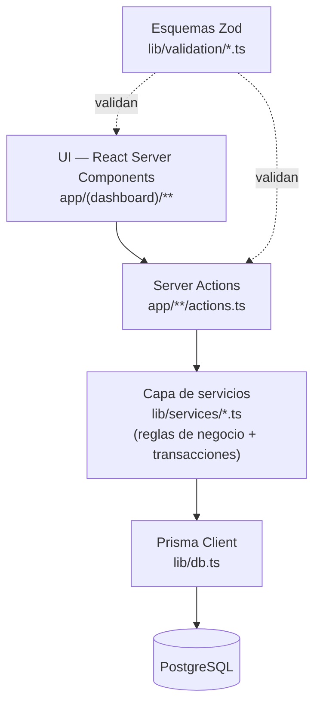

# BodeGasosur — Arquitectura

Sistema de control de inventario para las bodegas del grupo gasolinero **Gasosur**.

## 1. Contexto

El área de Compras necesita trazabilidad completa del material: qué entra, qué sale,
hacia qué estación va, quién lo transporta, quién lo autoriza, cuándo, en qué cantidad,
a qué costo unitario, a qué área se destina y con qué observaciones.

El objetivo inmediato es una **demo funcional** que sirva como instrumento de
levantamiento de requerimientos: enseñarla al área de Compras para que corrijan,
contradigan y completen el modelo. No es todavía el sistema definitivo.

## 2. Decisiones tomadas

| Decisión | Elección | Implicación |
|---|---|---|
| Stack | Next.js (App Router) + TypeScript + Prisma + PostgreSQL | Un solo repo, un solo lenguaje, despliegue trivial cuando toque |
| Modelo de stock | Multi-bodega con existencia por artículo/bodega y traspasos | Requiere bodega origen/destino en cada movimiento |
| Autenticación | Sin roles por ahora | La autorización se captura como **dato**, no como permiso (ver §4.3) |
| Entorno | Local (localhost + Postgres en Docker) | Sin dependencia de nube; el proyecto queda portable |

## 3. Principios rectores

Estos cuatro principios son los que hacen que el sistema sirva para auditar y no solo
para "llevar la cuenta". Son la parte de la arquitectura que más caro sale cambiar después.

### 3.1 El movimiento es un libro contable, no un registro editable

Todo lo que pasa en la bodega se escribe como un **movimiento** (entrada, salida,
traspaso, ajuste). Una vez confirmado, **no se edita ni se borra**: se cancela con un
movimiento de reverso que deja rastro. Si Compras pregunta "¿por qué esta salida
cambió de 40 a 10 piezas?", el sistema tiene la respuesta.

### 3.2 La existencia es un resultado, no una fuente de verdad

`Existencia` (cantidad por artículo/bodega) es una **proyección** del libro de
movimientos, mantenida en la misma transacción de base de datos por rendimiento.
Siempre debe poder recalcularse desde cero a partir de los movimientos. Eso da una
herramienta de diagnóstico enorme: si el stock no cuadra, se recalcula y se compara.

### 3.3 La autorización hoy es dato, mañana es permiso

Aunque la demo no tiene login, el sistema **sí** registra quién solicitó, quién
autorizó, quién entregó y quién transportó cada movimiento — apuntando al catálogo de
`Persona`. Cuando llegue la autenticación, `Persona` se vincula a `Usuario` y esos
mismos campos pasan de ser capturados manualmente a ser validados por permisos.
El modelo de datos no cambia.

### 3.4 Nada se captura como texto libre si puede ser catálogo

Estaciones, áreas, artículos, unidades, proveedores y personas son catálogos. El texto
libre solo vive en `observaciones`. Es lo que permite después preguntarle al sistema
"cuánto material mandamos a la estación X en el trimestre" sin pelearse con
"Estacion 4", "est. 4" y "ESTACION IV".

## 4. Arquitectura de la aplicación

### 4.1 Capas



**Regla dura:** ningún componente de UI habla con Prisma directamente para escribir.
Toda mutación pasa por `lib/services`, que es el único lugar donde viven las reglas de
inventario (validar existencia, calcular costo promedio, generar folio, actualizar la
proyección). Así la lógica es testeable sin levantar el navegador y sobrevive si mañana
se agrega una API REST, un móvil o una importación masiva desde Excel.

### 4.2 Stack concreto

| Capa | Tecnología | Por qué |
|---|---|---|
| Framework | Next.js 16 (App Router, Turbopack) | Server Components: los listados de inventario se renderizan en el servidor, sin API intermedia |
| Lenguaje | TypeScript (strict) | El dominio tiene muchos estados; los tipos evitan errores de captura |
| ORM | Prisma 7 + adaptador `@prisma/adapter-pg` | Migraciones versionadas y transacciones explícitas, que es justo lo que exige el §3.1 |
| Base de datos | PostgreSQL 16 | Transacciones serias, `NUMERIC` exacto para dinero, constraints reales |
| Validación | Zod 4 | Un solo esquema valida el formulario y la acción de servidor |
| UI | Tailwind CSS 4 + primitivas propias | Un puñado de componentes en `src/components/ui`, sin dependencias de terceros que después estorben |
| Formularios | Acciones de servidor + `useActionState` | Validación en el servidor sin duplicar reglas en el cliente |
| Fechas | date-fns (locale `es`) | Formato local sin sorpresas de zona horaria |
| Tests | Vitest | Enfocados a `lib/services`, que es donde está el riesgo real |

### 4.3 Estructura de carpetas

```text
BodeGasosur/
├─ docs/                          # Esta documentación
├─ prisma/
│  ├─ schema.prisma               # Modelo de datos
│  ├─ migrations/                 # Historial versionado
│  └─ seed.ts                     # Datos de Gasosur para la demo
├─ prisma.config.ts               # Prisma 7 lee aquí la URL de conexión
├─ src/
│  ├─ app/
│  │  ├─ layout.tsx               # Barra lateral + área de contenido
│  │  ├─ page.tsx                 # Tablero
│  │  └─ catalogos/
│  │     ├─ page.tsx              # Índice de catálogos
│  │     └─ [slug]/               # Los ocho catálogos, con una sola pantalla
│  │        ├─ page.tsx           # Listado con buscador
│  │        ├─ actions.ts         # Acción de servidor: validar y guardar
│  │        ├─ nuevo/page.tsx
│  │        └─ [id]/page.tsx      # Edición
│  ├─ components/
│  │  ├─ ui/                      # Primitivas: botón, campos, tabla, tarjetas
│  │  ├─ catalogos/               # Formulario genérico de catálogo
│  │  └─ navegacion.tsx
│  └─ lib/
│     ├─ db.ts                    # Cliente Prisma (singleton)
│     ├─ utils.ts                 # cn, formato de moneda y cantidades
│     ├─ catalogos/
│     │  ├─ definiciones.ts       # Los catálogos, declarados (ver §4.4)
│     │  ├─ repos.ts              # Acceso a datos por catálogo
│     │  └─ formulario.ts         # Tipos compartidos del formulario
│     └─ services/                # Reglas de inventario (a partir de la fase 2)
├─ docker-compose.yml             # PostgreSQL local
└─ .env.example
```

### 4.4 Los catálogos se declaran, no se programan

Ocho catálogos con la misma pantalla repetida ocho veces serían ocho lugares
donde arreglar el mismo detalle. En su lugar, cada catálogo es una entrada en
`src/lib/catalogos/definiciones.ts` que describe sus campos, y de esa descripción
salen tres cosas a la vez: las columnas de la tabla, los controles del formulario
y el esquema de validación de Zod.

La consecuencia práctica importa para el levantamiento de requerimientos: cuando
Compras diga *«a los proveedores hay que agregarles el plazo de pago»*, el cambio
es una línea de configuración, no una pantalla nueva.

Lo único que se escribe a mano por catálogo es el acceso a datos en `repos.ts`,
donde cada campo se mapea explícitamente al modelo de Prisma para que TypeScript
verifique que lo que se guarda existe.

## 5. Entorno local

PostgreSQL corre en Docker para no ensuciar la máquina y para que el día que se
despliegue sea exactamente la misma base de datos.

> **Puerto 5433, no 5432.** Este equipo ya tiene una instalación local de
> PostgreSQL 18 ocupando el 5432. El contenedor se publica en el 5433 para que
> ambas convivan sin tocar la instalación existente.

```bash
npm install
docker compose up -d      # o: npm run db:up
cp .env.example .env
npx prisma migrate dev    # o: npm run db:migrate
npx prisma db seed        # o: npm run db:seed
npm run dev
```

La aplicación queda en <http://localhost:3000>.

Prisma 7 ya no acepta la URL de conexión dentro de `schema.prisma`: vive en
`prisma.config.ts`, y el cliente se construye con el adaptador `@prisma/adapter-pg`
en `src/lib/db.ts`.

Comandos útiles:

| Comando | Qué hace |
|---|---|
| `npm run dev` | Servidor de desarrollo |
| `npm run db:up` / `db:down` | Levanta o baja PostgreSQL |
| `npm run db:migrate` | Crea y aplica una migración tras cambiar el esquema |
| `npm run db:seed` | Vuelve a sembrar los catálogos |
| `npm run db:studio` | Explorador visual de la base de datos |
| `npm run db:reset` | Borra todo, remigra y resiembra |

## 6. Decisiones deliberadamente diferidas

No se resuelven ahora, pero la arquitectura les deja lugar:

- **Autenticación y roles.** Se agrega `Usuario` con relación 1:1 opcional a `Persona`.
  Los campos `solicitadoPor` / `autorizadoPor` ya existen; solo se blindan con permisos.
- **Despliegue.** Next.js + Postgres corre igual en Railway, en un VPS o en servidor
  interno de Gasosur. No hay nada atado a un proveedor.
- **Órdenes de compra.** Hoy la entrada apunta a un proveedor y una referencia de
  factura/remisión. Si Compras necesita el ciclo completo (requisición → OC → recepción
  parcial), se agrega como capa **arriba** del movimiento, sin tocar el libro.
- **Lotes y caducidades.** Si aparece material con caducidad (lubricantes, químicos),
  se agrega `Lote` colgando de la partida del movimiento.
- **Archivos adjuntos.** Foto de la remisión o del vale firmado: campo en el movimiento
  cuando haya dónde almacenarlos.
