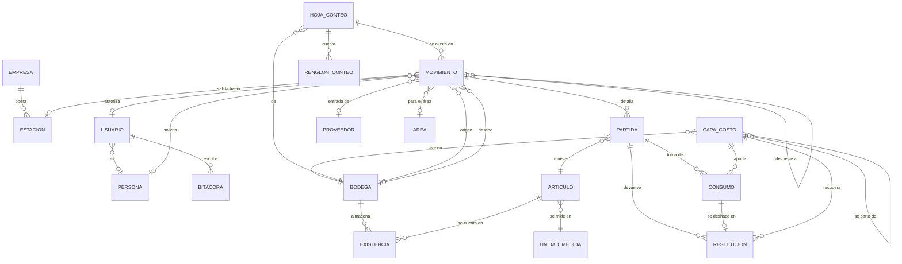

# BodeGasosur — Modelo de datos

Recoge lo acordado con Compras en los [hallazgos del levantamiento](cimientos-word/03-hallazgos-levantamiento.docx), el
catálogo global de [03-estaciones](03-estaciones.md), el análisis del Excel vigente en
[04-datos-actuales](04-datos-actuales.md) y las correcciones de la
[auditoría de arquitectura](cimientos-word/04-auditoria-arquitectura.docx).

> **Este documento ya describe el código, no un destino.** El esquema vive en
> [`prisma/schema.prisma`](../prisma/schema.prisma) y los invariantes que la base hace
> cumplir en [`prisma/sql/`](../prisma/sql/). La base del modelo se implementó en la fase 2
> (`v0.2.0`) y la fase 5 completó el contrato de Entradas: captura estructurada, orden de
> partidas, idempotencia, dinero exacto, folios, capas y existencias. La fase 7 agregó la
> hoja de conteo, la restitución exacta de capas y la conciliación de cada movimiento
> contra sus partidas ([contrato](contratos-otros/05-fase-7-traspasos-devoluciones-conteo.md)). Lo que sigue explica
> **por qué** está así; la fuente de verdad de **cómo** está es el esquema.

## 1. Panorama



Dos esquemas de PostgreSQL:

- **`catalogo_gasosur`** — `Empresa` y `Estacion`. Global para el grupo. Otros proyectos
  no leen estas tablas: leen **vistas versionadas** (§7).
- **`public`** — todo lo demás, propio de BodeGasosur.

Veintidós modelos en total: dos en `catalogo_gasosur` y veinte en `public`.

## 2. Los cinco tipos de movimiento

| Tipo | Origen | Destino | Contraparte | Efecto |
|---|---|---|---|---|
| **ENTRADA** | — | Bodega | Proveedor + factura o remisión | `+` en destino, **crea capa de costo** |
| **SALIDA** | Bodega | — | Estación + área | `−` en origen, **consume capas** |
| **TRASPASO** | Bodega | Bodega | — | `−` origen, `+` destino, partiendo la capa |
| **DEVOLUCIÓN** | — | Bodega | Estación | `+` en destino; puede referenciar la salida original, y entonces regresa a su bodega de origen |
| **AJUSTE** | Bodega *o* — | — *o* Bodega | Motivo (conteo, merma, daño) | `+` o `−` |

**El signo del ajuste vive en la bodega, no en la cantidad.** Un ajuste que suma lleva
`bodegaDestinoId`; uno que resta lleva `bodegaOrigenId`, igual que una entrada y una
salida. Así la cantidad es siempre positiva y el invariante 3 no tiene excepciones. Antes
esto estaba sin decidir, y la tabla de tipos y el invariante 3 se contradecían.

Los **préstamos** no son un tipo aparte: son una `SALIDA` con la bandera `esPrestamo`, que
queda abierta mientras falte cualquier pieza por volver en devoluciones vinculadas a ella.
Es el compresor que Diana menciona. El saldo no se guarda: se calcula desde los consumos
de la salida y las capas que crearon sus devoluciones vigentes. Una devolución sin salida
no lo reduce y una salida revertida deja de contar.

**Los ajustes no se capturan sueltos.** Nacen al confirmar una hoja de conteo —hasta dos,
uno que suma y otro que resta, con el motivo de la hoja— o como reversa de otro
movimiento.

**La reversa es otro asiento**, ligado por `cancelaAId`: un `TRASPASO` en sentido
contrario si revierte un traspaso, un `AJUSTE` en cualquier otro caso. Retira completas las
capas que creó el original y devuelve cada consumo del original a su capa exacta, con una
`RestitucionCapa` por consumo. Solo hay una por original y una reversa no se revierte.

Las **recepciones parciales** no agregan una tabla en la fase 5: cada entrega física es una
`ENTRADA` independiente y varias pueden compartir `(proveedorId, referencia)`. Esto permite
agrupar y sumar lo recibido, pero no afirmar cuánto falta: sin una orden de compra no existe
una cantidad comprometida contra la cual comparar. Cuando se construya ese ciclo, la orden
será la capa superior que calcule cumplimiento sin cambiar el libro.

## 3. Estados

| Tipo | Flujo |
|---|---|
| ENTRADA, TRASPASO, DEVOLUCIÓN, AJUSTE | `BORRADOR → CONFIRMADO`, o `CANCELADO` |
| Hoja de conteo (`HojaConteo`) | `BORRADOR → CONFIRMADO`, o `CANCELADO`; enum propio `EstatusConteo` |
| SALIDA | `SOLICITADA → AUTORIZADA → RETIRADA → RECIBIDA`, con `RECHAZADA` y `CANCELADO`; `RECIBIDA` es terminal |

Son **dos máquinas de estados en un solo enum**, y la base sabe cuál corresponde a cada
tipo: un `CHECK` sobre `(tipo, estatus)` impide un `ENTRADA` en estatus `AUTORIZADA`. Qué
transición es legal —y no solo qué combinación existe— la defienden el trigger SQL y
la capa de servicios, para que una transición ilegal no dependa de la interfaz.

`estatus` **no tiene valor por omisión**: el inicial depende del tipo —una salida nace
`SOLICITADA`, todo lo demás nace `BORRADOR`— y una columna no puede tener un `DEFAULT` que
dependa de otra columna.

**La existencia se descuenta al pasar a `RETIRADA`**, no al autorizar. Autorizar es un
permiso; retirar es el hecho físico. Entre uno y otro el material sigue en la bodega.

Revertir **no es una transición**: el original conserva `CONFIRMADO`, `RETIRADA` o
`RECIBIDA`, y «revertido» se deriva de que otro movimiento lo apunte con `cancelaAId`.
Un borrador se descarta y una salida sin retirar se cancela; solo lo que afectó el
inventario se revierte.

`RECIBIDA` confirma que la estación recibió el material y cierra la salida sin
volver a descontar existencia. Guarda quién y cuándo confirmó. La fase 6 no genera
vale imprimible, por decisión de alcance comunicada el 2026-09-23.

**Cada transición deja su actor y su marca de tiempo**: `creadoPorId`, `confirmadoPorId` /
`confirmadoEn`, `autorizadoPorId` / `autorizadoEn`, `rechazadoPorId` / `rechazadoEn`,
`entregadoPorId` / `entregadoEn`, `recibidoPorId` / `recibidoEn`,
`canceladoPorId` / `canceladoEn`. Los nombres `entregado*` se conservan para el
registro del retiro físico. Un `CHECK` por cada par impide que exista uno sin el otro.

En una `ENTRADA`, **quien recibe es `confirmadoPor`**: confirmar significa que el usuario
verificó el material y decidió incorporarlo al inventario. `creadoPor` conserva quién
capturó el borrador, aunque sea una persona distinta. `recibidoPor` se usa al
confirmar una `SALIDA` en la estación.

## 4. Invariantes

Los once del levantamiento, más lo que hizo falta escribir para que fueran verificables.
La columna de la derecha dice **quién los hace cumplir** — que es la diferencia entre un
invariante y un buen propósito.

| | Invariante | Quién lo impone |
|---|---|---|
| 1 | Un movimiento confirmado no se edita ni se borra; corregir = cancelar y recapturar | Trigger + servicios |
| 2 | Solo afectan existencias los movimientos `CONFIRMADO` (o el paso a `RETIRADA` en salidas) | Servicios |
| 3 | Todo movimiento confirmado tiene al menos una partida, y cada partida lleva `cantidad > 0` | Trigger de transición + `CHECK` |
| 4 | Un artículo no se repite dentro del mismo movimiento | `@@unique` |
| 5 | Origen y destino de un traspaso son bodegas distintas | `CHECK` |
| 6 | **La existencia nunca queda negativa** | `CHECK` + bloqueo `FOR UPDATE` |
| 7 | **Ninguna salida pasa de `SOLICITADA` sin un usuario con `puedeAutorizar`** | **Trigger** |
| 8 | El folio es consecutivo por tipo y se asigna al confirmar, no al crear el borrador | `CHECK` + `UPDATE … RETURNING` |
| 9 | `SUM(cantidadRestante)` de las capas de un artículo/bodega = `Existencia.cantidad` | `CHECK` parcial + prueba de integración |
| 10 | Las capas se consumen por orden de `(fechaOriginal, id)` — PEPS | Servicios |
| 11 | `costoUnitarioConIva >= costoUnitario` siempre | `CHECK` |

Y tres que la auditoría obligó a agregar:

| | Invariante | Quién lo impone |
|---|---|---|
| 12 | El par de costos se conoce junto o se desconoce junto | `CHECK` |
| 13 | El dinero existe solo en `ENTRADA`; el tipo de cambio, solo en dólares | `CHECK` |
| 14 | Una clave de negocio no cambia después del alta | **Trigger** |

Y los que agregó la fase 7:

| | Invariante | Quién lo impone |
|---|---|---|
| 15 | Capas, consumos y restituciones de un movimiento son exactamente los que dicen sus partidas según su tipo; sin confirmar, no tiene ninguno | **Trigger diferido** |
| 16 | Una capa descuenta lo consumido menos lo restituido | **Trigger diferido** |
| 17 | Las devoluciones vigentes de una salida no exceden lo que salió de cada capa | **Trigger diferido** + candado de la salida |
| 18 | Una reversa por original, que no se revierte y lo reproduce en sentido contrario; una salida con devoluciones vigentes no se revierte | `UNIQUE` + **trigger diferido** |
| 19 | Una hoja de conteo confirmada es exactamente sus ajustes y deja la existencia en lo contado | **Trigger diferido** |
| 20 | Una devolución ligada a una salida entra a la bodega de la que salió | **Trigger** |

**El invariante 9 se verifica por igualdad exacta**, sin tolerancia, porque las cantidades
son enteras. Con decimales, el consumo PEPS acabaría dejando residuos de milésimas y la
prueba habría necesitado un *«iguales dentro de 0.001»* — una tolerancia en una prueba de
invariantes es una puerta por donde se cuela el error que la prueba existía para atrapar.

## 5. Costeo por capas, consumidas por PEPS

Compras pidió **el costo de la factura**, no un promedio del almacén. Eso saca el costo de
la ficha del artículo y lo lleva a capas:

- **Toda cantidad que entra crea capa, siempre.** Entrada, traspaso, devolución y el ajuste
  del inventario inicial.
- Cada **SALIDA** consume capas por antigüedad —**PEPS**— y registra en `ConsumoCapa` de
  dónde salió cada pieza y a qué costo.
- El costo de una salida **se congela**: no cambia aunque después entre material más caro.

**PEPS está confirmado.** Compras lo eligió deliberadamente aunque contabilidad no exija
método alguno: da mejor control que un promedio, porque cada salida conserva el costo real
de la compra de la que salió. Encaja además con lo ya decidido: al no rastrearse la serie
([B5](cimientos-word/03-hallazgos-levantamiento.docx)), no hay forma de saber de
qué factura salió una pieza concreta, y PEPS es la aproximación más cercana.

### El inventario migrado entra con capa y sin costo

Ésta fue la corrección más importante de la auditoría (**A1**), y conviene entender qué
evita.

El Excel no tiene ningún dato de dinero, y se decidió no capturar a mano los 225 costos. La
versión anterior de este documento resolvía eso metiendo las existencias iniciales como un
`AJUSTE` **sin capa**. La consecuencia aparecía después: la primera salida de un artículo
no valuado encontraría existencia 40 y capas 0, y solo había dos desenlaces, los dos malos
— bloquear una salida que sí tiene existencia, contra lo que Compras pidió por escrito, o
descontar existencia sin consumir capa y dejar que las dos cifras divergieran en silencio
para siempre.

La corrección es que **la capa siempre existe** y lo que falta es el costo:

```prisma
/// Nulo = no se conoce el costo (inventario migrado). Distinto de cero.
costoUnitario       Decimal? @db.Decimal(14, 4)
costoUnitarioConIva Decimal? @db.Decimal(14, 4)
```

Nulo no es cero: *«no sé cuánto costó»* y *«costó nada»* son afirmaciones distintas, y el
reporte de valuación tiene que poder decir *«1,240 piezas sin valuar»* en vez de mentir con
un total. Cada artículo adquiere costo la primera vez que se registre una entrada suya.

### Qué fecha ordena PEPS

Una capa tiene dos fechas y solo una ordena:

- `fecha` — cuándo apareció la capa **en esa bodega**. Informativa.
- `fechaOriginal` — la de la **`ENTRADA` original**. Es la que ordena, junto con el `id`.

La distinción existe por el traspaso. Un traspaso parte una capa: consume N piezas en el
origen y crea una capa nueva en el destino, con `origenId` apuntando a la capa de la que
salió y **conservando la fecha de la entrada original**. Si llevara la fecha del traspaso,
el material viejo se iría al final de la fila PEPS en el destino y el costeo mentiría.

La **devolución** funciona igual, y así queda escrito lo que antes no lo estaba: crea una
capa nueva por cada capa de la salida original a la que le toca devolver —se reparten en
orden PEPS entre los consumos con saldo—, con `origenId` a la capa
consumida y su `fechaOriginal` heredada. No reabre la capa original — eso borraría el
rastro de que hubo devolución. Cuando la devolución no referencia ninguna salida, el costo
es nulo, que es el caso que **A1** ya sabe representar.

El desempate es `id`, y no es arbitrario: los UUIDv7 están ordenados por tiempo de
creación, así que `ORDER BY fechaOriginal, id` significa *«por día del hecho, y dentro del
día por orden de captura»*.

### Moneda e impuestos

Las entradas se capturan en pesos o en dólares. `MovimientoPartida` y `CapaCosto` guardan
los costos **siempre en pesos**, convertidos al tipo de cambio confirmado de la entrada,
para que el valor del inventario no baile con el dólar de hoy.

El movimiento conserva `moneda`, `tipoCambio`, `subtotal`, `iva` y `total` como constancia
de lo que decía la factura **en su moneda original**. Tres `CHECK` cierran el bloque: el
dinero solo existe en `ENTRADA`, en dólares el tipo de cambio es obligatorio —sin él la
partida y la capa no se pueden valuar en pesos— y en pesos está prohibido, porque no
significa nada. La interfaz recibe el costo por la presentación elegida y en la moneda de
la factura; la capa de servicios lo convierte a costo por unidad base en MXN antes de
guardar la partida (§6).

### El inventario se valúa por partida doble: sin IVA y con IVA

Compras quiere ver las dos cifras — **subtotal sin IVA y total con IVA**. No es una
preferencia entre dos opciones: son dos columnas del mismo reporte.

La consecuencia es que **todo lugar donde se guarda un costo guarda el par**:
`costoUnitario` y `costoUnitarioConIva`, en `MovimientoPartida`, `CapaCosto` y
`ConsumoCapa`. Se guardan las dos cifras en vez de calcular una a partir de la otra por dos
razones. La tasa no siempre es 16 %: hay bienes a tasa 0 y podría haber compras en zona
fronteriza al 8 %, y la tasa vive en la partida de la entrada (`tasaIva`), no en una
constante del sistema. Y recalcular sobre miles de renglones acumula diferencias de
redondeo que hacen que el reporte no cuadre contra la factura.

### La regla de redondeo

Faltaba y ya está escrita:

> **Se redondea a dos decimales por renglón, medio hacia arriba, y después se suman los
> renglones.** Nunca al revés. Y **el redondeo ocurre en PostgreSQL, no en JavaScript**.

`ROUND(x, 2)` sobre `numeric` es exacto y su comportamiento está definido; el mismo cálculo
en JavaScript pasa por punto flotante. Es la diferencia entre cuadrar contra la factura y
no cuadrar por tres centavos.

El **costo unitario se guarda con cuatro decimales**, no con dos, y no es un descuido: mil
tornillos que la factura cobra en $456.70 salen a $0.4567 cada uno. Con dos decimales serían
$0.46, y mil piezas darían $460.00 — $3.30 de más, con el error creciendo justo donde vive
el material barato de bodega. Los cuatro decimales no son un importe: son la constancia de
a cuánto salió la pieza. Los importes —`subtotal`, `iva`, `total`— sí van a dos.

### Contrato de la fase 5: confirmación, primera existencia e idempotencia

**Construido en la base y el servicio de la fase 5:** un borrador no tiene folio ni afecta
inventario. La transición `BORRADOR → CONFIRMADO`, el folio, la conversión monetaria, las
capas y el incremento de existencia ocurren en una sola transacción.

La confirmación reclama primero el encabezado con `SELECT … FOR UPDATE`. Después bloquea
con `FOR SHARE`, en este orden fijo, el proveedor, la bodega destino y los artículos por id;
solo entonces relee y valida los catálogos. A continuación asegura en cero cada `Existencia`
ausente mediante `INSERT … ON CONFLICT DO NOTHING` y bloquea esas filas con `FOR UPDATE`,
también por `articuloId`. El orden global es **encabezado → proveedor → bodega → artículos
→ existencias → folio**.

La creación del borrador usa una llave de idempotencia UUID, única en la base y estable
durante validaciones y reintentos. La llave se busca antes de revalidar catálogos y compara
una representación canónica de todo lo capturado, pero no de los valores derivados. El
candado del encabezado es el reclamo principal de la confirmación; el `UPDATE` final
condicionado a `estatus = 'BORRADOR'` es una defensa adicional. Repetir la misma operación
devuelve el mismo movimiento; nunca crea capas, existencia o folios adicionales. El
contrato completo está en
[`02-fase-5-entradas.md`](contratos-otros/02-fase-5-entradas.md).

## 6. Normalización a unidades base enteras

`cantidad`, `cantidadInicial`, `cantidadRestante` y `stockMinimo` son `Int`. No hay
fracciones de la unidad base en una bodega y el Excel vigente tampoco las contempla
([04 §3](04-datos-actuales.md)).

**`UnidadMedida` describe la unidad base contable del artículo, no una magnitud divisible**:
una cubeta de 19 litros es *1 CUB*, no *19 LT*. Litro, galón, kilogramo y metro salieron del
catálogo porque permitirían fracciones que el modelo deliberadamente no maneja.

La presentación de captura es otra cosa. En cualquier movimiento se elige `UNIDAD` —cuya
etiqueta visible es la unidad del artículo, por ejemplo `PZA` o `CUB`— o `CAJA`. Toda
captura se normaliza antes de afectar el libro:

```text
factorConversion = 1                                      si se captura UNIDAD
factorConversion = fotografía de Articulo.piezasPorCaja   si se captura CAJA
cantidad = cantidadCapturada × factorConversion
```

Por eso una caja de doce entra como `cantidad = 12`, mientras que una salida de cinco
piezas se captura como `5 UNIDAD`, usa factor 1 y consume exactamente cinco. La misma regla
sirve para entradas, salidas, traspasos, devoluciones y ajustes; existencia y PEPS nunca
operan con cajas.

La fase 5 reemplaza `capturaOriginal` por datos estructurados en `MovimientoPartida`:
`orden`, `presentacionCapturada`, `cantidadCapturada`, `factorConversion` y, para entradas,
`costoUnitarioCapturado`. `orden` conserva la posición elegida por la persona y es único
dentro del movimiento; el identificador técnico permanece estable aunque una fila cambie
de posición. `cantidad` y los dos costos canónicos siguen siendo los valores normalizados.
El factor confirmado es histórico y no cambia si después cambia el catálogo. Un borrador
cuyo factor ya no coincide debe guardarse de nuevo antes de confirmarse; el servidor no lo
reinterpreta silenciosamente.

Para una entrada, el costo capturado también se normaliza. Si `tipoCambioAplicable` es 1
en MXN y el tipo de cambio confirmado en USD:

```text
costoUnitarioBaseMxn = redondear4(
  costoUnitarioCapturado × tipoCambioAplicable ÷ factorConversion
)
```

Los totales de factura se calculan desde la captura original y se redondean por renglón; no
se reconstruyen desde el costo base redondeado. El contrato completo, incluidos IVA,
validaciones y ejemplos, está en
[`02-fase-5-entradas.md`](contratos-otros/02-fase-5-entradas.md#5-normalización-a-la-unidad-base).

## 7. Usuarios, permisos y el catálogo compartido

**Clerk autentica; PostgreSQL autoriza.** El razonamiento completo está en
[01 §3.6](01-arquitectura.md). Aquí, lo que eso significa para el modelo:

`Usuario` no guarda contraseñas ni sesiones. Guarda el enlace con Clerk (`clerkUserId`), una
copia del correo sincronizada por webhook, el rol, la bandera `puedeAutorizar` y el enlace
opcional con una `Persona`.

**Tres roles**, no cinco:

| Rol          | Empresas y Estaciones | Resto de tablas      | Movimientos |
| ------------ | --------------------- | -------------------- | ----------- |
| `SUPERADMIN` | CRUD                  | CRUD                 | Entradas completas; Salidas: lectura, captura, retiro, recepción y autorización solo con bandera; traspasos, devoluciones y conteo completos; **reversas** |
| `COMPRAS`    | Lectura               | Catálogos operativos | Entradas completas; Salidas: lectura, captura, retiro, recepción y autorización solo con bandera; traspasos, devoluciones y conteo completos |
| `JEFE`       | Lectura               | Lectura              | Consulta de todos los movimientos; autorización de salidas solo con bandera |

La matriz ya contiene los permisos de Entradas usados por sus páginas y Server Actions,
y los cinco permisos de Salidas. Para `salidas:autorizar`, la puerta común exige además
`puedeAutorizar` vigente. El [contrato de la fase 6](contratos-otros/04-fase-6-salidas.md)
documenta el avance de esa fase. La fase 7 agregó `traspasos:*`, `devoluciones:*` y
`ajustes:*` —leer, capturar y confirmar; los de ajustes cubren la hoja de conteo— y
`movimientos:revertir`, solo del Superadmin.

`puedeAutorizar` es una **bandera del usuario, no un rol**: un Jefe puede tenerla y un
usuario de Compras puede no tenerla. La lista de facultados cambia —el Lic. Hugo, la Lic.
Andrea, el área de Compras y la C.P. Cosumel— y por eso no puede vivir en el código.

Solo el `SUPERADMIN` escribe `Empresa` y `Estacion` porque viven en el esquema global que
otros proyectos leen: un cambio ahí sale de BodeGasosur.

**Y esos otros proyectos no leen las tablas.** Leen vistas versionadas, con un rol dedicado
de solo lectura:

```sql
CREATE VIEW catalogo_gasosur.v_estacion_v1 AS
  SELECT id, numero, alias, "empresaId", activa FROM catalogo_gasosur."Estacion";

CREATE ROLE lector_catalogo NOLOGIN;
GRANT SELECT ON catalogo_gasosur.v_estacion_v1 TO lector_catalogo;
```

Con eso se puede renombrar una columna física sin romper software ajeno —que es lo que
[05 §10](05-versionado-y-despliegue.md) anticipa que hará falta—, la escritura es imposible
por construcción y no por acuerdo, y ninguna contraseña queda en el repositorio: el rol es
de grupo y cada proyecto entra con su propio usuario.

Importa además una revocación explícita sobre `public`. Como la llave foránea entre
esquemas se conservó, el catálogo compartido vive **dentro de la base de BodeGasosur**: un
proyecto hermano comprometido tiene una conexión abierta hacia aquí, y lo único que lo
separa del libro contable son esos permisos.

## 8. Qué queda registrado

Dos tablas responden dos preguntas distintas, y por eso son dos:

- **`Bitacora`** — *«¿quién cambió este dato?»*. Append-only, con `antes` y `despues` en
  `jsonb`. La escribe un **trigger**, no los servicios: la extensión de Prisma conocería al
  usuario pero no vería lo que escriben `prisma studio`, los scripts de migración ni una
  consulta directa. Para la aplicación, el actor sale de un JWT RS256 de Clerk verificado
  por `seguridad.fijar_actor()` y ligado a la transacción; el trigger guarda
  `verificacion = 'liga'` y su `jti`. Solo los logins de migración y scripts de confianza
  pueden declarar `app.usuario_id` o `app.origen`. El webhook conserva un origen
  declarado, verificado con Svix en la ruta. Una escritura ordinaria sin liga se rechaza.
- **`EventoAcceso`** — *«quién entró»*, incluido quien tocó la puerta y no abrió: una
  identidad de Clerk sin fila en `Usuario` deja `usuarioId` nulo y `clerkUserId` lleno.
  Las funciones de `seguridad` registran eventos de sesión y accesos realmente denegados;
  el usuario de ejecución no inserta registros directamente.

Mezclarlas habría llenado el libro de cambios de ruido de inicios de sesión hasta volverlo
inservible justo cuando alguien lo necesitara.

`EventoWebhook` completa el juego: las entregas de Clerk llegan al menos una vez, así que
se guarda el identificador de la entrega **antes** de procesarla y en la misma transacción.
Si ya estaba, no se vuelve a procesar; si la transacción falla, el reintento la recupera.

## 9. Qué cambió respecto a la demo

| Cambio | Origen |
|---|---|
| `UUIDv7` nativo en vez de `cuid()` texto | [01](01-arquitectura.md) §3.5 |
| `Empresa` y `Estacion` en esquema global; el RFC sale de la estación | [03](03-estaciones.md) |
| `Usuario` enlazado a Clerk, tres roles y la bandera `puedeAutorizar` | D3, el requisito #1 y **F1** |
| Costeo por capas PEPS en vez de promedio ponderado | E1, confirmado por Compras |
| Cada costo por partida doble: sin IVA y con IVA, y ambos nulables | E3 y **A1** |
| `moneda`, `tipoCambio`, `subtotal`, `iva`, `total`, con sus `CHECK` | E3, E4 y los menores |
| `piezasPorCaja`; en fase 5, captura estructurada y factor histórico en vez de `capturaOriginal` | B4 y contrato de fase 5 |
| `MovimientoPartida.orden` único por movimiento para conservar el orden visible sin usar la posición como identidad | Contrato de interfaz y persistencia de la fase 5 |
| `numeroSerie` como texto, sin rastreo | B5 |
| Se eliminan `transportista` y `vehiculo`; `recibidoPor` pasa a `entregadoA` libre | D4 |
| Tipo `DEVOLUCION` y bandera `esPrestamo` | D7 y B6 |
| Estados de salida con autorización; `RETIRADA` registra salida física y `RECIBIDA` cierra desde 2026-09-23 | D2 y D6, ajustados por decisión de alcance posterior |
| `Proveedor` lleva su propia razón social y RFC; **no** apunta a `Empresa` | `Empresa` es exclusivamente Gasosur ([10](contratos-otros/01-plan-b-produccion.md)). Si una empresa del grupo debe ser proveedora, se decide como caso de negocio |
| `autorizadoPor` apunta a `Usuario`, con `autorizadoEn` y escritura única | **A2** |
| Actor y marca de tiempo por transición, más `Bitacora` | **A3** |
| `fecha` como `@db.Date`; los instantes con `@db.Timestamptz(3)` | **E4** |
| Cantidades enteras y unidad como presentación | Decisión de la fase 2 |
| `CapaCosto.origenId` y `fechaOriginal` | **F2** |
| Claves de negocio inmutables; `Articulo.clave` generada por secuencia | **F4** |
| Vistas versionadas y rol de solo lectura para `catalogo_gasosur` | **C3** |
| **Se descartó `claveAnterior`** | Decisión posterior a la auditoría: la traducción de los códigos viejos se resuelve en la migración de datos, no en la base |

## 10. Consultas que el modelo debe resolver

| Pregunta de Compras | Cómo se resuelve |
|---|---|
| ¿Cuánto material mandamos a la estación 4 este mes? | Salidas por `estacionId` y rango de fecha; sumar el importe redondeado por renglón |
| ¿Qué tengo en la bodega central? | `Existencia` por `bodegaId` |
| ¿Qué está por debajo del mínimo? | `Existencia.cantidad < Articulo.stockMinimo` |
| ¿Quién autorizó esta salida, cuándo, y quién se la llevó? | `autorizadoPor`, `autorizadoEn` y `entregadoA` |
| ¿Cuál es el historial de este filtro? | Kardex: partidas del artículo por fecha, con saldo corrido |
| ¿Cuánto vale el inventario? | Sobre las capas: `SUM(cantidadRestante × costoUnitario)` sin IVA y con IVA — **más el conteo de piezas sin valuar**, que son las capas de costo nulo |
| ¿Qué se gastó por estación este año? | Salidas agrupadas por `estacionId` |
| ¿Con qué frecuencia se pide esta pieza? | Conteo de partidas del artículo por periodo |
| ¿Qué salidas autorizadas faltan por retirar? | Salidas en estatus `AUTORIZADA` |
| ¿Qué salidas siguen sin confirmar recepción? | Salidas en estatus `RETIRADA` |
| ¿Qué material prestado no ha vuelto? | Salidas con `esPrestamo`, sin reversa, con saldo: consumido menos las capas de sus devoluciones vigentes |
| ¿De dónde salió esta pieza y a qué costo llegó a esta bodega? | `CapaCosto.origenId` hasta la capa de la entrada, con su `fechaOriginal` y su par de costos |
| ¿Qué corrigió esta reversa y por qué? | `cancelaAId`, `motivo`, y sus consumos y restituciones |
| ¿Quién le quitó el permiso de autorizar a la C.P. Cosumel? | `Bitacora`, tabla `Usuario`, comparando `antes` y `despues` |
| El reporte de los viernes | Entradas, salidas y stock final del periodo |
