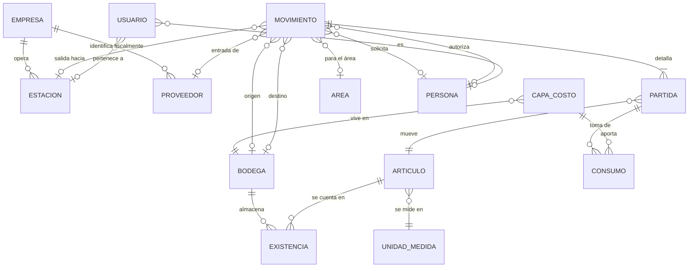

# BodeGasosur — Modelo de datos

Versión posterior al levantamiento. Recoge lo acordado con Compras en
[05-hallazgos](05-hallazgos-levantamiento.md), el catálogo global de
[06-estaciones](06-estaciones.md) y el análisis del Excel vigente en
[07-datos-actuales](07-datos-actuales.md).

> **Este documento describe el destino, no el estado actual del código.** El esquema en
> `prisma/schema.prisma` todavía es el de la demo. La migración es la fase 2 de
> [`fases-siguientes.md`](../fases-siguientes.md).

## 1. Panorama



Dos esquemas de PostgreSQL:

- **`catalogo_gasosur`** — `Empresa` y `Estacion`. Global para el grupo, lo leen otros
  proyectos. Nada de aquí apunta hacia `public`.
- **`public`** — todo lo demás, propio de BodeGasosur.

## 2. Los cinco tipos de movimiento

| Tipo | Origen | Destino | Contraparte | Efecto |
|---|---|---|---|---|
| **ENTRADA** | — | Bodega | Proveedor + factura o remisión | `+` en destino, **crea capa de costo** |
| **SALIDA** | Bodega | — | Estación + área | `−` en origen, **consume capas** |
| **TRASPASO** | Bodega | Bodega | — | `−` origen, `+` destino, al mismo costo |
| **DEVOLUCIÓN** | — | Bodega | Estación | `+` en destino; puede referenciar la salida original |
| **AJUSTE** | Bodega | — | Motivo (conteo, merma, daño) | `+` o `−` |

Los **préstamos** no son un tipo aparte: son una `SALIDA` con la bandera `esPrestamo`, que
queda abierta hasta que una `DEVOLUCIÓN` la cierra. Es el compresor que Diana menciona.

Las **entregas parciales** tampoco necesitan tabla: varias `ENTRADA` comparten la misma
`referencia` de factura. Cuando exista orden de compra, ella será el punto de agrupación.

## 3. Estados

| Tipo | Flujo |
|---|---|
| ENTRADA, TRASPASO, DEVOLUCIÓN, AJUSTE | `BORRADOR → CONFIRMADO`, o `CANCELADO` |
| SALIDA | `SOLICITADA → AUTORIZADA → ENTREGADA → RECIBIDA`, con `RECHAZADA` y `CANCELADO` |

**La existencia se descuenta al pasar a `ENTREGADA`**, no al autorizar. Autorizar es un
permiso; entregar es el hecho físico. Entre uno y otro el material sigue en la bodega.

`RECIBIDA` es lo que Diana llama *"cerrar el pendiente"*: confirma que la estación recibió.
No mueve existencia, solo cierra el ciclo. La bandeja de entregas sin confirmar es lo que
hoy vive en conversaciones de WhatsApp.

## 4. Invariantes

1. Un movimiento confirmado **no se edita ni se borra**. Corregir = cancelar y recapturar;
   la cancelación genera el asiento inverso y guarda `motivoCancelacion`.
2. Solo afectan existencias los movimientos `CONFIRMADO` (o `ENTREGADA` en salidas).
3. Todo movimiento tiene al menos una partida, con `cantidad > 0`.
4. Un artículo no se repite dentro del mismo movimiento.
5. Origen y destino de un traspaso son bodegas distintas.
6. **La existencia nunca queda negativa.** Confirmado por ambos: *"no dar salida si no hay
   existencia"*.
7. **Ninguna salida pasa de `SOLICITADA` sin un usuario con `puedeAutorizar`.** Es el
   requisito #1 del sistema.
8. El folio es consecutivo por tipo y se asigna al confirmar, no al crear el borrador.
9. `SUM(cantidadRestante)` de las capas de un artículo/bodega es igual a
   `Existencia.cantidad`. Hay un comando que lo verifica.

## 5. Costeo por capas, consumidas por PEPS

Compras pidió **el costo de la factura**, no un promedio del almacén. Eso saca el costo de
la ficha del artículo y lo lleva a capas:

- Cada **ENTRADA** crea una `CapaCosto` con su costo unitario y su cantidad.
- Cada **SALIDA** consume capas por orden de antigüedad —**PEPS**— y registra en
  `ConsumoCapa` de dónde salió cada pieza y a qué costo.
- El costo de una salida **se congela**: no cambia aunque después entre material más caro.
- Un **TRASPASO** mueve la capa de una bodega a otra conservando su costo.

Se eligió PEPS porque al decidirse que la serie **solo se anota y no se rastrea**
([B5](05-hallazgos-levantamiento.md#6-discrepancias--resueltas)), no hay forma de saber de
qué factura salió una pieza concreta. PEPS es la aproximación más cercana, y contabilidad
no exige método.

> **Pendiente de confirmar con Compras antes de construir las entradas.** La alternativa es
> promedio ponderado: más simple, pero deja de responder *"esta pieza costó lo que decía su
> factura"*.

### Moneda e impuestos

Las entradas se capturan en pesos o en dólares. La capa de costo guarda **siempre pesos**,
convertidos al tipo de cambio del día de la entrada, para que el valor del inventario no
baile con el dólar de hoy.

El movimiento conserva `moneda`, `tipoCambio`, `subtotal`, `iva` y `total` como constancia
de lo que decía la factura.

> **A confirmar:** el inventario se valúa al **subtotal, sin IVA**, que es la práctica
> contable habitual cuando el IVA es acreditable. Si Compras lo quiere con IVA, es cambiar
> qué campo alimenta la capa.

### El inventario migrado arranca sin costo

El Excel actual no tiene ningún dato de dinero, y se decidió no capturar a mano los 225
costos. Cada artículo adquiere costo la primera vez que se registre una entrada suya; hasta
entonces figura sin valuar. Las existencias iniciales entran como `AJUSTE` sin capa.

## 6. Usuarios y permisos

Cinco roles y una bandera independiente:

| Rol | Empresas y Estaciones | Resto de tablas | Movimientos |
|---|---|---|---|
| `SUPERADMIN` | CRUD | CRUD | Todo |
| `ADMIN` | **Solo lectura** | CRUD | Todo |
| `COMPRAS` | Lectura | Catálogos operativos | Registra entradas, salidas y traspasos |
| `JEFE` | Lectura | Lectura | Consulta |
| `GERENTE` | Lectura | Lectura | Solicita para su estación |

`puedeAutorizar` es una **bandera del usuario, no un rol**: un Jefe puede tenerla y un
Admin puede no tenerla. La lista de facultados cambia —el Lic. Hugo, la Lic. Andrea, el
área de Compras y la C.P. Cosumel— y por eso no puede vivir en el código.

Solo el `SUPERADMIN` escribe `Empresa` y `Estacion` porque viven en el esquema global que
otros proyectos leen: un cambio ahí sale de BodeGasosur.

## 7. Esquema Prisma

```prisma
// prisma/schema.prisma
generator client {
  provider = "prisma-client-js"
}

datasource db {
  provider = "postgresql"
  schemas  = ["public", "catalogo_gasosur"]
}

enum TipoMovimiento {
  ENTRADA
  SALIDA
  TRASPASO
  DEVOLUCION
  AJUSTE

  @@schema("public")
}

enum EstatusMovimiento {
  BORRADOR
  CONFIRMADO
  SOLICITADA
  AUTORIZADA
  RECHAZADA
  ENTREGADA
  RECIBIDA
  CANCELADO

  @@schema("public")
}

enum Moneda {
  MXN
  USD

  @@schema("public")
}

enum Rol {
  SUPERADMIN
  ADMIN
  COMPRAS
  JEFE
  GERENTE

  @@schema("public")
}

// ─────────── Catálogo global del grupo ───────────

model Empresa {
  id          String  @id @default(uuid(7)) @db.Uuid
  razonSocial String
  /// Normalizado: mayúsculas, sin guiones ni espacios.
  rfc         String? @unique
  activa      Boolean @default(true)

  estaciones  Estacion[]
  proveedores Proveedor[]

  @@schema("catalogo_gasosur")
}

model Estacion {
  id        String  @id @default(uuid(7)) @db.Uuid
  numero    String  @unique              // ES05588
  alias     String                       // "Magallanes"
  empresaId String  @db.Uuid
  telefono  String?
  movil     String?
  correo    String?
  activa    Boolean @default(true)

  empresa     Empresa      @relation(fields: [empresaId], references: [id])
  movimientos Movimiento[]
  usuarios    Usuario[]

  @@schema("catalogo_gasosur")
}

// ─────────── Acceso ───────────

model Usuario {
  id             String  @id @default(uuid(7)) @db.Uuid
  correo         String  @unique
  hash           String
  rol            Rol
  /// Independiente del rol: quién puede autorizar salidas.
  puedeAutorizar Boolean @default(false)
  personaId      String? @unique @db.Uuid
  /// Solo para el rol GERENTE.
  estacionId     String? @db.Uuid
  activo         Boolean @default(true)

  persona  Persona?  @relation(fields: [personaId],  references: [id])
  estacion Estacion? @relation(fields: [estacionId], references: [id])

  @@schema("public")
}

// ─────────── Catálogos operativos ───────────

model Bodega {
  id        String  @id @default(uuid(7)) @db.Uuid
  clave     String  @unique
  nombre    String
  ubicacion String?
  activa    Boolean @default(true)

  existencias        Existencia[]
  capas              CapaCosto[]
  movimientosOrigen  Movimiento[] @relation("BodegaOrigen")
  movimientosDestino Movimiento[] @relation("BodegaDestino")

  @@schema("public")
}

/// Administración, mantenimiento y despacho.
model Area {
  id     String  @id @default(uuid(7)) @db.Uuid
  nombre String  @unique
  activa Boolean @default(true)

  movimientos Movimiento[]

  @@schema("public")
}

model UnidadMedida {
  id     String @id @default(uuid(7)) @db.Uuid
  clave  String @unique              // PZA, CAJA, LT
  nombre String

  articulos Articulo[]

  @@schema("public")
}

model CategoriaArticulo {
  id     String @id @default(uuid(7)) @db.Uuid
  nombre String @unique

  articulos Articulo[]

  @@schema("public")
}

model Articulo {
  id          String  @id @default(uuid(7)) @db.Uuid
  clave       String  @unique
  /// Código del Excel anterior. Se conserva para que Compras rastree su histórico.
  claveAnterior String?
  descripcion String
  unidadId    String  @db.Uuid
  categoriaId String? @db.Uuid
  /// Piezas que trae una caja. La existencia se lleva siempre en piezas.
  piezasPorCaja Int?
  stockMinimo Decimal @default(0) @db.Decimal(14, 3)
  activo      Boolean @default(true)

  unidad      UnidadMedida        @relation(fields: [unidadId],    references: [id])
  categoria   CategoriaArticulo?  @relation(fields: [categoriaId], references: [id])
  existencias Existencia[]
  capas       CapaCosto[]
  partidas    MovimientoPartida[]

  @@index([descripcion])
  @@schema("public")
}

model Proveedor {
  id              String  @id @default(uuid(7)) @db.Uuid
  /// Razón social y RFC viven en Empresa: 33 de los 137 proveedores son del propio grupo.
  empresaId       String  @db.Uuid
  nombreComercial String
  contacto        String?
  telefono        String?
  correo          String?
  giro            String?          // "Refacciones", "Papelería"…
  activo          Boolean @default(true)

  empresa     Empresa      @relation(fields: [empresaId], references: [id])
  movimientos Movimiento[]

  @@schema("public")
}

/// Quien solicita y quien autoriza. Se enlaza con Usuario cuando tiene acceso al sistema.
model Persona {
  id     String  @id @default(uuid(7)) @db.Uuid
  nombre String
  puesto String?
  activa Boolean @default(true)

  usuario     Usuario?
  solicitados Movimiento[] @relation("Solicitante")
  autorizados Movimiento[] @relation("Autorizador")

  @@schema("public")
}

// ─────────── Operación ───────────

model Movimiento {
  id      String            @id @default(uuid(7)) @db.Uuid
  folio   String?           @unique
  tipo    TipoMovimiento
  estatus EstatusMovimiento @default(BORRADOR)
  fecha   DateTime                              // fecha real del hecho

  bodegaOrigenId  String? @db.Uuid
  bodegaDestinoId String? @db.Uuid
  proveedorId     String? @db.Uuid              // ENTRADA
  estacionId      String? @db.Uuid              // SALIDA y DEVOLUCION
  areaId          String? @db.Uuid              // SALIDA
  referencia      String?                       // factura o remisión
  motivo          String?                       // AJUSTE

  // Dinero: solo en ENTRADA.
  moneda     Moneda?  @default(MXN)
  tipoCambio Decimal? @db.Decimal(14, 6)
  subtotal   Decimal? @db.Decimal(14, 2)
  iva        Decimal? @db.Decimal(14, 2)
  total      Decimal? @db.Decimal(14, 2)

  solicitadoPorId String? @db.Uuid
  autorizadoPorId String? @db.Uuid
  /// Texto libre: puede ser un ingeniero, un gerente, una paquetería o "Recep. Magallanes".
  entregadoA      String?

  /// SALIDA que espera retorno del material.
  esPrestamo Boolean @default(false)
  /// DEVOLUCION que cierra una salida previa.
  devuelveAId String? @db.Uuid

  observaciones     String?
  motivoCancelacion String?
  cancelaAId        String? @unique @db.Uuid

  createdAt DateTime @default(now())            // fecha de captura
  updatedAt DateTime @updatedAt

  partidas      MovimientoPartida[]
  capas         CapaCosto[]
  bodegaOrigen  Bodega?     @relation("BodegaOrigen",  fields: [bodegaOrigenId],  references: [id])
  bodegaDestino Bodega?     @relation("BodegaDestino", fields: [bodegaDestinoId], references: [id])
  proveedor     Proveedor?  @relation(fields: [proveedorId], references: [id])
  estacion      Estacion?   @relation(fields: [estacionId],  references: [id])
  area          Area?       @relation(fields: [areaId],      references: [id])
  solicitadoPor Persona?    @relation("Solicitante", fields: [solicitadoPorId], references: [id])
  autorizadoPor Persona?    @relation("Autorizador", fields: [autorizadoPorId], references: [id])
  devuelveA     Movimiento? @relation("Devolucion",  fields: [devuelveAId], references: [id])
  devoluciones  Movimiento[] @relation("Devolucion")
  cancelaA      Movimiento? @relation("Cancelacion", fields: [cancelaAId],  references: [id])
  canceladoPor  Movimiento? @relation("Cancelacion")

  @@index([tipo, estatus, fecha])
  @@index([estacionId, fecha])
  @@schema("public")
}

model MovimientoPartida {
  id           String  @id @default(uuid(7)) @db.Uuid
  movimientoId String  @db.Uuid
  articuloId   String  @db.Uuid
  /// Siempre en la unidad base (pieza).
  cantidad     Decimal @db.Decimal(14, 3)
  /// Lo que se capturó: 3 cajas de 12 se guardan como cantidad 36 y aquí "3 CAJA".
  capturaOriginal String?
  /// ENTRADA: costo de factura en la moneda del movimiento.
  /// SALIDA: costo real heredado de las capas consumidas.
  costoUnitario Decimal @db.Decimal(14, 4)
  /// Se anota, no se rastrea.
  numeroSerie   String?
  observaciones String?

  movimiento Movimiento    @relation(fields: [movimientoId], references: [id], onDelete: Cascade)
  articulo   Articulo      @relation(fields: [articuloId],   references: [id])
  consumos   ConsumoCapa[]

  @@unique([movimientoId, articuloId])
  @@index([articuloId])
  @@schema("public")
}

/// Una compra concreta con su costo. Es la unidad del costeo PEPS.
model CapaCosto {
  id           String   @id @default(uuid(7)) @db.Uuid
  bodegaId     String   @db.Uuid
  articuloId   String   @db.Uuid
  movimientoId String   @db.Uuid              // la ENTRADA que la creó
  fecha        DateTime                       // ordena el consumo PEPS
  cantidadInicial  Decimal @db.Decimal(14, 3)
  cantidadRestante Decimal @db.Decimal(14, 3)
  /// Siempre en pesos, ya convertido al tipo de cambio de la entrada.
  costoUnitario    Decimal @db.Decimal(14, 4)

  bodega     Bodega        @relation(fields: [bodegaId],     references: [id])
  articulo   Articulo      @relation(fields: [articuloId],   references: [id])
  movimiento Movimiento    @relation(fields: [movimientoId], references: [id])
  consumos   ConsumoCapa[]

  @@index([bodegaId, articuloId, fecha])
  @@schema("public")
}

/// De qué capa salió cada pieza de una salida. Una partida puede tocar varias capas.
model ConsumoCapa {
  id            String  @id @default(uuid(7)) @db.Uuid
  partidaId     String  @db.Uuid
  capaId        String  @db.Uuid
  cantidad      Decimal @db.Decimal(14, 3)
  costoUnitario Decimal @db.Decimal(14, 4)     // congelado al momento de la salida

  partida MovimientoPartida @relation(fields: [partidaId], references: [id], onDelete: Cascade)
  capa    CapaCosto         @relation(fields: [capaId],    references: [id])

  @@schema("public")
}

/// Proyección: siempre recalculable desde los movimientos confirmados.
model Existencia {
  bodegaId      String   @db.Uuid
  articuloId    String   @db.Uuid
  cantidad      Decimal  @default(0) @db.Decimal(14, 3)
  actualizadoEn DateTime @updatedAt

  bodega   Bodega   @relation(fields: [bodegaId],   references: [id])
  articulo Articulo @relation(fields: [articuloId], references: [id])

  @@id([bodegaId, articuloId])
  @@schema("public")
}

model Folio {
  tipo      TipoMovimiento @id
  prefijo   String                          // E, S, T, D, A
  siguiente Int            @default(1)

  @@schema("public")
}
```

## 8. Qué cambió respecto a la demo

| Cambio | Origen |
|---|---|
| `UUIDv7` nativo en vez de `cuid()` texto | [01-arquitectura](01-arquitectura.md) §3.5 |
| `Empresa` y `Estacion` en esquema global; el RFC sale de la estación | [06-estaciones](06-estaciones.md) |
| `Usuario`, `Rol` y la bandera `puedeAutorizar` | D3 y el requisito #1 |
| Costeo por capas PEPS en vez de promedio ponderado | E1 |
| `moneda`, `tipoCambio`, `subtotal`, `iva`, `total` | E3 y E4 |
| `piezasPorCaja` y `capturaOriginal` | B4 |
| `numeroSerie` como texto, sin rastreo | B5 |
| Se eliminan `transportista` y `vehiculo`; `recibidoPor` pasa a `entregadoA` libre | D4 |
| Tipo `DEVOLUCION` y bandera `esPrestamo` | D7 y B6 |
| Estados de salida con autorización y confirmación de recepción | D2 y D6 |
| `claveAnterior` en el artículo | Los 41 códigos que chocan entre bodegas |
| `Proveedor` apunta a `Empresa` | 33 de 137 proveedores son del propio grupo |

## 9. Consultas que el modelo debe resolver

| Pregunta de Compras | Cómo se resuelve |
|---|---|
| ¿Cuánto material mandamos a la estación 4 este mes? | Salidas por `estacionId` y rango de fecha; sumar `cantidad × costoUnitario` |
| ¿Qué tengo en la bodega central? | `Existencia` por `bodegaId` |
| ¿Qué está por debajo del mínimo? | `Existencia.cantidad < Articulo.stockMinimo` |
| ¿Quién autorizó esta salida y quién se la llevó? | `autorizadoPor` y `entregadoA` |
| ¿Cuál es el historial de este filtro? | Kardex: partidas del artículo por fecha, con saldo corrido |
| ¿Cuánto vale el inventario? | `SUM(cantidadRestante × costoUnitario)` de las capas |
| ¿Qué se gastó por estación este año? | Salidas agrupadas por `estacionId` |
| ¿Con qué frecuencia se pide esta pieza? | Conteo de partidas del artículo por periodo |
| ¿Qué salidas siguen sin confirmar recepción? | Salidas en estatus `ENTREGADA` |
| ¿Qué material prestado no ha vuelto? | Salidas con `esPrestamo` sin devolución que las cierre |
| El reporte de los viernes | Entradas, salidas y stock final del periodo |
