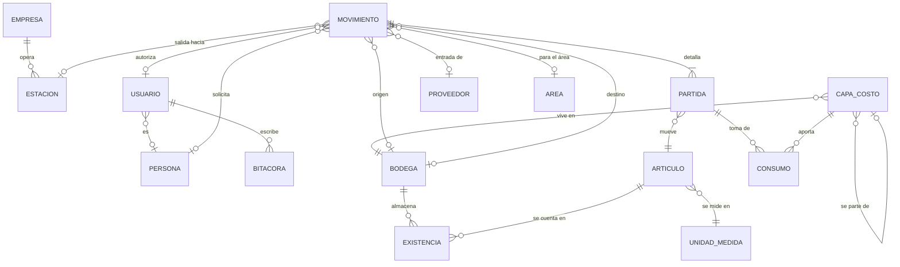

# BodeGasosur — Modelo de datos

Recoge lo acordado con Compras en [05-hallazgos](05-hallazgos-levantamiento.md), el
catálogo global de [06-estaciones](06-estaciones.md), el análisis del Excel vigente en
[07-datos-actuales](07-datos-actuales.md) y las correcciones de la
[auditoría de arquitectura](09-auditoria.md).

> **Este documento ya describe el código, no un destino.** El esquema vive en
> [`prisma/schema.prisma`](../prisma/schema.prisma) y los invariantes que la base hace
> cumplir en [`prisma/sql/`](../prisma/sql/). Ambos se implementaron en la fase 2
> (`v0.2.0`). Lo que sigue explica **por qué** está así; la fuente de verdad de **cómo**
> está es el esquema.

## 1. Panorama



Dos esquemas de PostgreSQL:

- **`catalogo_gasosur`** — `Empresa` y `Estacion`. Global para el grupo. Otros proyectos
  no leen estas tablas: leen **vistas versionadas** (§7).
- **`public`** — todo lo demás, propio de BodeGasosur.

Diecinueve modelos en total: dos en `catalogo_gasosur` y diecisiete en `public`.

## 2. Los cinco tipos de movimiento

| Tipo | Origen | Destino | Contraparte | Efecto |
|---|---|---|---|---|
| **ENTRADA** | — | Bodega | Proveedor + factura o remisión | `+` en destino, **crea capa de costo** |
| **SALIDA** | Bodega | — | Estación + área | `−` en origen, **consume capas** |
| **TRASPASO** | Bodega | Bodega | — | `−` origen, `+` destino, partiendo la capa |
| **DEVOLUCIÓN** | — | Bodega | Estación | `+` en destino; puede referenciar la salida original |
| **AJUSTE** | Bodega *o* — | — *o* Bodega | Motivo (conteo, merma, daño) | `+` o `−` |

**El signo del ajuste vive en la bodega, no en la cantidad.** Un ajuste que suma lleva
`bodegaDestinoId`; uno que resta lleva `bodegaOrigenId`, igual que una entrada y una
salida. Así la cantidad es siempre positiva y el invariante 3 no tiene excepciones. Antes
esto estaba sin decidir, y la tabla de tipos y el invariante 3 se contradecían.

Los **préstamos** no son un tipo aparte: son una `SALIDA` con la bandera `esPrestamo`, que
queda abierta hasta que una `DEVOLUCIÓN` la cierra. Es el compresor que Diana menciona.

Las **entregas parciales** tampoco necesitan tabla: varias `ENTRADA` comparten la misma
`referencia` de factura. Cuando exista orden de compra, ella será el punto de agrupación.

## 3. Estados

| Tipo | Flujo |
|---|---|
| ENTRADA, TRASPASO, DEVOLUCIÓN, AJUSTE | `BORRADOR → CONFIRMADO`, o `CANCELADO` |
| SALIDA | `SOLICITADA → AUTORIZADA → ENTREGADA → RECIBIDA`, con `RECHAZADA` y `CANCELADO` |

Son **dos máquinas de estados en un solo enum**, y la base sabe cuál corresponde a cada
tipo: un `CHECK` sobre `(tipo, estatus)` impide un `ENTRADA` en estatus `AUTORIZADA`. Qué
transición es legal —y no solo qué combinación existe— lo decide una tabla de transiciones
en la capa de servicios, para que una transición ilegal sea un error de tipos y no una
convención que se respeta mientras alguien se acuerde.

`estatus` **no tiene valor por omisión**: el inicial depende del tipo —una salida nace
`SOLICITADA`, todo lo demás nace `BORRADOR`— y una columna no puede tener un `DEFAULT` que
dependa de otra columna.

**La existencia se descuenta al pasar a `ENTREGADA`**, no al autorizar. Autorizar es un
permiso; entregar es el hecho físico. Entre uno y otro el material sigue en la bodega.

`RECIBIDA` es lo que Diana llama *«cerrar el pendiente»*: confirma que la estación recibió.
No mueve existencia, solo cierra el ciclo. La bandeja de entregas sin confirmar es lo que
hoy vive en conversaciones de WhatsApp.

**Cada transición deja su actor y su marca de tiempo**: `creadoPorId`, `confirmadoPorId` /
`confirmadoEn`, `autorizadoPorId` / `autorizadoEn`, `rechazadoPorId` / `rechazadoEn`,
`entregadoPorId` / `entregadoEn`, `recibidoPorId` / `recibidoEn`, `canceladoPorId` /
`canceladoEn`. Un `CHECK` por cada par impide que exista uno sin el otro.

## 4. Invariantes

Los once del levantamiento, más lo que hizo falta escribir para que fueran verificables.
La columna de la derecha dice **quién los hace cumplir** — que es la diferencia entre un
invariante y un buen propósito.

| | Invariante | Quién lo impone |
|---|---|---|
| 1 | Un movimiento confirmado no se edita ni se borra; corregir = cancelar y recapturar | Servicios |
| 2 | Solo afectan existencias los movimientos `CONFIRMADO` (o `ENTREGADA` en salidas) | Servicios |
| 3 | Todo movimiento tiene al menos una partida, con `cantidad > 0` | `CHECK` |
| 4 | Un artículo no se repite dentro del mismo movimiento | `@@unique` |
| 5 | Origen y destino de un traspaso son bodegas distintas | `CHECK` |
| 6 | **La existencia nunca queda negativa** | `CHECK` + bloqueo `FOR UPDATE` |
| 7 | **Ninguna salida pasa de `SOLICITADA` sin un usuario con `puedeAutorizar`** | **Trigger** |
| 8 | El folio es consecutivo por tipo y se asigna al confirmar, no al crear el borrador | `CHECK` + `UPDATE … RETURNING` |
| 9 | `SUM(cantidadRestante)` de las capas de un artículo/bodega = `Existencia.cantidad` | `CHECK` parcial + prueba de integración |
| 10 | Las capas se consumen por orden de `(fechaOriginal, id)` — PEPS | Servicios |
| 11 | `costoUnitarioConIva >= costoUnitario` siempre | `CHECK` |

Y tres que la auditoría obligó a agregar:

| | Invariante | Quién lo impone |
|---|---|---|
| 12 | El par de costos se conoce junto o se desconoce junto | `CHECK` |
| 13 | El dinero existe solo en `ENTRADA`; el tipo de cambio, solo en dólares | `CHECK` |
| 14 | Una clave de negocio no cambia después del alta | **Trigger** |

**El invariante 9 se verifica por igualdad exacta**, sin tolerancia, porque las cantidades
son enteras. Con decimales, el consumo PEPS acabaría dejando residuos de milésimas y la
prueba habría necesitado un *«iguales dentro de 0.001»* — una tolerancia en una prueba de
invariantes es una puerta por donde se cuela el error que la prueba existía para atrapar.

## 5. Costeo por capas, consumidas por PEPS

Compras pidió **el costo de la factura**, no un promedio del almacén. Eso saca el costo de
la ficha del artículo y lo lleva a capas:

- **Toda cantidad que entra crea capa, siempre.** Entrada, traspaso, devolución y el ajuste
  del inventario inicial.
- Cada **SALIDA** consume capas por antigüedad —**PEPS**— y registra en `ConsumoCapa` de
  dónde salió cada pieza y a qué costo.
- El costo de una salida **se congela**: no cambia aunque después entre material más caro.

**PEPS está confirmado.** Compras lo eligió deliberadamente aunque contabilidad no exija
método alguno: da mejor control que un promedio, porque cada salida conserva el costo real
de la compra de la que salió. Encaja además con lo ya decidido: al no rastrearse la serie
([B5](05-hallazgos-levantamiento.md#6-discrepancias--resueltas)), no hay forma de saber de
qué factura salió una pieza concreta, y PEPS es la aproximación más cercana.

### El inventario migrado entra con capa y sin costo

Ésta fue la corrección más importante de la auditoría (**A1**), y conviene entender qué
evita.

El Excel no tiene ningún dato de dinero, y se decidió no capturar a mano los 225 costos. La
versión anterior de este documento resolvía eso metiendo las existencias iniciales como un
`AJUSTE` **sin capa**. La consecuencia aparecía después: la primera salida de un artículo
no valuado encontraría existencia 40 y capas 0, y solo había dos desenlaces, los dos malos
— bloquear una salida que sí tiene existencia, contra lo que Compras pidió por escrito, o
descontar existencia sin consumir capa y dejar que las dos cifras divergieran en silencio
para siempre.

La corrección es que **la capa siempre existe** y lo que falta es el costo:

```prisma
/// Nulo = no se conoce el costo (inventario migrado). Distinto de cero.
costoUnitario       Decimal? @db.Decimal(14, 4)
costoUnitarioConIva Decimal? @db.Decimal(14, 4)
```

Nulo no es cero: *«no sé cuánto costó»* y *«costó nada»* son afirmaciones distintas, y el
reporte de valuación tiene que poder decir *«1,240 piezas sin valuar»* en vez de mentir con
un total. Cada artículo adquiere costo la primera vez que se registre una entrada suya.

### Qué fecha ordena PEPS

Una capa tiene dos fechas y solo una ordena:

- `fecha` — cuándo apareció la capa **en esa bodega**. Informativa.
- `fechaOriginal` — la de la **`ENTRADA` original**. Es la que ordena, junto con el `id`.

La distinción existe por el traspaso. Un traspaso parte una capa: consume N piezas en el
origen y crea una capa nueva en el destino, con `origenId` apuntando a la capa de la que
salió y **conservando la fecha de la entrada original**. Si llevara la fecha del traspaso,
el material viejo se iría al final de la fila PEPS en el destino y el costeo mentiría.

La **devolución** funciona igual, y así queda escrito lo que antes no lo estaba: crea una
capa nueva por cada capa que consumió la salida original, con `origenId` a la capa
consumida y su `fechaOriginal` heredada. No reabre la capa original — eso borraría el
rastro de que hubo devolución. Cuando la devolución no referencia ninguna salida, el costo
es nulo, que es el caso que **A1** ya sabe representar.

El desempate es `id`, y no es arbitrario: los UUIDv7 están ordenados por tiempo de
creación, así que `ORDER BY fechaOriginal, id` significa *«por día del hecho, y dentro del
día por orden de captura»*.

### Moneda e impuestos

Las entradas se capturan en pesos o en dólares. La capa de costo guarda **siempre pesos**,
convertidos al tipo de cambio del día de la entrada, para que el valor del inventario no
baile con el dólar de hoy.

El movimiento conserva `moneda`, `tipoCambio`, `subtotal`, `iva` y `total` como constancia
de lo que decía la factura. Tres `CHECK` cierran el bloque: el dinero solo existe en
`ENTRADA`, en dólares el tipo de cambio es obligatorio —sin él la capa no se puede valuar
en pesos— y en pesos está prohibido, porque no significa nada.

### El inventario se valúa por partida doble: sin IVA y con IVA

Compras quiere ver las dos cifras — **subtotal sin IVA y total con IVA**. No es una
preferencia entre dos opciones: son dos columnas del mismo reporte.

La consecuencia es que **todo lugar donde se guarda un costo guarda el par**:
`costoUnitario` y `costoUnitarioConIva`, en `MovimientoPartida`, `CapaCosto` y
`ConsumoCapa`. Se guardan las dos cifras en vez de calcular una a partir de la otra por dos
razones. La tasa no siempre es 16 %: hay bienes a tasa 0 y podría haber compras en zona
fronteriza al 8 %, y la tasa vive en la partida de la entrada (`tasaIva`), no en una
constante del sistema. Y recalcular sobre miles de renglones acumula diferencias de
redondeo que hacen que el reporte no cuadre contra la factura.

### La regla de redondeo

Faltaba y ya está escrita:

> **Se redondea a dos decimales por renglón, medio hacia arriba, y después se suman los
> renglones.** Nunca al revés. Y **el redondeo ocurre en PostgreSQL, no en JavaScript**.

`ROUND(x, 2)` sobre `numeric` es exacto y su comportamiento está definido; el mismo cálculo
en JavaScript pasa por punto flotante. Es la diferencia entre cuadrar contra la factura y
no cuadrar por tres centavos.

El **costo unitario se guarda con cuatro decimales**, no con dos, y no es un descuido: mil
tornillos que la factura cobra en $456.70 salen a $0.4567 cada uno. Con dos decimales serían
$0.46, y mil piezas darían $460.00 — $3.30 de más, con el error creciendo justo donde vive
el material barato de bodega. Los cuatro decimales no son un importe: son la constancia de
a cuánto salió la pieza. Los importes —`subtotal`, `iva`, `total`— sí van a dos.

## 6. Cantidades enteras

`cantidad`, `cantidadInicial`, `cantidadRestante` y `stockMinimo` son `Int`. No hay medias
piezas en una bodega, el Excel vigente no tiene columna de unidad y todo se maneja por
pieza ([07 §3](07-datos-actuales.md)).

De ahí se sigue que **`UnidadMedida` describe la presentación, no una magnitud**: una
cubeta de 19 litros es *1 CUB*, no *19 LT*. Las unidades divisibles —litro, galón,
kilogramo, metro— salieron del catálogo, porque conservarlas dejaba una trampa para el día
que alguien intentara capturar aceite a granel. Para el material que se compra por caja y
se cuenta por pieza está `Articulo.piezasPorCaja`, que convierte la captura: *3 CAJA* de 12
se guardan como cantidad 36 y `capturaOriginal = "3 CAJA"`.

## 7. Usuarios, permisos y el catálogo compartido

**Clerk autentica; PostgreSQL autoriza.** El razonamiento completo está en
[01 §3.6](01-arquitectura.md). Aquí, lo que eso significa para el modelo:

`Usuario` no guarda contraseñas ni sesiones. Guarda el enlace con Clerk (`clerkUserId`), una
copia del correo sincronizada por webhook, el rol, la bandera `puedeAutorizar` y el enlace
opcional con una `Persona`.

**Tres roles**, no cinco:

| Rol          | Empresas y Estaciones | Resto de tablas      | Movimientos                                          |
| ------------ | --------------------- | -------------------- | ---------------------------------------------------- |
| `SUPERADMIN` | CRUD                  | CRUD                 | Todo                                                 |
| `COMPRAS`    | Lectura               | Catálogos operativos | Registra entradas, salidas, traspasos y devoluciones |
| `JEFE`       | Lectura               | Lectura              | Consulta                                             |

La columna de **Movimientos es diseño**: se construye en las fases 5 a 7. Desde la fase 3,
`src/lib/permisos.ts` declara los permisos de catálogos y de usuarios, y esos sí están
implementados.

`puedeAutorizar` es una **bandera del usuario, no un rol**: un Jefe puede tenerla y un
usuario de Compras puede no tenerla. La lista de facultados cambia —el Lic. Hugo, la Lic.
Andrea, el área de Compras y la C.P. Cosumel— y por eso no puede vivir en el código.

Solo el `SUPERADMIN` escribe `Empresa` y `Estacion` porque viven en el esquema global que
otros proyectos leen: un cambio ahí sale de BodeGasosur.

**Y esos otros proyectos no leen las tablas.** Leen vistas versionadas, con un rol dedicado
de solo lectura:

```sql
CREATE VIEW catalogo_gasosur.v_estacion_v1 AS
  SELECT id, numero, alias, "empresaId", activa FROM catalogo_gasosur."Estacion";

CREATE ROLE lector_catalogo NOLOGIN;
GRANT SELECT ON catalogo_gasosur.v_estacion_v1 TO lector_catalogo;
```

Con eso se puede renombrar una columna física sin romper software ajeno —que es lo que
[08 §10](08-versionado-y-despliegue.md) anticipa que hará falta—, la escritura es imposible
por construcción y no por acuerdo, y ninguna contraseña queda en el repositorio: el rol es
de grupo y cada proyecto entra con su propio usuario.

Importa además una revocación explícita sobre `public`. Como la llave foránea entre
esquemas se conservó, el catálogo compartido vive **dentro de la base de BodeGasosur**: un
proyecto hermano comprometido tiene una conexión abierta hacia aquí, y lo único que lo
separa del libro contable son esos permisos.

## 8. Qué queda registrado

Dos tablas responden dos preguntas distintas, y por eso son dos:

- **`Bitacora`** — *«¿quién cambió este dato?»*. Append-only, con `antes` y `despues` en
  `jsonb`. La escribe un **trigger**, no los servicios: la extensión de Prisma conocería al
  usuario pero no vería lo que escriben `prisma studio`, los scripts de migración ni una
  consulta directa. El actor llega por variable de sesión (`app.usuario_id`), y cuando
  nadie la fijó, `app.origen` dice quién escribió.
- **`EventoAcceso`** — *«quién entró»*, incluido quien tocó la puerta y no abrió: una
  identidad de Clerk sin fila en `Usuario` deja `usuarioId` nulo y `clerkUserId` lleno.

Mezclarlas habría llenado el libro de cambios de ruido de inicios de sesión hasta volverlo
inservible justo cuando alguien lo necesitara.

`EventoWebhook` completa el juego: las entregas de Clerk llegan al menos una vez, así que
se guarda el identificador de la entrega **antes** de procesarla y en la misma transacción.
Si ya estaba, no se vuelve a procesar; si la transacción falla, el reintento la recupera.

## 9. Qué cambió respecto a la demo

| Cambio | Origen |
|---|---|
| `UUIDv7` nativo en vez de `cuid()` texto | [01](01-arquitectura.md) §3.5 |
| `Empresa` y `Estacion` en esquema global; el RFC sale de la estación | [06](06-estaciones.md) |
| `Usuario` enlazado a Clerk, tres roles y la bandera `puedeAutorizar` | D3, el requisito #1 y **F1** |
| Costeo por capas PEPS en vez de promedio ponderado | E1, confirmado por Compras |
| Cada costo por partida doble: sin IVA y con IVA, y ambos nulables | E3 y **A1** |
| `moneda`, `tipoCambio`, `subtotal`, `iva`, `total`, con sus `CHECK` | E3, E4 y los menores |
| `piezasPorCaja` y `capturaOriginal` | B4 |
| `numeroSerie` como texto, sin rastreo | B5 |
| Se eliminan `transportista` y `vehiculo`; `recibidoPor` pasa a `entregadoA` libre | D4 |
| Tipo `DEVOLUCION` y bandera `esPrestamo` | D7 y B6 |
| Estados de salida con autorización y confirmación de recepción | D2 y D6 |
| `Proveedor` lleva su propia razón social y RFC; **no** apunta a `Empresa` | `Empresa` es exclusivamente Gasosur ([10](10-plan-b-produccion.md)). Si una empresa del grupo debe ser proveedora, se decide como caso de negocio |
| `autorizadoPor` apunta a `Usuario`, con `autorizadoEn` y escritura única | **A2** |
| Actor y marca de tiempo por transición, más `Bitacora` | **A3** |
| `fecha` como `@db.Date`; los instantes con `@db.Timestamptz(3)` | **E4** |
| Cantidades enteras y unidad como presentación | Decisión de la fase 2 |
| `CapaCosto.origenId` y `fechaOriginal` | **F2** |
| Claves de negocio inmutables; `Articulo.clave` generada por secuencia | **F4** |
| Vistas versionadas y rol de solo lectura para `catalogo_gasosur` | **C3** |
| **Se descartó `claveAnterior`** | Decisión posterior a la auditoría: la traducción de los códigos viejos se resuelve en la migración de datos, no en la base |

## 10. Consultas que el modelo debe resolver

| Pregunta de Compras | Cómo se resuelve |
|---|---|
| ¿Cuánto material mandamos a la estación 4 este mes? | Salidas por `estacionId` y rango de fecha; sumar el importe redondeado por renglón |
| ¿Qué tengo en la bodega central? | `Existencia` por `bodegaId` |
| ¿Qué está por debajo del mínimo? | `Existencia.cantidad < Articulo.stockMinimo` |
| ¿Quién autorizó esta salida, cuándo, y quién se la llevó? | `autorizadoPor`, `autorizadoEn` y `entregadoA` |
| ¿Cuál es el historial de este filtro? | Kardex: partidas del artículo por fecha, con saldo corrido |
| ¿Cuánto vale el inventario? | Sobre las capas: `SUM(cantidadRestante × costoUnitario)` sin IVA y con IVA — **más el conteo de piezas sin valuar**, que son las capas de costo nulo |
| ¿Qué se gastó por estación este año? | Salidas agrupadas por `estacionId` |
| ¿Con qué frecuencia se pide esta pieza? | Conteo de partidas del artículo por periodo |
| ¿Qué salidas siguen sin confirmar recepción? | Salidas en estatus `ENTREGADA` |
| ¿Qué material prestado no ha vuelto? | Salidas con `esPrestamo` sin devolución que las cierre |
| ¿Quién le quitó el permiso de autorizar a la C.P. Cosumel? | `Bitacora`, tabla `Usuario`, comparando `antes` y `despues` |
| El reporte de los viernes | Entradas, salidas y stock final del periodo |
