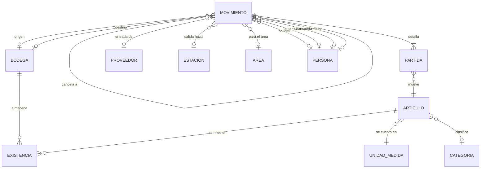

# BodeGasosur — Modelo de datos

## 1. Panorama



## 2. Los cuatro tipos de movimiento

Todo el sistema gira alrededor de una sola tabla de movimientos con cuatro
comportamientos. Esto evita cuatro módulos casi idénticos y hace que el kardex sea una
sola consulta.

| Tipo | Bodega origen | Bodega destino | Contraparte | Efecto en stock |
|---|---|---|---|---|
| **ENTRADA** | — | Requerida | Proveedor + referencia (factura/remisión) | `+` en destino |
| **SALIDA** | Requerida | — | Estación + área | `−` en origen |
| **TRASPASO** | Requerida | Requerida | — (es entre bodegas del grupo) | `−` en origen, `+` en destino |
| **AJUSTE** | Requerida | — | Motivo (conteo físico, merma, daño) | `+` o `−` según la cantidad |

Los datos que pidió Compras se reparten así:

- *hacia qué estación* → `estacionId` (salidas)
- *a qué área* → `areaId` (salidas)
- *quién transporta* → `transportistaId`
- *quién autoriza* → `autorizadoPorId`
- *cuándo* → `fecha` (del hecho real) y `createdAt` (de la captura — no siempre son la misma)
- *en qué cantidad* → `partida.cantidad`
- *costo unitario* → `partida.costoUnitario`
- *observaciones* → `movimiento.observaciones` y `partida.observaciones`

## 3. Invariantes del sistema

Reglas que la capa de servicios debe garantizar siempre. Son las que hay que validar
con Compras antes de codificar (ver `03-levantamiento-de-requerimientos.md`).

1. Un movimiento **CONFIRMADO** nunca se edita ni se borra. Corregir = cancelar y
   volver a capturar; la cancelación genera el asiento inverso y guarda `motivoCancelacion`.
2. Solo los movimientos **CONFIRMADOS** afectan existencias. Los **BORRADOR** no.
3. Un movimiento tiene **al menos una partida**, y toda partida tiene cantidad > 0.
4. Un artículo no puede repetirse dos veces en el mismo movimiento (se suma en un renglón).
5. Origen y destino de un traspaso deben ser bodegas distintas.
6. La existencia por artículo/bodega **no puede quedar negativa** — salvo que Compras
   confirme que sí sucede en la práctica (pregunta abierta, §4 del cuestionario).
7. El folio es consecutivo, único por tipo de movimiento, y se asigna al **confirmar**,
   no al crear el borrador (para no dejar huecos en la numeración).
8. `SUM(partidas)` de todos los movimientos confirmados de un artículo/bodega debe ser
   igual a `Existencia.cantidad`. Habrá un comando de verificación que lo compruebe.

## 4. Costeo

Propuesta: **costo promedio ponderado móvil**, que es el método más común en almacenes
de refacciones y consumibles y el más fácil de explicar a Compras.

- **Entrada:** el costo unitario se captura de la factura. El promedio se recalcula:
  `nuevoPromedio = (existenciaValor + cantidadEntrada × costoEntrada) / (existenciaCantidad + cantidadEntrada)`
- **Salida:** el costo unitario **no se captura**, se toma del promedio vigente de esa
  bodega y se **congela** en la partida. Así el costo histórico de una salida nunca cambia
  aunque después entre material más caro.
- **Traspaso:** sale al promedio de la bodega origen y entra a ese mismo costo en destino.

> **A validar con Compras:** si contabilidad exige PEPS (primeras entradas, primeras
> salidas) el modelo necesita capas de costo por lote. Es un cambio de tamaño medio, por
> eso conviene preguntarlo antes de escribir código.

## 5. Esquema Prisma (borrador)

```prisma
// prisma/schema.prisma
generator client { provider = "prisma-client-js" }
datasource db { provider = "postgresql"; url = env("DATABASE_URL") }

enum TipoMovimiento   { ENTRADA SALIDA TRASPASO AJUSTE }
enum EstatusMovimiento{ BORRADOR CONFIRMADO CANCELADO }

// ─────────────── Catálogos ───────────────

model Bodega {
  id        String   @id @default(cuid())
  clave     String   @unique          // BOD-01
  nombre    String
  ubicacion String?
  activa    Boolean  @default(true)

  existencias        Existencia[]
  movimientosOrigen  Movimiento[] @relation("BodegaOrigen")
  movimientosDestino Movimiento[] @relation("BodegaDestino")
}

model Estacion {
  id          String  @id @default(cuid())
  clave       String  @unique          // EST-04
  nombre      String
  ubicacion   String?
  activa      Boolean @default(true)
  movimientos Movimiento[]
}

/// Área destino dentro de la estación: Despacho, Tienda, Mantenimiento, Administración…
model Area {
  id          String  @id @default(cuid())
  nombre      String  @unique
  activa      Boolean @default(true)
  movimientos Movimiento[]
}

model UnidadMedida {
  id        String @id @default(cuid())
  clave     String @unique             // PZA, LT, CAJA, KG
  nombre    String
  articulos Articulo[]
}

model CategoriaArticulo {
  id        String @id @default(cuid())
  nombre    String @unique
  articulos Articulo[]
}

model Articulo {
  id             String  @id @default(cuid())
  clave          String  @unique        // SKU interno
  descripcion    String
  unidadId       String
  categoriaId    String?
  stockMinimo    Decimal @default(0) @db.Decimal(14, 3)
  activo         Boolean @default(true)

  unidad      UnidadMedida       @relation(fields: [unidadId],    references: [id])
  categoria   CategoriaArticulo? @relation(fields: [categoriaId], references: [id])
  existencias Existencia[]
  partidas    MovimientoPartida[]

  @@index([descripcion])
}

model Proveedor {
  id          String  @id @default(cuid())
  razonSocial String
  rfc         String? @unique
  contacto    String?
  telefono    String?
  activo      Boolean @default(true)
  movimientos Movimiento[]
}

/// Personas que intervienen: solicita, autoriza, transporta, recibe.
/// Cuando exista autenticación, esta tabla se enlaza 1:1 con Usuario.
model Persona {
  id             String  @id @default(cuid())
  nombre         String
  puesto         String?
  esTransportista Boolean @default(false)
  activa         Boolean @default(true)

  solicitados  Movimiento[] @relation("Solicitante")
  autorizados  Movimiento[] @relation("Autorizador")
  transportados Movimiento[] @relation("Transportista")
  recibidos    Movimiento[] @relation("Receptor")
}

// ─────────────── Operación ───────────────

model Movimiento {
  id        String            @id @default(cuid())
  folio     String?           @unique   // se asigna al CONFIRMAR
  tipo      TipoMovimiento
  estatus   EstatusMovimiento @default(BORRADOR)
  fecha     DateTime                    // fecha real del hecho

  bodegaOrigenId  String?
  bodegaDestinoId String?
  proveedorId     String?               // ENTRADA
  estacionId      String?               // SALIDA
  areaId          String?               // SALIDA
  referencia      String?               // factura, remisión, orden de compra
  motivo          String?               // AJUSTE

  solicitadoPorId String?
  autorizadoPorId String?
  transportistaId String?
  recibidoPorId   String?
  vehiculo        String?               // unidad o placas

  observaciones      String?
  motivoCancelacion  String?
  cancelaAId         String?  @unique   // apunta al movimiento que reversa

  createdAt DateTime @default(now())    // fecha de captura
  updatedAt DateTime @updatedAt

  partidas       MovimientoPartida[]
  bodegaOrigen   Bodega?     @relation("BodegaOrigen",  fields: [bodegaOrigenId],  references: [id])
  bodegaDestino  Bodega?     @relation("BodegaDestino", fields: [bodegaDestinoId], references: [id])
  proveedor      Proveedor?  @relation(fields: [proveedorId],     references: [id])
  estacion       Estacion?   @relation(fields: [estacionId],      references: [id])
  area           Area?       @relation(fields: [areaId],          references: [id])
  solicitadoPor  Persona?    @relation("Solicitante",   fields: [solicitadoPorId], references: [id])
  autorizadoPor  Persona?    @relation("Autorizador",   fields: [autorizadoPorId], references: [id])
  transportista  Persona?    @relation("Transportista", fields: [transportistaId], references: [id])
  recibidoPor    Persona?    @relation("Receptor",      fields: [recibidoPorId],   references: [id])
  cancelaA       Movimiento? @relation("Cancelacion",   fields: [cancelaAId],      references: [id])
  canceladoPor   Movimiento? @relation("Cancelacion")

  @@index([tipo, estatus, fecha])
  @@index([estacionId, fecha])
}

model MovimientoPartida {
  id            String  @id @default(cuid())
  movimientoId  String
  articuloId    String
  cantidad      Decimal @db.Decimal(14, 3)
  costoUnitario Decimal @db.Decimal(14, 4)   // capturado en entrada, calculado en salida
  observaciones String?

  movimiento Movimiento @relation(fields: [movimientoId], references: [id], onDelete: Cascade)
  articulo   Articulo   @relation(fields: [articuloId],   references: [id])

  @@unique([movimientoId, articuloId])       // invariante 4
  @@index([articuloId])
}

/// Proyección: siempre recalculable desde los movimientos confirmados.
model Existencia {
  bodegaId       String
  articuloId     String
  cantidad       Decimal  @default(0) @db.Decimal(14, 3)
  costoPromedio  Decimal  @default(0) @db.Decimal(14, 4)
  actualizadoEn  DateTime @updatedAt

  bodega   Bodega   @relation(fields: [bodegaId],   references: [id])
  articulo Articulo @relation(fields: [articuloId], references: [id])

  @@id([bodegaId, articuloId])
}

/// Consecutivos por tipo de movimiento.
model Folio {
  tipo      TipoMovimiento @id
  prefijo   String                       // E, S, T, A
  siguiente Int            @default(1)
}
```

## 6. Consultas que el modelo debe resolver sin esfuerzo

Sirven como prueba de que el modelo aguanta lo que Compras va a pedir:

| Pregunta de Compras | Cómo la resuelve el modelo |
|---|---|
| ¿Cuánto material mandamos a la estación 4 este mes? | `Movimiento` filtrado por `tipo=SALIDA`, `estacionId`, rango de `fecha`; sumar `cantidad × costoUnitario` de las partidas |
| ¿Qué tengo en la bodega central? | `Existencia` por `bodegaId` |
| ¿Qué está por debajo del mínimo? | `Existencia.cantidad < Articulo.stockMinimo` |
| ¿Quién autorizó esta salida y quién la llevó? | Campos `autorizadoPor`, `transportista`, `vehiculo` del movimiento |
| ¿Cuál es el historial de este filtro de aceite? | Kardex: partidas del artículo ordenadas por fecha, con saldo corrido |
| ¿En qué se gasta más por área? | Salidas agrupadas por `areaId` |
| ¿Qué le compramos a este proveedor? | Entradas filtradas por `proveedorId` |
