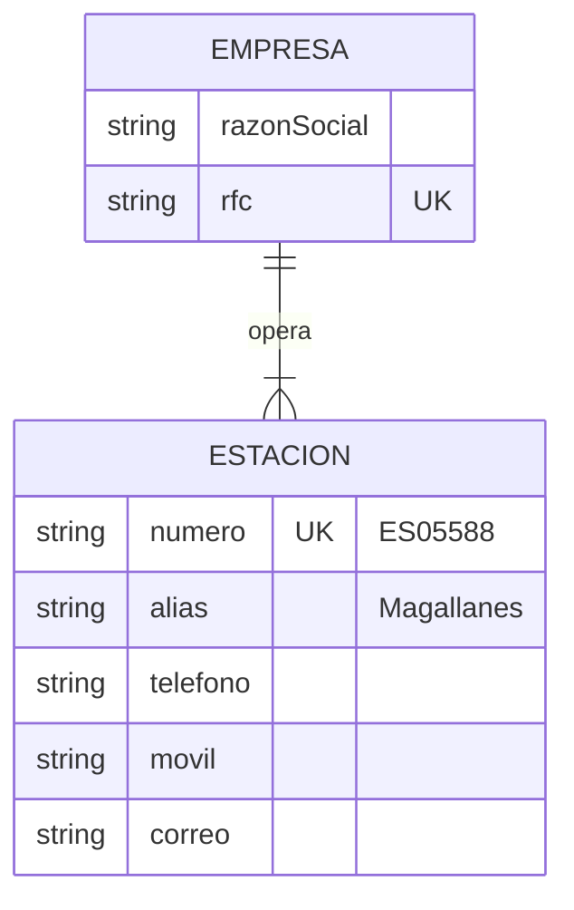

# BodeGasosur — Catálogo global de empresas y estaciones

Fuente: `Estaciones.xlsx` (**32 estaciones capturadas**, agosto 2026).

> El grupo opera alrededor de **40 estaciones**, y hay más empresas de las 21 que aparecen
> aquí. **LA HERRADURA** es una de las que faltan. El archivo es un punto de partida
> incompleto por diseño: el catálogo se completa desde el sistema, no editando el Excel.
>
> El número exacto no afecta al funcionamiento — ninguna parte del sistema depende de
> cuántas estaciones haya.

Este catálogo se declara **global para el grupo Gasosur**: lo consume BodeGasosur y
debe poder consumirlo cualquier proyecto futuro sin duplicarlo.

## 1. El hallazgo que define el modelo

El archivo trae ocho columnas: Razón Social, RFC, No. Estación, Alias, Teléfono, Móvil y
Correo. Pero **el RFC no identifica a la estación, identifica a la empresa que la opera**,
y varias estaciones comparten empresa:

| Empresa | Estaciones |
|---|---|
| SERVICIO CAYACO, S.A. DE C.V. | Cayaco 1, Cayaco 2, Cayaco 3 |
| SERVI FER, S.A. DE C.V. | Servi Fer Acapulco, Chilpofer, Tecámac |
| COMBUSTIBLES GASOSUR, S.A. DE C.V. | Chilpo 1, Chilpo 2, Cruz Grande |
| INMUEBLES PORBA, S.A. DE C.V. | Porba Acapulco, Porba México |
| SERVI BOULEVARD, S.A. DE C.V. | Boulevard Acapulco, Boulevard México |
| ALCARAZ SOBERANIS, S.A. DE C.V. | Alcaraz 1, Alcaraz 2 |
| SERVICIO LLANO LARGO, S.A. DE C.V. | El Quemado, Puerto Marquez |
| COMBUSTIBLES COYUCA, S.A. DE C.V. | Coyuca 1, Coyuca 2 |

**21 empresas operan las 32 estaciones capturadas** —ocho con dos o tres estaciones, trece con una—.

Poner el RFC en la estación repetiría el mismo dato hasta tres veces y garantizaría que
tarde o temprano queden versiones distintas del mismo RFC. El modelo correcto son dos
tablas.



> **`Empresa` es exclusivamente Gasosur.** El proveedor lleva sus propios datos fiscales y
> no apunta a este catálogo, aunque 33 renglones del Excel de proveedores compartan RFC con
> empresas del grupo. Si una de ellas debe ser proveedora algún día, se decide como caso de
> negocio, no con un vínculo opcional ([01-plan-b-produccion.md](decisiones-otros/01-plan-b-produccion.md)).

## 2. Campos

### Empresa

| Campo | Notas |
|---|---|
| `razonSocial` | Tal como aparece en el archivo. Requiere limpieza: *"ESTACION DE SERVICIO POLOTITLAN, S.A. DE C.V."* trae tabuladores al final |
| `rfc` | Único. **Normalizar sin guiones ni espacios** (ver §4) |

### Estacion

| Campo | Notas |
|---|---|
| `numero` | `ES05588`. Único, es el identificador natural del grupo |
| `alias` | *"Magallanes"*, *"Cayaco 1"*. Es el nombre principal en la operación diaria |
| `telefono` | Opcional. Tres estaciones traen **dos números separados por `/`** |
| `movil` | Opcional |
| `correo` | Opcional |
| `activa` | No viene en el archivo; se agrega para dar de baja sin borrar historia |

### Un solo alias

BodeGasosur usa **un alias por estación**: el que trae `Estaciones.xlsx`. No se modelan
alias alternativos.

El histórico del Excel usa otros nombres —`VACACIONAL`, `SAN MARCOS`, `ALBORADA`,
`PLAYAS`— que son apodos de estaciones existentes o de estaciones aún no capturadas.
**Esos nombres se resuelven con Compras y se traducen al alias oficial durante la
migración**, no se guardan como sinónimos en la base de datos.

Es la decisión correcta para este alcance: una tabla de sinónimos serviría para importar
un histórico que de todos modos hay que revisar a mano, y a cambio dejaría permanentemente
dos formas válidas de nombrar la misma estación.

Los vacíos son reales, no errores de captura: Radio Faro no tiene teléfono, móvil ni
correo, y Tecámac no tiene teléfono ni móvil. El esquema los admite como nulos.

## 3. Cómo se hace global

Recomendación: un **esquema de PostgreSQL aparte**, `catalogo_gasosur`, en la misma base
de datos, con `Empresa` y `Estacion` adentro. Prisma lo soporta con `multiSchema`.

```prisma
model Empresa {
  id          String  @id @default(uuid(7)) @db.Uuid
  razonSocial String
  rfc         String? @unique
  activa      Boolean @default(true)

  estaciones  Estacion[]

  @@schema("catalogo_gasosur")
}

model Estacion {
  id        String  @id @default(uuid(7)) @db.Uuid
  numero    String  @unique              // ES05588
  alias     String                       // "Magallanes"
  empresaId String  @db.Uuid
  telefono  String?
  movil     String?
  correo    String?
  activa    Boolean @default(true)

  empresa     Empresa      @relation(fields: [empresaId], references: [id])
  movimientos Movimiento[]
  usuarios    Usuario[]

  @@schema("catalogo_gasosur")
}
```

> El esquema completo, con el `datasource` y el resto de las tablas, vive en
> [02-modelo-de-datos.md](02-modelo-de-datos.md) §7. **Ese es el canónico**; lo de arriba
> es un extracto para leerlo en contexto.

Por qué un esquema y no otra base de datos: un proyecto futuro puede leer
`catalogo_gasosur.estacion` con una sola conexión, y BodeGasosur conserva llaves foráneas
reales contra él. Dos bases de datos obligarían a sincronizar copias, que es justo el
problema que se quiere evitar.

**Regla que lo mantiene global:** ninguna tabla de `catalogo_gasosur` apunta hacia
`public`. Las dependencias van en un solo sentido. Así el catálogo se puede extraer a su
propio servicio el día que haga falta, sin desenredar nada.

## 4. Normalización del RFC

El mismo RFC aparece escrito de dos formas entre los archivos:

- `Estaciones.xlsx` → `MAS950425A11`
- `CATALOGO PROVEDORES` → `MAS-950425-A11`

Son la misma empresa. Si se guardan tal cual, quedan dos empresas distintas y el catálogo
global nace roto.

**Regla:** el RFC se almacena en mayúsculas, sin guiones ni espacios, y esa forma
normalizada es la que lleva el índice único. Se aplica en la capa de servicios, no solo
en la pantalla, para que la importación masiva quede sujeta a la misma regla.

## 5. Pendientes de datos

1. **Faltan estaciones y empresas.** Se capturan desde el sistema conforme aparezca la
   información. También faltan teléfonos y correos de Radio Faro y Tecámac. No bloquea nada.
2. **Los destinos del histórico** son alias de estaciones existentes o estaciones aún no
   listadas. Se resuelven con la tabla de alias y completando el catálogo. La excepción
   son `PORBA` y `SERVI FER`: nombran a la empresa, no a la estación, y solo Compras
   puede decir a cuál de sus dos o tres estaciones se refería cada salida.
3. **Estaciones fuera de Guerrero.** Porba México, Boulevard México, Polotitlán, Porcla y
   Tecámac tienen lada 593/55: están en el Estado de México. Es un dato operativo
   relevante — el envío de material a esas cinco no puede funcionar igual que a las de
   Acapulco.
