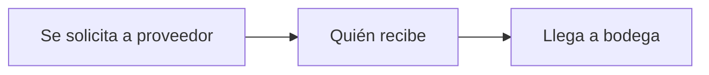

# BodeGasosur — Hallazgos del levantamiento

Consolidado de las respuestas del área de Compras y de las anotaciones de la junta de
demostración.

## 1. Fuentes

| Fuente | Contenido |
|---|---|
| `BodeGasosur - Diana.docx` | Respuestas de la Lic. Diana Damián Hernández |
| `BodeGasosur - Oscar.docx` | Respuestas del Lic. Oscar Bailón Delgado |
| Junta de demostración | Anotaciones sobre el orden real de los flujos |
| Cierre de discrepancias | Resolución de las trece diferencias entre ambos cuestionarios (§6) |
| `Estaciones.xlsx` | Catálogo de estaciones → [06-estaciones.md](06-estaciones.md) |
| `MACRO STOCK CONTROL BODEGA.xlsx` | Inventario y proveedores actuales → [07-datos-actuales.md](07-datos-actuales.md) |

## 2. Cambios al cuestionario respecto al borrador

- **Eliminada** la pregunta *"¿Cuántas estaciones surten y cómo las identifican
  internamente?"* — respondida fuera del cuestionario (§3).
- **Bloque C, entrada de material:** *"transferencia de otra empresa del grupo"* pasó a
  *"transferencia de otra estación"*, que refleja mejor la operación real.
- **Bloque C, ciclo de compra:** se agregó *"Especifica el ciclo completo"*.
- **Bloque G, integración:** de *"¿un sistema contable o ERP?"* a **CONTPAQi** por nombre.
- **Bloque G, accesos:** de *"¿Dirección o contabilidad?"* a *"¿Alguna otra área necesita
  acceso?"*, más abierta.
- **Bloque A, áreas:** se quitó *tienda/OXXO* de los ejemplos.
- Se retiraron las acotaciones que sugerían la respuesta (el *"casi siempre sí"* de la
  exportación a Excel, la nota sobre faltantes de captura en la validación de existencias).
  Fue lo correcto: sesgaban.

## 3. Estaciones

El grupo opera alrededor de **40 estaciones**. `Estaciones.xlsx` trae **32 capturadas** y
22 empresas; faltan varias, entre ellas **LA HERRADURA**. El número exacto todavía no se
conoce y no afecta al funcionamiento: nada en el sistema depende de cuántas haya.

Se identifican por **alias + número de estación + RFC**. NextPol usa solo nombre y RFC, así
que el número de estación es un dato que BodeGasosur agrega.

**Corrección importante al diseño inicial:** el RFC **no pertenece a la estación, sino a la
empresa que la opera**. Veintidós empresas operan las 32 estaciones capturadas — Servicio Cayaco tiene
tres, Servi Fer tres, Combustibles Gasosur tres. Poner el RFC en la estación lo repetiría y
acabaría con versiones divergentes del mismo dato. Van dos tablas: `Empresa` y `Estacion`.

El catálogo se declara **global para el grupo**, en su propio esquema de PostgreSQL, para
que otros proyectos de Gasosur lo consuman sin duplicarlo. Se completa desde una pantalla
del sistema, no editando el Excel. Todo el detalle en
[06-estaciones.md](06-estaciones.md).

## 4. Flujos confirmados en la junta

### Salida de material hacia estaciones

El dato clave de la junta: **en entrega y recepción no hay personas definidas**. Puede
entregar Compras, un ingeniero, el gerente que pasó por la pieza, una paquetería o un
taxi. Lo mismo del lado que recibe.

Consecuencia de diseño: `solicitadoPor` y `autorizadoPor` sí apuntan al catálogo de
`Persona` — son un grupo acotado y conocido. `entregadoA` **no puede ser una llave foránea
obligatoria**; necesita admitir texto libre. Forzar el catálogo ahí frenaría la captura
diaria.

El histórico lo confirma: en *"quién se lo lleva"* aparecen empleados de Compras,
ingenieros, personal de estación y hasta un punto físico —*"Recep. Magallanes"*—, que ni
siquiera es una persona.

**El Excel actual ya contiene los tres papeles del flujo**, aunque una columna esté mal
rotulada:

| Columna del Excel | Campo del modelo |
|---|---|
| *Diagnóstico* (en realidad, quién pidió) | `solicitadoPor` |
| *Autorizó* | `autorizadoPor` |
| *Quién se lo lleva* | `entregadoA` |

Que el 78 % de las solicitudes venga del *gerente* encaja con lo que describió Compras.

Por **D4**, se eliminan del modelo `transportista` y `vehiculo`: no hay personas asignadas
al transporte y no se registran placas.

### Entrada de material a bodega

Confirma que hoy **no hay orden de compra formal**: se pide al proveedor, alguien recibe
—en la recepción de Magallanes, en la paquetería o en una estación— y el material llega
a la bodega. Diana señala que la requisición y la orden de compra se podrían añadir
"poco a poco".

Un matiz importante: **quien recibe no siempre está en la bodega**. Recibir y que el
material llegue a bodega son dos momentos distintos, y a veces con días de diferencia.

## 5. Veredicto sobre los supuestos

| # | Supuesto | Veredicto | Qué dijeron |
|---|---|---|---|
| S1 | Varias bodegas con traspasos | ✅ **Confirmado** | Dos bodegas: **Magallanes** y **Servi Fer**, mismo tipo de material, sí se mueve entre ellas |
| S2 | Costo por promedio ponderado | ❌ **Contradicho** | Ambos: *"costo de la factura"*. Contabilidad no exige método |
| S3 | Sin lotes ni series | ✅ **Confirmado al resolverse B5** | Hay material con serie, pero se decidió **no rastrearlo**: la serie se anota como texto y nada más |
| S4 | Autorización solo como dato | ❌ **Contradicho** | Es el requisito #1: *"no permitir salida de material sin autorización"* |
| S5 | No permitir existencia negativa | ✅ **Confirmado** | Ambos: *"no dar salida si no hay existencia"* |
| S6 | Salida en un solo paso | ❌ **Contradicho** | Diana: *"cierro pendiente confirmando con el gerente si recibió"*. Oscar: *"se confirma la recepción"* |
| S7 | Una unidad de medida por artículo | ❌ **Contradicho** | Se compra en caja y se entrega en pieza **o** en caja completa |
| S8 | Sin órdenes de compra | ✅ **Confirmado por ahora** | *"Por el momento solo se registra la entrada"*, con intención de crecer |
| S9 | Solo pesos, sin impuestos | ❌ **Contradicho** | Se maneja **IVA** y se compra en **dólares** |
| S10 | Escritorio con internet | ✅ **Confirmado** | La captura ocurre en las **oficinas de Acapulco**, no en las bodegas (§9). El internet de Servi Fer deja de ser un problema |

Cuatro de diez supuestos cayeron. Dos se salvaron al aclararse los detalles: **S10** al
saberse que la captura ocurre en las oficinas de Acapulco, y **S3** al decidirse que la
serie solo se anota, no se rastrea.

Es exactamente para lo que servía la demo: cada supuesto contradicho aquí es un rediseño
que no se pagó en código, y cada uno que se salvó es trabajo que no hubo que hacer.

## 6. Discrepancias — resueltas

Cerradas con Compras en agosto de 2026. Esta es la versión que manda.

| # | Tema | Resolución |
|---|---|---|
| **A4** | Áreas destino | **Administración, mantenimiento y despacho.** Tres áreas fijas |
| **B5** | Series y lotes | Hay material con número de serie, **pero no todo**. Se decide **no rastrear** el material por serie; solo poder **anotar el número** como dato |
| **C4** | Quién recibe y captura | **Compras recibe y Compras captura.** Las estaciones no son punto de recepción |
| **C5** | Documento de entrada | **Facturas o remisiones, y sí se guardan** |
| **C6** | Material dañado o faltante | Dañado o equivocado → **devolución**. De menos → **se solicita el resto** |
| **D1** | Cómo se solicita | Llamada, WhatsApp o Teams. **No se modela**: el canal es irrelevante |
| **D3** | Quién autoriza | **Lic. Hugo, Lic. Andrea y área de Compras.** Debe ser **modificable** desde el sistema: se dan y se retiran permisos sin tocar código |
| **D4** | Transporte | **No hay personas asignadas** y **no se registran placas ni vehículo** |
| **E6** | Presupuesto | No hay presupuesto. Sí se quiere **gasto acumulado por estación** |
| **F1** | Inventario físico | Conteo en papel que luego se pasa al Excel, o captura directa en el Excel |
| **G1** | Reporte de los viernes | Inventario general: **entradas, salidas y stock final** |
| **H1** | Usuarios | Gerentes de las estaciones, área de Compras y jefes que lo soliciten. **Número variable por diseño** |
| **H2** | Dispositivos | **Computadora y celular** |

### 6.1 Consecuencias de diseño

**B5 es la mejor noticia del levantamiento.** Poder *anotar* un número de serie es un campo
de texto en la partida. *Rastrear* por serie habría obligado a capas de costo por unidad y
a un kardex por pieza individual. Es la diferencia entre un campo y un rediseño completo,
y se optó por el campo.

**D3 obliga a que los permisos sean datos.** No se puede codificar "Hugo, Andrea y
Compras" en el programa: hicieron explícito que la lista cambia. Se necesita una pantalla
de usuarios donde se marque quién puede autorizar.

El sistema queda con **cinco roles**: Superadmin, Admin, Compras, Jefe y Gerente. La
diferencia entre los dos primeros es que solo el Superadmin puede escribir en `Empresa` y
`Estacion` — el Admin las consulta. La matriz completa está en
[`fases-siguientes.md`](../fases-siguientes.md), fase 3.

La facultad de autorizar es **independiente del rol**: es una bandera del usuario, así que
un Jefe puede tenerla y un Admin puede no tenerla.

**D4 simplifica la salida.** Se eliminan del modelo `transportista` y `vehiculo`. Lo que
sí se conserva es **quién se lleva el material**, que es lo que registran hoy.

**H2 revierte lo dicho en §9.** Aunque la captura se opera desde las oficinas de Acapulco,
piden celular explícitamente. El diseño debe ser responsivo desde el inicio — más barato
que adaptarlo después.

**H1 confirma que los permisos van por rol, no por lista de personas.** Un gerente nuevo
no puede requerir intervención del desarrollador.

## 7. Cambios al modelo de datos que se derivan

Ordenados por cuánto arrastran.

### 7.1 Costeo por capas, no por promedio (de S2 + S3)

Piden el costo de la factura, no un promedio del almacén. Eso saca el costo de la ficha
del artículo y lo lleva a **capas de entrada**: cada compra crea una capa con su costo, y
cada salida consume capas heredando el costo real.

Al resolverse **B5** —no se rastrea por serie— las capas se consumen por **PEPS**: sale
primero lo que entró primero. Es lo más cercano al *"costo de la factura"* que se puede
lograr sin identificar pieza por pieza, y como contabilidad no exige método (E2), no hay
nada que contradiga.

**PEPS confirmado.** Compras lo eligió aunque contabilidad no exija método alguno: da
mejor control, porque cada salida conserva el costo real de la compra de la que salió.

**El inventario se valúa de las dos formas:** subtotal sin IVA y total con IVA. Son dos
columnas del mismo reporte, no una alternativa entre dos. Por eso cada costo se guarda por
partida doble en el modelo.

**Y arranca vacío.** Se decidió no capturar a mano el costo de los 225 artículos migrados
(ver [07-datos-actuales.md](07-datos-actuales.md) §3): cada artículo adquiere costo la
primera vez que se registre una entrada suya. Hasta entonces figura sin valuar.

### 7.2 Moneda e impuestos (de S9)

Cada entrada necesita: `moneda` (MXN/USD), `tipoCambio` aplicado, subtotal, IVA e importe
total. El costo en inventario se guarda **en pesos al tipo de cambio de la entrada** — así
el valor del inventario no baila con el dólar de hoy.

### 7.3 Autorización como flujo, no como campo (de S4)

Esto revierte la decisión de *"sin roles por ahora"*. La respuesta a *"¿qué NO debe hacer
el sistema?"* fue idéntica en ambos cuestionarios: no permitir salidas sin autorización.
Un campo de texto no lo garantiza; hacen falta usuarios, roles y estados.

Estados de la salida: `SOLICITADA → AUTORIZADA → ENTREGADA → RECIBIDA`, con
`RECHAZADA` y `CANCELADA` como salidas del flujo.

### 7.4 Confirmación de recepción (de S6)

El estado `RECIBIDA` es lo que Diana llama *"cerrar el pendiente"*. Debe existir una
bandeja de salidas entregadas pendientes de confirmar — hoy eso vive en su cabeza y en
conversaciones de WhatsApp.

### 7.5 Empaque: caja y pieza (de S7)

El artículo necesita `piezasPorCaja`. La existencia se lleva **siempre en la unidad
base** (pieza) y la captura permite elegir caja o pieza, convirtiendo al vuelo.

### 7.6 Número de serie: un campo, no un rastreo (de B5)

Hay material con número de serie, pero no todo, y se decidió **no rastrearlo**. La serie
se **anota** en la partida como texto libre y ahí termina.

Es la resolución más barata del levantamiento. Rastrear por serie habría obligado a llevar
existencia por unidad individual y un kardex por pieza; anotarla es una columna de texto.

De las *"versiones viejas obsoletas y actualizadas"* que menciona Diana se encarga el
catálogo de artículos: son artículos distintos, y basta poder marcar uno como inactivo sin
borrar su historia — que es lo que ya hace la baja lógica.

### 7.7 Empresas y estaciones (de §3)

Se parte en dos tablas, en un esquema global del grupo:

- `Empresa` — `razonSocial`, `rfc` único normalizado sin guiones
- `Estacion` — `numero` único (ES05588), `alias`, `telefono`, `movil`, `correo`, `activa`

Un solo alias por estación, el del archivo. Se elimina `clave`, y el RFC se va a `Empresa`
porque hasta tres estaciones lo comparten. Detalle en [06-estaciones.md](06-estaciones.md).

### 7.8 Préstamos y devoluciones

Dos flujos que el modelo actual no contempla:

- **Préstamo con retorno** — Diana menciona un compresor que entra y sale; Oscar confirma
  que en ocasiones se presta y regresa. Necesita un movimiento que quede *abierto* hasta
  que el material vuelva.
- **Devolución de estación a bodega** — poco frecuente pero real, por pieza equivocada o
  no utilizada.

### 7.9 Entregas parciales

Ambos confirman que ocurren. Una compra puede generar varias entradas y hay que poder
ver qué falta por llegar. Encaja bien con la orden de compra que Diana quiere "poco a
poco": es el momento natural para introducirla.

## 8. Requerimientos nuevos que no estaban contemplados

| Requerimiento | Fuente | Nota |
|---|---|---|
| Alertas de stock mínimo **por WhatsApp** | Ambos | Requiere un proveedor de mensajería; conviene empezar por pantalla y correo |
| Pantalla de alta y edición de estaciones | Levantamiento | El catálogo llega incompleto (32 de 34) y se completa desde el sistema |
| Reporte semanal al Lic. Hugo, **cada viernes** | Ambos | Por **G1**: inventario general con entradas, salidas y stock final |
| Exportación a Excel | Ambos | En todos los listados y reportes |
| Migración del histórico en Excel | Ambos | Archivo recibido y analizado en [07-datos-actuales.md](07-datos-actuales.md) |
| Inventario físico cada 2–3 meses | Ambos | Hoy se cuenta en papel y se pasa al Excel (**F1**). Necesita hoja de conteo imprimible y captura de diferencias |
| Gasto acumulado por estación | Diana | Confirmado en **E6**. Sin presupuesto contra el cual comparar, solo el acumulado |
| Frecuencia de consumo por pieza | Diana | Es lo que usan para decidir stock mínimo y para detectar fallas repetidas |

**Fuera de alcance:** Diana describió querer saber *"quién diagnosticó, en dónde se
colocó la pieza y en qué fecha"*. Eso es historial de mantenimiento por dispensario y
**se descarta por completo**: BodeGasosur lleva control de inventario y nada más.

Al revisar el Excel resultó que **no se pierde ningún dato**. La columna rotulada
*Diagnóstico* no registra un diagnóstico técnico: registra **quién solicitó el material**,
y se conserva como `solicitadoPor`. Nunca hubo información de mantenimiento en el archivo.

Sí se conserva lo que sigue siendo inventario puro: a qué estación y a qué área se envió
cada pieza, quién la solicitó, quién la autorizó y con qué frecuencia se consume.

## 9. Dónde se opera el sistema

**El control de inventario no se lleva en las bodegas.** Se lleva en las oficinas de
Gasosur, en Acapulco, Costera Miguel Alemán, edificio Costera W.

Esto cancela el que parecía el mayor riesgo técnico del proyecto. Que Servi Fer no tenga
internet estable deja de importar: nadie captura desde ahí. La aplicación web con
conexión permanente es suficiente, y **no hace falta modo sin conexión** — que era, por
mucho, lo más caro de todo lo que había salido del levantamiento.

Queda una sola actividad que sí ocurre físicamente en la bodega: el **inventario físico
cada 2–3 meses**. Se resuelve imprimiendo la hoja de conteo desde el sistema y capturando
las diferencias al regresar a la oficina. No requiere nada especial.

Lo que **no** cambia es el diseño responsivo: al resolverse **H2**, Compras pidió
computadora **y** celular. Aunque la captura se opere desde la oficina, las pantallas
deben funcionar en ambos desde el inicio — adaptarlas después sale más caro.

## 10. Impacto en el plan de fases

El orden original sigue siendo válido; cambia el contenido de cada fase. El desglose
completo está en [`fases-siguientes.md`](../fases-siguientes.md), en la raíz del proyecto.

Los tres ajustes de fondo:

- **Los usuarios y permisos se adelantan.** Dejaron de ser opcionales y bloquean la fase de
  salidas: no se puede construir *"no permitir salida sin autorización"* sin saber quién es
  quien captura.
- **Las entradas nacen completas.** Moneda, tipo de cambio, IVA y capas de costo desde el
  primer día. Agregarlos después obligaría a recalcular todo lo capturado.
- **La migración se parte en dos.** Catálogos y existencia inicial pueden hacerse ya;
  el histórico de movimientos queda al final y como tarea aparte, porque depende de que
  Compras aclare a qué estación se refieren `PORBA` y `SERVI FER` en cada salida.

## 11. Preguntas abiertas

Todo lo del levantamiento quedó cerrado. Lo que sigue pendiente salió del análisis de los
archivos y de decisiones que aún no se toman:

| Pregunta | Bloquea |
|---|---|
| ¿Qué monto o tipo de pieza obliga a pedir autorización del Lic. Hugo? | Fase de salidas |
| Cuando se entrega a *"recepción de la estación"*, ¿el área que consume se sabe en ese momento o después? | Fase de salidas |
| ¿A qué estación exacta se refieren `PORBA` y `SERVI FER` en cada salida del histórico? | Migración del histórico, únicamente |
| Datos de las estaciones y empresas faltantes | Nada: se capturan desde el sistema cuando aparezcan |
