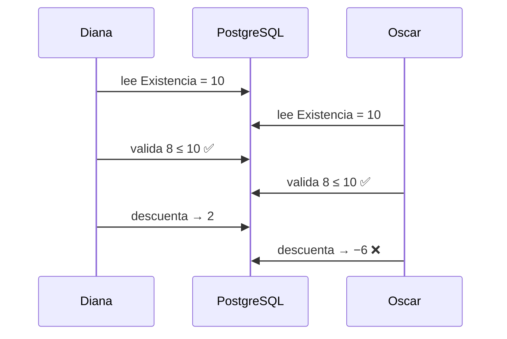

# BodeGasosur — Auditoría de arquitectura

Revisión de la arquitectura, el modelo de datos, el stack y la política de despliegue,
hecha sobre los documentos [01](01-arquitectura.md)–[08](08-versionado-y-despliegue.md),
sobre [`fases-siguientes.md`](../fases-siguientes.md) y sobre el código de la demo
(`v0.1.0`). Agosto de 2026.

> **Qué es y qué no es este documento.** No propone funcionalidad nueva ni reabre lo que
> Compras pidió: eso está cerrado en [05-hallazgos](05-hallazgos-levantamiento.md). Revisa
> una sola cosa: **si las decisiones técnicas ya tomadas sostienen lo que prometen.**
>
> **Los hallazgos ya se resolvieron uno por uno.** Cada uno se discutió y se decidió; la
> columna *Estado* de §3 dice en qué quedó. Los que tocaban el esquema se aplicaron en la
> `v0.2.0`, regenerando la migración inicial. El texto de los hallazgos se conserva **tal
> como se escribió**, sin corregirlo a posteriori: sirve para entender por qué el sistema
> está como está, y en dos casos —**B3** y **F2**— la propia discusión encontró que la
> recomendación original no se sostenía.

## 0. En qué quedó

| | |
|---|---|
| **Resueltos en la `v0.2.0`** | A1, A2, A3, A4, A5, C3, E4, F1, F2, F4, F6 — están en el esquema y en [`prisma/sql/`](../prisma/sql/) |
| **Decididos, se construyen en su fase** | B1, B2, B3, B4, C1, C2, F3, F5 |
| **Abiertos** | D1, D2, D3, D4, D5, E1, E2, E3 — operación y despliegue, en la tabla transversal de [`fases-siguientes.md`](../fases-siguientes.md) |
| **Decidido no hacerlo** | La parte de **F4** que pedía conservar `claveAnterior`: los códigos viejos no se guardan en la base, se mapean en la migración de datos |

Dos correcciones que salieron de discutir los hallazgos y que la auditoría no había visto:

- **B3(a) no es compatible con F2.** La auditoría recomienda impedir una entrada fechada
  antes del último consumo, y llama a esa opción *«la honesta y la barata»*. Pero un
  traspaso inserta en el destino una capa con la fecha de la entrada original, casi siempre
  anterior a lo ya consumido ahí: aplicar la validación a todas las capas bloquearía casi
  todos los traspasos. La consecuencia real es que **§3.2 tenía que corregirse de todos
  modos**, y esa única corrección —*el recálculo verifica cantidades, no costos*— cierra
  **B3**, **F2** y **F3** a la vez.
- **E4 se queda corto en dos puntos.** Dice que `DateTime` es `timestamptz`: no lo es,
  Prisma genera `TIMESTAMP` **sin zona**. Y corrige solo la escritura: al leer una columna
  `date`, formatearla en hora de México la recorre un día hacia atrás, así que la zona
  correcta para mostrarla es **UTC** y la de un instante es `America/Mexico_City`. Ver
  [01 §4.5](01-arquitectura.md).

## 1. Método

Se revisó documentación y código buscando tres cosas, en este orden:

1. **Contradicciones internas** — dónde un documento promete algo que otro impide.
2. **Invariantes sin quien los haga cumplir** — reglas escritas en prosa que nada verifica.
3. **Decisiones faltantes** — huecos que hoy no duelen porque nadie ha llegado a ellos.

No se revisó la interfaz, la accesibilidad ni el rendimiento: a esta escala no son riesgo.
Lo que sí se revisó es todo lo que queda grabado en el esquema o en los datos, porque es lo
único que después no se puede cambiar barato. Ver §12 para el alcance completo.

## 2. Veredicto

La documentación está por encima del promedio de la industria y eso condiciona la lectura
de lo que sigue. El levantamiento registra los supuestos que se cayeron en vez de
esconderlos, las decisiones vienen con su porqué, y la separación entre *«esto es el
destino»* y *«esto es el código actual»* está declarada donde corresponde. **Ninguno de los
hallazgos es un error de negligencia.** Casi todos son cosas que todavía no se han escrito.

Dicho eso, hay un patrón que atraviesa la mitad de la lista y conviene nombrarlo antes que
los hallazgos individuales:

> **Los once invariantes de [02 §4](02-modelo-de-datos.md#4-invariantes) están escritos en
> español y ninguno está escrito en la base de datos.** Todos dependen de que la capa de
> servicios sea el único escritor — y no lo será: la migración de la fase 4 escribe
> directo, `prisma studio` escribe directo, y cualquier script futuro también.

El segundo patrón es más corto de enunciar: **el sistema está diseñado para un solo usuario
a la vez.** Nada en los documentos menciona qué pasa cuando dos capturas coinciden, y las
tres operaciones centrales —consumir capas PEPS, descontar existencia y tomar folio— son
carreras clásicas.

## 3. Resumen

| #      | Hallazgo                                                                             | Severidad   | Corregir antes de |
| ------ | ------------------------------------------------------------------------------------ | ----------- | ----------------- |
| **A1** | El inventario migrado sin costo rompe el invariante 9 y deja a PEPS sin capas        | **Crítico** | Fase 2            | ✅ `v0.2.0` |
| **A2** | `autorizadoPor` apunta a `Persona`, no a `Usuario`: el requisito #1 no queda probado | **Crítico** | Fase 2            | ✅ `v0.2.0` |
| **A3** | No hay bitácora: el libro contable no dice quién escribió                            | Alto        | Fase 2            | ✅ `v0.2.0` |
| **A4** | Un solo enum de estatus para dos máquinas de estados distintas                       | Medio       | Fase 2            | ✅ `v0.2.0` |
| **A5** | `Movimiento` es una tabla-dios con todo nullable y la base no valida nada            | Alto        | Fase 2            | ✅ `v0.2.0` |
| **B1** | PEPS, existencia no negativa y folio son tres carreras sin resolver                  | **Crítico** | Fase 5            | Decidido — fase 5 |
| **B2** | Sin idempotencia: doble clic duplica el movimiento                                   | Alto        | Fase 5            | Decidido — fase 5 |
| **B3** | La fecha retroactiva rompe el orden PEPS y contradice §3.2                           | Alto        | Fase 5            | ✅ decidido (ver §0) |
| **B4** | Transacción interactiva con locks sobre serverless con pooler                        | Medio       | Despliegue        | Decidido — fase 5 |
| **C1** | La fase 3 no tiene stack de autenticación decidido                                   | Alto        | Fase 3            | ✅ **Clerk** integrado |
| **C2** | Las Server Actions son endpoints públicos y hoy no verifican nada                    | **Crítico** | Fase 3            | ✅ `accionProtegida` |
| **C3** | El catálogo compartido no tiene control de acceso a nivel de base                    | Medio       | Fase 2            | ✅ `v0.2.0` |
| **C4** | Datos personales reales versionados en git                                           | Bajo        | Cuando se decida  | ✅ decidido: diferido con disparador |
| **D1** | Vercel Pro + Supabase Pro: la opción más cara y la que peor encaja                   | Medio       | `v1.0.0`          | Abierto — antes de `v1.0.0` |
| **D2** | Respaldos sin RPO/RTO ni prueba de restauración                                      | Alto        | `v1.0.0`          | Abierto — antes de `v1.0.0` |
| **D3** | `prisma migrate deploy` dentro del build                                             | Medio       | Despliegue        | Abierto — al desplegar |
| **D4** | No hay CI y el ritual de versionado es manual                                        | Medio       | Ya                | Abierto — cuanto antes |
| **D5** | Cero observabilidad                                                                  | Bajo        | `v1.0.0`          | Abierto — antes de `v1.0.0` |
| **E1** | Vitest y `lib/services/` documentados pero inexistentes                              | Alto        | Ya                | Parcial: marcado como planeado |
| **E2** | Cuatro dependencias instaladas sin usar, una contradice la arquitectura              | Bajo        | Ya                | Abierto |
| **E3** | Sin decisión de stack para impresión y exportación, ambas confirmadas                | Medio       | Fase 6            | Abierto — bloquea la fase 6 |
| **E4** | Zona horaria: el error más probable de todo el sistema                               | Alto        | Fase 2            | ✅ `v0.2.0` |
| **F1** | Cinco roles es más de lo que el levantamiento sostiene                               | Medio       | Fase 3            | ✅ tres roles |
| **F2** | Traspaso y devolución subespecificados justo donde PEPS se rompe                     | Alto        | Fase 2            | ✅ `v0.2.0` |
| **F3** | «Cancelar y recapturar» no es reversible bajo PEPS sin una regla                     | Medio       | Fase 7            | ✅ decidido (ver §0) |
| **F4** | Claves de negocio en la URL, sin declararlas inmutables                              | Medio       | Fase 2            | ✅ `v0.2.0`, sin `claveAnterior` |
| **F5** | No hay plan de corte del Excel al sistema                                            | Medio       | Fase 4            | Decidido — fase 4 |
| **F6** | Índices que la fase 8 va a pedir y que el esquema de destino perdió                  | Bajo        | Fase 8            | ✅ índices; lo demás diferido |

---

## 4. Bloque A — Contradicciones del modelo

Son cambios de esquema. Hoy son una migración; después de la `v1.0.0`, una MAYOR con plan
de migración y datos reales adentro ([08 §5](08-versionado-y-despliegue.md#5-las-reglas)).

### A1 — El inventario migrado sin costo rompe el invariante 9 y deja a PEPS sin capas

[02 §4](02-modelo-de-datos.md#4-invariantes) declara el invariante 9: `SUM(cantidadRestante)`
de las capas de un artículo/bodega es igual a `Existencia.cantidad`, y hay un comando que lo
verifica. Tres secciones después, [02 §5](02-modelo-de-datos.md#5-costeo-por-capas-consumidas-por-peps)
decide que las existencias iniciales entran como `AJUSTE` **sin capa**.

Los 225 artículos migrados nacen violando el invariante, y el comando que lo verifica
reporta falla desde el primer día.

Peor es la consecuencia operativa. La primera `SALIDA` de un artículo no valuado encuentra
existencia 40 y capas 0. PEPS no tiene qué consumir, y solo hay dos desenlaces posibles:

- **Bloquear la salida** — contradice el invariante 6, que Compras confirmó por escrito y
  por separado (*«no dar salida si no hay existencia»*, y aquí sí la hay).
- **Consumir nada y descontar existencia** — a partir de ahí existencia y capas divergen en
  silencio, permanentemente, sin que nadie se entere.

Ninguno de los dos está escrito. El sistema va a hacer uno de los dos por accidente.

**Corrección.** Toda cantidad que entra crea capa, **siempre**. La capa del ajuste inicial
lleva `costoUnitario` nulo:

```prisma
model CapaCosto {
  /// Nulo = no se conoce el costo (inventario migrado). Distinto de cero.
  costoUnitario       Decimal? @db.Decimal(14, 4)
  costoUnitarioConIva Decimal? @db.Decimal(14, 4)
}
```

Nulo no es cero: *«no sé cuánto costó»* y *«costó nada»* son afirmaciones distintas y el
reporte de valuación tiene que poder distinguirlas. Con esto el invariante 9 se cumple
universalmente, PEPS siempre encuentra de dónde consumir, y la valuación puede decir
*«1,240 piezas sin valuar»* en vez de mentir con un total.

### A2 — `autorizadoPor` apunta a `Persona`, no a `Usuario`

El requisito número uno del sistema es *«no permitir salida sin autorización»*. El permiso
vive en `Usuario.puedeAutorizar`. Pero `Movimiento.autorizadoPorId` apunta a `Persona`, y
`Persona` no tiene bandera.

Se puede registrar una autorización a nombre de alguien que nunca tuvo el permiso. Y no hay
`autorizadoEn`, así que tampoco se sabe cuándo ocurrió — lo cual importa porque la bandera
es editable: saber *«¿lo tenía cuando autorizó?»* exige la fecha del acto.

**Corrección.**

```prisma
model Movimiento {
  /// Quién solicitó: puede no tener cuenta en el sistema (el gerente de la estación).
  solicitadoPorId       String?   @db.Uuid   // → Persona, se queda igual
  /// Quién autorizó: obligatoriamente un usuario con la facultad. Escritura única.
  autorizadoPorUsuarioId String?  @db.Uuid   // → Usuario
  autorizadoEn           DateTime?
}
```

La transición a `AUTORIZADA` valida `puedeAutorizar` en ese instante, dentro de la misma
transacción, y ambas columnas son de escritura única.

### A3 — No hay bitácora: el libro contable no dice quién escribió

[01 §3.1](01-arquitectura.md#31-el-movimiento-es-un-libro-contable-no-un-registro-editable)
promete responder *«¿por qué esta salida cambió de 40 a 10 piezas?»*. El modelo responde
**qué** cambió. No responde **quién** ni **cuándo**: `Movimiento` no tiene `creadoPorId`,
`confirmadoPorId`, `entregadoEn`, `recibidoEn` ni `canceladoPorId`.

Hay un caso más grave. `puedeAutorizar` es una bandera editable — esa fue una decisión
deliberada y correcta ([05 §6.1](05-hallazgos-levantamiento.md#61-consecuencias-de-diseño)).
Pero si alguien se la quita a la C.P. Cosumel, no queda rastro de que la tuvo. **El permiso
más importante del sistema es el único dato sin historia.**

**Corrección.** Dos piezas:

1. Actor y marca de tiempo por cada transición de `Movimiento`.
2. Una tabla `Bitacora` append-only —`tabla`, `registroId`, `accion`, `usuarioId`,
   `antes jsonb`, `despues jsonb`, `fecha`— alimentada desde una **extensión de Prisma
   Client** o un **trigger de PostgreSQL**, no desde cada servicio a mano. Escribirla a
   mano garantiza que tarde o temprano se olvide justo en la operación que importaba.

### A4 — Un solo enum de estatus para dos máquinas de estados distintas

`EstatusMovimiento` mezcla el flujo de entrada, traspaso, devolución y ajuste
(`BORRADOR → CONFIRMADO`) con el de salida
(`SOLICITADA → AUTORIZADA → ENTREGADA → RECIBIDA`). Nada en la base impide un
`tipo = ENTRADA, estatus = AUTORIZADA`.

**Corrección.** Un `CHECK` sobre `(tipo, estatus)` en SQL a mano, más una tabla de
transiciones legales en la capa de servicios:

```ts
const TRANSICIONES: Record<TipoMovimiento, Partial<Record<Estatus, Estatus[]>>> = {
  SALIDA: {
    SOLICITADA: ["AUTORIZADA", "RECHAZADA", "CANCELADO"],
    AUTORIZADA: ["ENTREGADA", "CANCELADO"],
    ENTREGADA:  ["RECIBIDA"],
  },
  ENTRADA: { BORRADOR: ["CONFIRMADO", "CANCELADO"] },
  // …
};
```

Que la transición ilegal sea un error de tipos, no una convención que se respeta mientras
alguien se acuerde.

### A5 — `Movimiento` es una tabla-dios con todo nullable, y la base no valida nada

[01 §4.2](01-arquitectura.md#42-stack-concreto) justifica PostgreSQL por *«transacciones
serias, `NUMERIC` exacto para dinero, constraints reales»*. El esquema de destino no tiene
prácticamente ninguna constraint. Es el patrón general del §2 en su forma más concreta.

**Corrección.** SQL a mano en las migraciones, que Prisma conserva porque vive en los
archivos de migración y no en el `schema.prisma`:

| Invariante | Constraint |
|---|---|
| ENTRADA ⇒ destino y proveedor no nulos, origen nulo | `CHECK` por tipo |
| SALIDA ⇒ origen y estación no nulos | `CHECK` por tipo |
| Traspaso entre bodegas distintas (inv. 5) | `CHECK (bodegaOrigenId <> bodegaDestinoId)` |
| Existencia nunca negativa (inv. 6) | `CHECK (cantidad >= 0)` |
| Capa consistente (inv. 9) | `CHECK (cantidadRestante BETWEEN 0 AND cantidadInicial)` |
| Cantidad positiva (inv. 3) | `CHECK (cantidad > 0)` |
| Costo con IVA ≥ sin IVA (inv. 11) | `CHECK (costoUnitarioConIva >= costoUnitario)` |
| `estacionId` obligatorio solo si `rol = GERENTE` | `CHECK` |
| Moneda y tipo de cambio solo en ENTRADA | `CHECK` |

Conviene anotar en la fase 2 que `prisma migrate dev` genera el diff y **el SQL se agrega a
mano al archivo generado**. Es la única parte del flujo de Prisma que no es automática y la
que se olvida.

---

## 5. Bloque B — Concurrencia

### B1 — Tres carreras clásicas sin resolver



Dos salidas simultáneas del mismo artículo y bodega: ambas leen existencia 10, ambas
validan bien, ambas consumen la misma capa. Resultado: existencia negativa y
`cantidadRestante` negativo. **El invariante 6 —el que Diana y Oscar confirmaron por
separado— se rompe sin que nadie haga nada mal.**

Lo mismo con `Folio.siguiente`: leer y después escribir produce folios duplicados, y el
folio tiene índice único, así que la segunda captura falla con un error incomprensible.

**Corrección.** Una regla arquitectónica, escrita con el mismo peso que las cuatro de
[01 §3](01-arquitectura.md#3-principios-rectores):

> **Toda mutación de existencia empieza bloqueando la fila de `Existencia`** con
> `SELECT … FOR UPDATE`. Esa fila es el candado natural por artículo y bodega. Después se
> leen las capas ordenadas, también `FOR UPDATE`.

El folio se toma con una sola sentencia, dentro de la misma transacción:

```sql
UPDATE folio SET siguiente = siguiente + 1 WHERE tipo = $1 RETURNING siguiente;
```

Nunca leer y luego escribir.

**Decisión pendiente que sale de aquí:** ¿el folio reinicia cada año? (`E-2026-00001`). En
la práctica mexicana casi siempre sí, y es un cambio de dato, no de formato.

### B2 — Sin idempotencia: doble clic duplica el movimiento

Las Server Actions son endpoints POST. Un usuario impaciente con una conexión lenta es el
caso normal, no el borde.

**Corrección.** Las transiciones son actualizaciones condicionales, y se verifica el número
de filas afectadas:

```ts
const { count } = await tx.movimiento.updateMany({
  where: { id, estatus: "BORRADOR" },
  data:  { estatus: "CONFIRMADO", folio, confirmadoPorId, confirmadoEn: ahora },
});
if (count !== 1) throw new ErrorTransicion("El movimiento ya no está en borrador.");
```

Para el alta, una llave de idempotencia generada al renderizar el formulario.

### B3 — La fecha retroactiva rompe el orden PEPS y contradice §3.2

`fecha` es la del hecho real y la captura viene después — los propios documentos señalan que
recibir y que el material llegue a bodega son momentos distintos, *«a veces con días de
diferencia»* ([05 §4](05-hallazgos-levantamiento.md#4-flujos-confirmados-en-la-junta)).

PEPS ordena por `CapaCosto.fecha`. Registrar hoy una entrada fechada la semana pasada
inserta una capa **en el pasado**, que debió consumirse antes que otras ya consumidas. Los
costos congelados de esas salidas ya no coinciden con lo que daría un recálculo.

Eso choca con [01 §3.2](01-arquitectura.md#32-la-existencia-es-un-resultado-no-una-fuente-de-verdad),
que promete que todo *«siempre debe poder recalcularse desde cero»*.

**Corrección.** Elegir una y escribirla:

- **(a)** PEPS ordena por `(fecha, id)` y el sistema **impide** una entrada fechada antes
  del último consumo de ese artículo y bodega. Es una validación de diez líneas.
- **(b)** Se permite, y §3.2 se corrige para decir que el recálculo verifica **cantidades,
  no costos**.

La (a) es la honesta y la barata. Lo que no se puede es dejar la promesa como está.

### B4 — Transacción interactiva con locks sobre serverless con pooler

La consumición PEPS es una transacción interactiva que mantiene tomada una conexión del
pool, con filas bloqueadas, durante varios viajes de ida y vuelta — en una función que puede
arrancar en frío o agotar su tiempo a la mitad.

**Corrección.** Todo el consumo PEPS en **un solo viaje**: una función de PostgreSQL
(`consumir_peps(bodega, articulo, cantidad)`) o un CTE, invocada con `$queryRaw` dentro de
la transacción. Beneficio lateral y mayor que el original: es el único lugar donde la
lógica de inventario no se puede saltar, que es justo el supuesto que **A5** no sostiene.

---

## 6. Bloque C — Seguridad

### C1 — La fase 3 no tiene stack de autenticación decidido

`Usuario.hash` es el único rastro de una decisión. Falta: estrategia de sesión, algoritmo de
hash, recuperación de contraseña, bloqueo por intentos fallidos y —la que decide— **la
revocación**.

`puedeAutorizar` es editable. Si el permiso viaja dentro de un JWT, quitárselo a alguien no
surte efecto hasta que el token expire. Para el permiso que es el requisito #1 del sistema,
eso no es aceptable.

**Corrección propuesta.** Sesiones en base de datos (tabla `Sesion`, token opaco en cookie
`httpOnly`) + **argon2id**. Para ~10 usuarios sin OAuth son unas 150 líneas, cero riesgo de
dependencia, revocación inmediata y bitácora de accesos de regalo. Auth.js v5 también
sirve; lo que no sirve es llegar a la fase 3 sin haberlo decidido.

**Lo que se hizo — fase 3.** No fue esa. Se eligió **Clerk**, y `Usuario.hash` ya no
existe: la fila guarda `clerkUserId` y nada más ([01 §3.6](01-arquitectura.md)). El
argumento de la revocación se resolvió por otro lado y sigue en pie: `rol` y
`puedeAutorizar` **nunca** se copian a los claims, se leen de PostgreSQL en cada petición,
así que quitar la bandera surte efecto en la siguiente. Lo que Clerk se lleva es lo que no
daba valor y sí riesgo: contraseñas, sesiones, expiración, límite de intentos y
recuperación.

### C2 — Las Server Actions son endpoints públicos y hoy no verifican nada

`actions.ts` escribía en cualquier catálogo sin una sola comprobación. Era correcto para una
demo y dejaba de serlo en la fase 3.

Y hay que decirlo explícitamente porque es el error más frecuente del App Router: **el
middleware de Next.js no es una frontera de autorización.** Cada acción de servidor es una
URL propia, invocable directamente; el middleware es enrutamiento, no control de acceso.
CVE-2025-29927 fue exactamente esa clase de defecto.

**Corrección.** Que olvidar la verificación sea un error de compilación, no un descuido de
revisión. No un `requerirUsuario()` al principio de cada función —eso se olvida—, sino que
la única forma de obtener un cliente de escritura sea a través del permiso:

```ts
export const escribirCatalogo = accionProtegida(
  ([slug]) => catalogoPorSlug(slug).permisoEscritura,
  async (tx, usuario, slug, id, datos) => { /* … */ },
);
```

**Lo que se hizo — fase 3.** Eso, y con el mecanismo completo: `lib/db.ts` dejó de exportar
el cliente de Prisma y una regla de ESLint cierra `src/app/`, así que no hay a qué llamarle
sin pasar por el permiso. El permiso no es fijo: sale de la definición del catálogo, porque
escribir `Empresa` exige `catalogos:globales:escribir` y escribir `Bodega` no. Leer va por
`consultar()`, en una transacción `READ ONLY` que PostgreSQL hace cumplir.

### C3 — El catálogo compartido no tiene control de acceso a nivel de base

[08 §8](08-versionado-y-despliegue.md#la-seguridad-no-se-delega) dice que Prisma se conecta
con un rol privilegiado y que por eso RLS no protege nada. Correcto **para BodeGasosur**.
Pero el propósito entero de `catalogo_gasosur` es que otros proyectos del grupo se conecten
directo ([06 §3](06-estaciones.md#3-cómo-se-hace-global)). ¿Con qué rol lo hacen? Si es el
mismo, cualquiera de esos proyectos puede escribir el catálogo global, y se cae la regla de
[01 §3.3](01-arquitectura.md#33-la-autorización-es-un-permiso-y-la-lista-de-quién-lo-tiene-es-un-dato)
de que solo el Superadmin lo escribe.

**Corrección, que además resuelve el pendiente de
[08 §10](08-versionado-y-despliegue.md#10-pendiente-versionar-el-contrato-compartido) sin
trabajo extra:** exponer el catálogo por **vistas versionadas** y otorgar `SELECT` sobre las
vistas a un rol dedicado.

```sql
CREATE VIEW catalogo_gasosur.v_estacion_v1 AS
  SELECT id, numero, alias, "empresaId", activa FROM catalogo_gasosur."Estacion";

CREATE ROLE lector_catalogo;
GRANT USAGE  ON SCHEMA catalogo_gasosur TO lector_catalogo;
GRANT SELECT ON catalogo_gasosur.v_estacion_v1 TO lector_catalogo;
```

Con eso se puede renombrar una columna física sin romper software ajeno —que es literalmente
lo que §10 anticipa que hará falta— y la escritura es imposible por construcción, no por
acuerdo. Las vistas y los `GRANT` van en migraciones a mano.

### C4 — Datos personales reales versionados en git

`docs/*.xlsx` y `docs/*.docx` traen nombres, teléfonos y correos de 137 proveedores y de
empleados identificados. El [`.gitignore`](../.gitignore) documenta la decisión de
versionarlos, así que fue deliberada.

El repositorio es privado hoy y eso basta por ahora. Pero el historial de git es permanente:
un cambio a público o un colaborador añadido lo expone, y quitarlo después exige reescribir
historia. Es dato personal de personas identificadas, regulado por la LFPDPPP.

**Corrección.** Decidirlo conscientemente, no por omisión. O el repositorio se queda privado
para siempre y eso queda por escrito, o los archivos fuente se mueven a un drive compartido
y en `docs/` se queda el análisis derivado — que es donde está el valor de todos modos.

---

## 7. Bloque D — Despliegue y operación

### D1 — Vercel Pro + Supabase Pro es la opción más cara y la que peor encaja con esta carga

Alrededor de 45 USD al mes, y Vercel Pro se cobra **por asiento**. A cambio, ¿qué compra el
serverless aquí? Escalado elástico que no se necesita y presencia global que tampoco: todos
los usuarios están en una oficina en Acapulco ([05 §9](05-hallazgos-levantamiento.md#9-dónde-se-opera-el-sistema)).

Lo que sí cuesta está inventariado en el propio [08 §8](08-versionado-y-despliegue.md#8-despliegue-vercel-pro--supabase-pro):
el pooler, dos URLs de conexión, `DIRECT_URL`, la advertencia de IPv6, Skew Protection,
arranques en frío sobre transacciones con locks (**B4**) y `migrate deploy` metido en el
build (**D3**). Media sección de ese documento existe para administrar complejidad que el
propio despliegue introduce.

**Alternativa.** Un contenedor único —Railway, Fly, o un VPS con Docker Compose— con
`next start`:

| | Vercel + Supabase | Contenedor + Postgres administrado |
|---|---|---|
| Conexiones | Pooler, dos URLs, IPv6 | Una cadena, conexiones largas |
| Transacciones con lock | Riesgo de arranque en frío | Sin riesgo |
| Migraciones | Dentro del build | Paso de release explícito |
| Skew Protection | Necesaria | No aplica |
| Costo aprox. | ~45 USD/mes, por asiento | ~10–25 USD/mes |

La arquitectura ya presume portabilidad ([01 §6](01-arquitectura.md#6-decisiones-deliberadamente-diferidas)).
Ejercerla ahora es gratis; después no.

Conservar Supabase sigue siendo razonable por los respaldos administrados, Studio y Storage
para los adjuntos diferidos. **Supabase + contenedor** es un punto medio sólido.

Y una pregunta que conviene hacerle a Gasosur ahora y no en la `v1.0.0`: si un libro
contable con costos y proveedores puede vivir con un proveedor en Estados Unidos, o lo
quieren en un servidor del grupo.

### D2 — Respaldos sin RPO/RTO ni prueba de restauración

*«Supabase Pro… incluye respaldos»* es la única mención en todo el proyecto. Para un sistema
de registro no es una política de respaldos. Además, **PITR en Supabase Pro es un
complemento de pago**, no viene incluido; conviene verificarlo antes de darlo por hecho.

**Corrección**, y es corta: `pg_dump` diario a un almacenamiento que **Gasosur controle** —no
solo el del proveedor—, retención decidida por escrito, y **un simulacro de restauración
documentado antes de la `v1.0.0`**. Un respaldo que nunca se ha restaurado es una hipótesis.

### D3 — `prisma migrate deploy` dentro del build

Los builds corren en vistas previas, pueden repetirse y pueden reintentarse. Una migración
es un paso de release, no de build.

**Corrección.** Comando de deploy separado, solo contra producción, y anotar la migración
aplicada en el CHANGELOG como [08 §5](08-versionado-y-despliegue.md#5-las-reglas) ya exige.

### D4 — No hay CI y el ritual de versionado es manual

No existe `.github/`. Nada verifica tipos, lint, pruebas ni deriva entre `schema.prisma` y
las migraciones.

**Corrección.** Un workflow de unas cuarenta líneas: `tsc --noEmit`, `eslint`, `vitest run`
contra un servicio de Postgres, y `prisma migrate diff --exit-code` para detectar deriva. Es
lo que vuelve segura la política de *«mientras el sistema esté en 0.x, romper está
permitido»*.

### D5 — Cero observabilidad

El manejo de errores hoy es un `console.error` dentro de una acción de servidor. En
producción ese registro es invisible en la práctica.

**Corrección.** Sentry o equivalente, con el release atado a la misma versión que ya se
muestra en el pie de página ([08 §9](08-versionado-y-despliegue.md#9-la-versión-tiene-que-verse-en-la-aplicación)).
Eso es lo que vuelve accionable esa sección: hoy el pie dice qué está corriendo, pero no hay
dónde ver qué falló.

---

## 8. Bloque E — El stack

### E1 — Vitest y `lib/services/` documentados pero inexistentes

[01 §4.2](01-arquitectura.md#42-stack-concreto) lista Vitest y [01 §4.3](01-arquitectura.md#43-estructura-de-carpetas)
incluye `lib/services/`. Ninguno de los dos existe. Para un documento cuyo valor es ser
confiable, es un defecto en sí mismo: o se instala o se marca como planeado.

Pero lo importante es otra cosa. **Aquí las pruebas que valen no son unitarias.** Son de
integración contra el Postgres real que ya está en [`docker-compose.yml`](../docker-compose.yml),
y son cuatro:

1. Recalcular `Existencia` desde el libro y comparar contra la proyección — el §3.2, que hoy
   es una promesa sin verificador.
2. `SUM(cantidadRestante) == Existencia.cantidad` por artículo y bodega (inv. 9).
3. Dos salidas en paralelo del mismo artículo nunca dejan existencia negativa (**B1**).
4. Un movimiento cancelado deja la existencia exactamente como estaba.

Esas cuatro valen más que doscientas pruebas unitarias, y las cuatro corren en CI.

### E2 — Dependencias instaladas sin usar

`react-hook-form`, `@hookform/resolvers`, `date-fns` y `lucide-react` están en
[`package.json`](../package.json) y no aparecen en `src/`.

`react-hook-form` además **contradice** [01 §4.2](01-arquitectura.md#42-stack-concreto), que
dice que los formularios son acciones de servidor + `useActionState` — que es lo que el
código realmente hace, y hace bien. O se quita la dependencia o se corrige el documento.

### E3 — Sin decisión de stack para impresión y exportación

Dos requisitos confirmados sin tecnología elegida:

- **Exportar a Excel en todos los listados** — confirmado por Diana y por Oscar
  ([05 §8](05-hallazgos-levantamiento.md#8-requerimientos-nuevos-que-no-estaban-contemplados)).
  `exceljs` en streaming del lado del servidor; afecta dónde vive la consulta.
- **Impresión.** Y aquí hay un hueco real: la pregunta 22 del cuestionario —*«¿Se firma un
  vale de salida? ¿Necesitan imprimir ese comprobante desde el sistema?»*— está marcada 🔴
  **bloqueante** y no aparece resuelta en
  [05 §6](05-hallazgos-levantamiento.md#6-discrepancias--resueltas) ni asignada a ninguna
  fase. La hoja de conteo imprimible sí está (fase 7); el vale no.

El vale no es un detalle de acabado. Si existe, cambia el flujo de salida —folio impreso,
reimpresión, quién firma— y toca la fase 6, no la 9. El propio
[03 §5](03-levantamiento-de-requerimientos.md#5-cómo-documentar-lo-que-vaya-saliendo) lo usa
como plantilla de ejemplo (`RF-012`) sin estado real.

Ambos apuntan a la misma decisión faltante: hoja de estilo de impresión contra PDF generado
en servidor. Decidirlo una vez sale más barato que dos.

### E4 — Zona horaria: el error más probable de todo el sistema

`Movimiento.fecha` es `DateTime`, es decir `timestamptz`. Pero el hecho es una **fecha**, no
un instante. El servidor y Postgres corren en UTC; un movimiento capturado a las 18:30 en
Acapulco (UTC−6) se guarda como el **día siguiente**.

Consecuencias concretas, todas visibles para Compras:

- El reporte de los viernes incluye y excluye los movimientos equivocados.
- El orden PEPS se recorre un día.
- Los totales mensuales por estación no cuadran contra el Excel — que es exactamente la
  comparación con la que Compras va a juzgar si el sistema sirve.

**Corrección.** `fecha` como `@db.Date`, y todo «hoy» calculado en `America/Mexico_City`,
nunca con `new Date()` en el servidor. `createdAt` se queda como `timestamptz`: ese sí es un
instante. Son dos líneas ahora y una migración de datos después.

---

## 9. Bloque F — Alcance y modelo

### F1 — Cinco roles es más de lo que el levantamiento sostiene, y `GERENTE` es el caro

**D1** establece que el canal de solicitud —llamada, WhatsApp, Teams— explícitamente **no se
modela** porque es irrelevante. [05 §9](05-hallazgos-levantamiento.md#9-dónde-se-opera-el-sistema)
establece que el sistema se opera desde la oficina de Acapulco. Pero la fase 6 dice *«solicita
el gerente»*, y el rol `GERENTE` implica dar cuentas a unos 40 gerentes de estación: altas,
bajas, restablecimiento de contraseñas, capacitación, soporte y una superficie de ataque
mucho mayor — para una solicitud que de todos modos llega por WhatsApp y que Compras captura.

**Corrección.** Arrancar con **tres roles** —Superadmin, Compras y Consulta— más la bandera
`puedeAutorizar`, con Compras capturando la `SOLICITADA` a nombre del gerente vía
`solicitadoPor → Persona`, que el modelo ya soporta y que es justo para lo que se diseñó.
`GERENTE` con autoservicio queda como fase posterior, cuando Compras lo pida.

Esto quita el mayor costo operativo de la `v1.0.0` y **no contradice nada de lo que Compras
dijo** — al contrario, es la lectura literal de D1 y de §9.

Aparte: `ADMIN` frente a `SUPERADMIN` diferenciándose solo en dos tablas es un rol muy
delgado. Eso es un **permiso** (`catalogo_global:escribir`), no un rol. Y si se conservan los
cinco, la matriz tiene que ser una tabla de datos y no un `switch` — de lo contrario se
vuelve al problema que §3.3 ya resolvió para `puedeAutorizar`: agregar un rol exigiría tocar
el programa.

### F2 — Traspaso y devolución subespecificados justo donde PEPS se rompe

**Traspaso.** Un traspaso rara vez se lleva una capa completa. Tiene que **partirla**:
consumir N en el origen y crear una capa nueva en el destino con el mismo costo. Pero
`CapaCosto.movimientoId` está documentado como *«la ENTRADA que la creó»*, y una capa nacida
de un traspaso rompe ese comentario. Falta además lo más importante: **¿qué `fecha` lleva la
capa nueva?** Si lleva la del traspaso, el material se va al final de la fila PEPS en el
destino y el costeo miente. Debe conservar la fecha de la entrada original.

**Devolución.** ¿A qué costo regresa el material? ¿Al de las capas que consumió la salida
original —correcto, y recuperable vía `ConsumoCapa`— o al de hoy, que es incorrecto?
¿Reabre la capa consumida o crea una nueva? No está escrito en ninguna parte.

**Corrección.** Escribir las dos reglas antes de la fase 5 y agregar al esquema:

```prisma
model CapaCosto {
  /// Capa de la que se partió esta, en un traspaso. Nulo si nació de una ENTRADA.
  origenId      String?  @db.Uuid
  /// Fecha de la ENTRADA original: es la que ordena PEPS, no la del traspaso.
  fechaOriginal DateTime
}
```

Es un cambio de esquema: hoy es una migración, en la fase 7 es un rediseño con datos reales
adentro.

### F3 — «Cancelar y recapturar» no es reversible bajo PEPS sin una regla

La salida S consumió las capas A y B. Después entró E y la salida S2 consumió B y C.
Cancelar S devuelve cantidad a A y B, lo cual es aritméticamente correcto. Pero el **orden**
PEPS ya es históricamente falso: S2 debió haber consumido las unidades devueltas de A.
Recalcular desde cero da un resultado distinto al almacenado.

**Corrección.** Decidir y documentar:

- La cancelación devuelve a las capas exactas vía `ConsumoCapa`, y se acepta que el libro es
  *«como se ejecutó»* y no *«como se recalcula»* — con §3.2 corregido a verificación de
  cantidades. **Es la correcta para esta operación.**
- O cada cancelación dispara un recosteo de los movimientos posteriores de ese artículo y
  bodega. Es lo que §3.2 promete hoy sin decirlo.

### F4 — Claves de negocio en la URL, sin declararlas inmutables

`/estaciones/ES05588` es la decisión correcta y está bien argumentada en
[01 §3.5](01-arquitectura.md#35-el-identificador-técnico-y-la-clave-de-negocio-son-cosas-distintas).
Lo que falta es la otra mitad: la fase 4 **renumera 225 artículos**, y una `clave` mal
capturada se va a corregir. Si la clave de negocio cambia, se rompen URLs, marcadores y todo
lo que Compras haya pegado en un WhatsApp.

**Corrección.** Declarar la clave inmutable después del alta —o editable solo por el
Superadmin, con redirección desde el valor anterior—. Y `Articulo.claveAnterior` debería ser
único por bodega: es la garantía de trazabilidad de toda la migración
([07 §2](07-datos-actuales.md#2-el-problema-crítico-los-códigos-chocan-entre-bodegas)) y hoy
nada impide duplicados.

### F5 — No hay plan de corte del Excel al sistema

La fase 4 carga la existencia inicial de un archivo fechado el 29 de agosto de 2026. Para
cuando salga la `v1.0.0`, Compras habrá seguido usando el Excel durante meses. Esa foto va a
estar vieja, y no hay fecha de congelamiento, ni periodo de operación en paralelo, ni
procedimiento para volver a correr la carga.

**Corrección.** Que la migración sea **código idempotente y versionado en el repositorio**
(`prisma/migracion-datos/`), ejecutable N veces contra una base limpia — no trabajo manual
en Studio. Y planear el corte: congelar el Excel un viernes, correr la migración con el
archivo de ese día, operar ambos en paralelo una semana y conciliar.

Esa semana en paralelo es lo que compra la confianza de Compras, y de paso es la mejor
prueba posible de los invariantes del bloque A.

### F6 — Índices que la fase 8 va a pedir

Respecto a la demo, el esquema de destino elimina `Existencia @@index([articuloId])` y los
índices de `Movimiento` sobre `bodegaOrigenId` y `bodegaDestinoId`.

A esta escala es gratis, pero vale la pena considerar denormalizar `fecha` y `bodegaId` sobre
`MovimientoPartida`: el libro es inmutable, así que una columna denormalizada **no puede
desincronizarse**, y convierte el kardex de un join ordenado por la tabla de al lado en un
escaneo indexado de una sola tabla.

---

## 10. Menores

- `Movimiento.moneda` tiene `@default(MXN)` en una columna nullable: todo traspaso nace con
  moneda. Que sea nula salvo en `ENTRADA`, con `CHECK`.
- **Falta la regla de redondeo** de `cantidad × costoUnitario` (14,3 × 14,4). Definirla una
  vez —redondeo a dos decimales por renglón, después sumar renglones— o los reportes no van a
  cuadrar contra la factura, que es justamente el argumento con el que
  [02 §5](02-modelo-de-datos.md#el-inventario-se-valúa-por-partida-doble-sin-iva-y-con-iva)
  justificó guardar el par de costos.
- No hay regla sobre desactivar un registro en uso: ¿se puede dar de baja una `Bodega` con
  existencia mayor que cero? ¿un `Articulo` con capas vivas?
- ~~Falta límite de intentos de inicio de sesión (fase 3).~~ Resuelto por delegación: lo
  hace Clerk desde la fase 3, y por eso dejó de ser código nuestro (§3.6).
- Los adjuntos están diferidos *«cuando haya dónde almacenarlos»*, pero **C5** confirma que
  las facturas y remisiones *«sí se guardan»*, y en cuanto entra Supabase hay dónde. El
  diferimiento se quedó sin motivo.

---

## 11. Plan de corrección

Ordenado por cuándo deja de ser barato arreglarlo, no por severidad.

> Se conserva como se escribió. Lo que ya se hizo está en **§0**: el bloque «antes de la
> fase 2» se completó en la `v0.2.0` —salvo el punto 7, donde se decidió no conservar
> `claveAnterior`—, y el resto vive en [`fases-siguientes.md`](../fases-siguientes.md).

### Antes de la fase 2 — quedan grabados en el esquema

| | Hallazgo |
|---|---|
| 1 | Toda entrada crea capa, siempre, con costo nulo para el inventario migrado (**A1**) |
| 2 | `autorizadoPor → Usuario` + `autorizadoEn`, escritura única (**A2**) |
| 3 | Actor y marca de tiempo por transición, más tabla `Bitacora` (**A3**) |
| 4 | `Movimiento.fecha` como `@db.Date`; todo «hoy» en `America/Mexico_City` (**E4**) |
| 5 | Los once invariantes como `CHECK` en SQL a mano (**A4**, **A5**) |
| 6 | `CapaCosto.origenId` y `fechaOriginal` (**F2**) |
| 7 | Claves de negocio inmutables; `claveAnterior` única por bodega (**F4**) |
| 8 | Vistas versionadas y rol de solo lectura para `catalogo_gasosur` (**C3**) |

### Antes de las fases 5 y 6 — son reglas y código

| | Hallazgo |
|---|---|
| 9 | Regla escrita: toda mutación de existencia bloquea con `FOR UPDATE`; folio con `UPDATE … RETURNING`; decidir si reinicia cada año (**B1**) |
| 10 | PEPS en una función de PostgreSQL, un solo viaje (**B4**) |
| 11 | Idempotencia por transición condicional y llave de idempotencia (**B2**) |
| 12 | Decidir la regla de fecha retroactiva y corregir §3.2 (**B3**) |
| 13 | Escribir las reglas de costeo de traspaso, devolución y cancelación (**F2**, **F3**) |
| 14 | Autenticación: sesiones en base de datos + argon2id (**C1**) |
| 15 | Verificación de permiso forzada por tipos en cada acción (**C2**) |
| 16 | Las cuatro pruebas de invariantes contra Postgres real, en CI (**E1**, **D4**) |
| 17 | Cerrar la pregunta 22 con Compras y decidir impresión y exportación (**E3**) |

### Antes de la `v1.0.0`

| | Hallazgo |
|---|---|
| 18 | Recortar a tres roles y diferir `GERENTE` con autoservicio (**F1**) |
| 19 | Reconsiderar Vercel + Supabase frente a un contenedor único (**D1**) |
| 20 | Política de respaldos con RPO/RTO y simulacro de restauración (**D2**) |
| 21 | `migrate deploy` fuera del build, como paso de release (**D3**) |
| 22 | Observabilidad, con el release atado a la versión del pie (**D5**) |
| 23 | Migración de datos como código idempotente, con fecha de corte (**F5**) |
| 24 | Alinear documentos y código: Vitest, `lib/services/`, dependencias sin usar (**E1**, **E2**) |
| 25 | Decidir qué pasa con los archivos con datos personales (**C4**) |

### Si solo se atienden cinco

**1, 2, 4, 9 y 16.** Los cuatro primeros son defectos que quedan grabados en el esquema y en
los datos; el quinto es lo único que va a avisar cuando alguno de los otros veinte se rompa.

---

## 12. Lo que esta auditoría no revisó

Por honestidad sobre la cobertura:

- **Interfaz, accesibilidad y responsivo.** A esta escala no son riesgo técnico, y el
  compromiso de **H2** ya está en la fase 9.
- **Rendimiento.** Con 225 artículos y ~400 movimientos al año, cualquier consulta razonable
  es instantánea. El único apunte está en **F6** y es preventivo.
- **La corrección del levantamiento.** Se dio por buena: lo que Compras pidió es lo que
  dicen [05](05-hallazgos-levantamiento.md), [06](06-estaciones.md) y
  [07](07-datos-actuales.md). Esta auditoría revisa el diseño, no el requisito.
- **Los archivos fuente de Excel y Word.** Se leyó el análisis derivado, no se reprocesaron
  los archivos.
- **El código de la demo más allá de los catálogos.** No hay más código: las fases 2 a 9
  están sin construir, y ahí está justamente el valor de auditar ahora.
