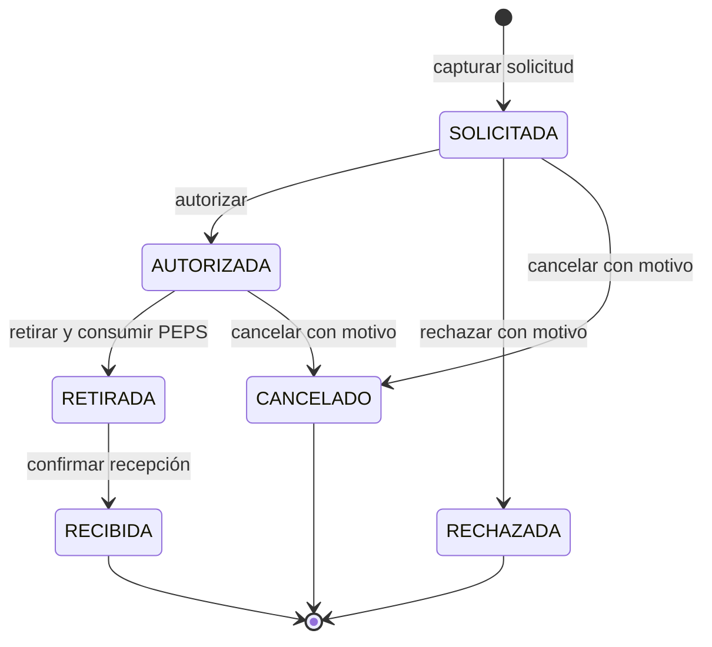
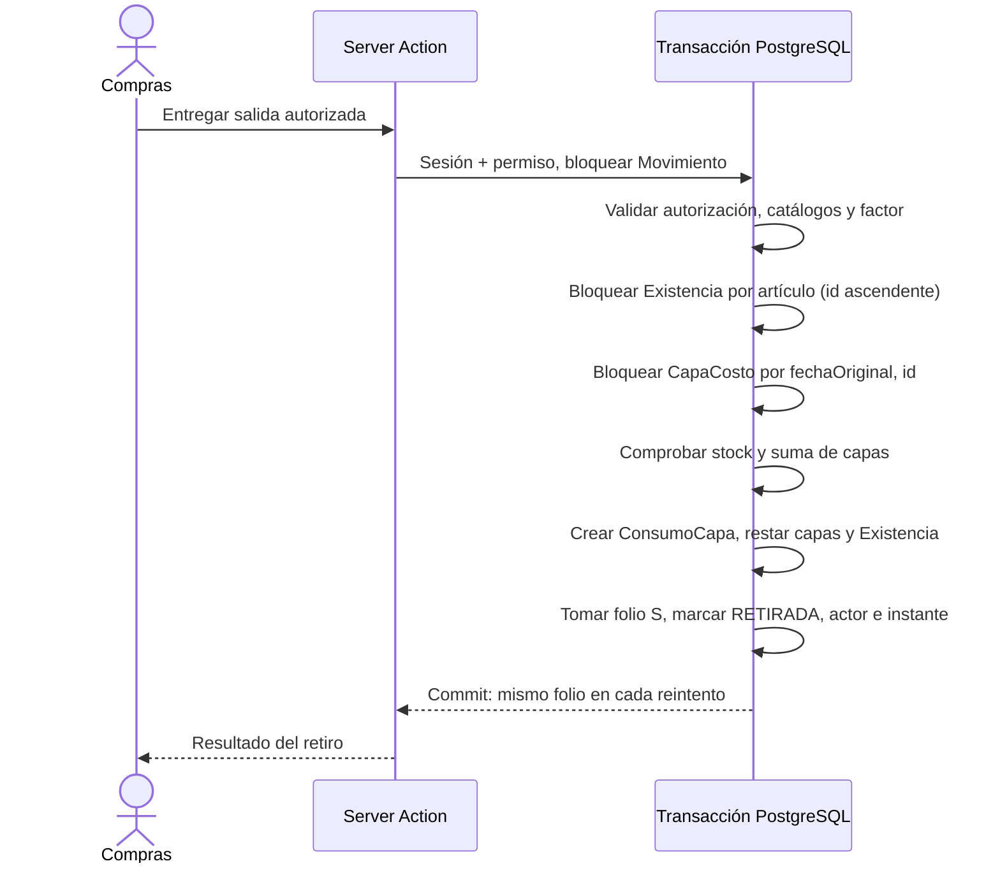

# BodeGasosur — contrato de la fase 6: Salidas

**Estado:** fase 6 construida en desarrollo. La matriz de permisos, las restricciones y conciliación SQL, el dominio transaccional, las seis Server Actions y las pantallas de Salidas están implementados y probados. Complementa el [modelo de datos](../02-modelo-de-datos.md) y el [contrato de Entradas](02-fase-5-entradas.md).

## 1. Resultado y alcance

Compras captura una solicitud de material para una estación, con bodega origen,
solicitante, partidas, área opcional, préstamo opcional y observaciones. Una persona
facultada la autoriza o rechaza. Compras confirma la entrega física del material
autorizado con `RETIRADA`; en ese acto el sistema asigna folio, consume capas PEPS y
descuenta existencia en una transacción. Después confirma en `RECIBIDA` que la estación
lo recibió, con el usuario y el instante de la confirmación. `RECIBIDA` cierra la salida.

Quedan para la fase 7 la devolución de préstamos, el asiento inverso de una salida ya
entregada y los traspasos. El histórico de salidas tampoco se importa en esta fase.

**Decisión de alcance comunicada el 2026-09-23:** no se genera ni imprime vale de salida.
La confirmación de recepción es un estado del sistema, sin documento imprimible.
El nombre `RETIRADA` distingue la salida física de la bodega de `RECIBIDA`, que
confirma la llegada a la estación.

## 2. Estados y edición

El servicio trata la solicitud como inmutable desde el alta. Para corregir una captura, se cancela y se crea otra con nueva llave. La base permite escribir partidas mientras está `SOLICITADA` porque el encabezado debe insertarse antes de sus partidas; desde `AUTORIZADA` las congela. La autorización cubre exactamente ese conjunto final.
En `SOLICITADA` y `AUTORIZADA` no hay folio, consumos ni efecto en existencia.
`RECHAZADA` y `CANCELADO` son terminales, también sin efecto en inventario.
`RETIRADA` conserva partidas, folio, costos, consumos y existencia descontada; solo
admite la transición a `RECIBIDA`. La recepción guarda `recibidoPorId` y
`recibidoEn`, sin volver a mover inventario. `RECIBIDA` es terminal. Una salida
retirada no se cancela cambiando estatus: la reversa por asiento pertenece a la fase 7.

El folio `S-000001` se toma al entregar, dentro de la transacción y con el mecanismo
`Folio` existente. No se asigna al solicitar ni al autorizar; la autorización no
reserva inventario.

## 3. Actores y permisos

| Acción                               | Roles                           | Condición adicional                       |
| ------------------------------------ | ------------------------------- | ----------------------------------------- |
| Leer                                 | `SUPERADMIN`, `COMPRAS`, `JEFE` | Usuario activo                            |
| Capturar y cancelar antes de entrega | `SUPERADMIN`, `COMPRAS`         | Usuario activo                            |
| Autorizar o rechazar                 | Cualquier rol                   | `Usuario.puedeAutorizar = true` al actuar |
| Retirar                              | `SUPERADMIN`, `COMPRAS`         | Autorización previa registrada            |
| Confirmar recepción                  | `SUPERADMIN`, `COMPRAS`         | Salida ya retirada                        |

Todas las mutaciones pasan por `accionProtegida()` y las consultas por `consultar()`.
La identidad de cada actor sale de la sesión activa, jamás de un campo del formulario.
La puerta común relee `activo`, `rol` y `puedeAutorizar` bajo `FOR SHARE` al final de
cada transacción de escritura, antes de confirmarla. Así una revocación ya confirmada
revierte la operación; una revocación posterior espera al commit. Haber tenido la
facultad en el pasado no habilita una acción nueva. La revocación posterior **no borra
una autorización histórica**. Si el negocio necesita invalidar autorizaciones previas,
Compras debe cancelar las solicitudes autorizadas todavía no entregadas.

`solicitadoPorId` apunta a `Persona`, que puede no tener cuenta; `creadoPorId` es quien
captura. `entregadoA` identifica en texto a quien retiró físicamente el material.
`entregadoPorId` y `entregadoEn` identifican a quien registró el retiro y cuándo;
se conservan esos nombres de columnas. `recibidoPorId` y `recibidoEn` registran al
usuario autenticado que confirmó la recepción y su instante. No se recopila firma
ni se genera acuse imprimible.

## 4. Captura y validación

- `fecha` es el día operativo de la salida. Al solicitar se guarda provisionalmente
  el día actual en México; al retirar se fija el día real de la salida, sin aceptar
  una fecha enviada por el cliente. El día de la solicitud también está en
  `createdAt`. Si se espera una fecha de entrega futura, se registra
  cuando ocurra. Una fecha anterior al día de entrega requiere una política explícita
  de Compras y una prueba de recálculo PEPS antes de habilitarla.
- Bodega origen, estación y artículos deben existir y estar activos en la entrega.
  Área y solicitante son opcionales, pero se validan si se proporcionan. Al menos una
  partida; un artículo una vez por salida; cantidades enteras positivas.
- `UNIDAD` usa factor `1`; `CAJA` usa la fotografía de `piezasPorCaja`. El servidor
  deriva `cantidad = cantidadCapturada × factorConversion`. Antes de entregar compara
  el factor de cada caja con el catálogo vigente; si cambió, cancela y vuelve a
  solicitar, porque la solicitud autorizada es inmutable.
- El cliente no envía costos. La entrega copia a `ConsumoCapa` el par de costos MXN de
  cada capa; el costo de la partida solo puede representar un valor único si todas
  sus capas comparten el mismo par. Cuando una partida toca capas de costos distintos,
  el detalle y los reportes suman `ConsumoCapa` y no inventan un costo unitario único.
  Las capas de costo desconocido conservan ambos importes nulos.

## 5. Idempotencia y transacción de entrega

El alta usa un UUID de idempotencia único. Repetir la misma llave y la misma captura
devuelve la solicitud existente; una captura distinta con la misma llave es conflicto.
La llave no concede acceso. Cada transición bloquea el encabezado con
`SELECT ... FOR UPDATE`, lee el estatus bajo el candado y cambia el estatus con un
`UPDATE ... WHERE estatus = <origen>`. Una repetición de la transición ya realizada
devuelve el resultado original sin reescribir actor ni instante. Repetir con un motivo
o un «entregado a» distinto, o intentar una transición de otra rama, es conflicto.

El orden de bloqueos es **encabezado → catálogos → artículos → existencias por
`articuloId` → capas por `(articuloId, fechaOriginal, id)` → folio**. La consulta de
capas usa `FOR UPDATE` sin `SKIP LOCKED`: saltar una capa bloqueada violaría PEPS.
Todas las partidas se normalizan y se comprueban antes de consumir. La existencia y
la suma de capas disponibles deben cubrir cada cantidad. Si falta una unidad o hay
descuadre, se aborta toda la transacción, incluido el folio. Se debe manejar el caso
de una capa sin costo y evitar desbordamiento de `integer` y `numeric`.

Una entrada retroactiva confirmada durante esta operación debe respetar el mismo orden
de bloqueos sobre `Existencia`; la entrega lee las capas después de adquirir ese
candado. Así ve el conjunto ya confirmado, no una mezcla de capas nuevas y stock
anterior.

## 6. Fronteras de seguridad implementadas

La primera migración de esta fase ya obliga llave de idempotencia, secuencia de estados,
datos propios de cada estado, partidas antes de autorizar, consumo completo antes de
entregar y congelación de partidas después de autorizar. Las pruebas escriben directo
contra PostgreSQL. La migración incremental sustituye el valor del enum por
`RETIRADA`, retira la restricción transitoria de `RECIBIDA` y actualiza el trigger.
El servicio PEPS descuenta capas y existencia en una transacción. El trigger diferido
`85-conciliacion.sql` comprueba al confirmar que cada descuento de capa corresponda a
sus consumos, que cada existencia coincida con sus capas y que los consumos cubran
exactamente las partidas de salidas `RETIRADA` o `RECIBIDA`. Además impide editar o
borrar capas y consumos ya escritos. La migración revisa los datos existentes antes
de instalar los triggers; `BG606` y `BG607` se traducen a mensajes seguros.

Las seis Server Actions usan Zod dentro de `accionProtegida()`, después de comprobar
sesión y permiso. El `FormData` se lee dentro de esa puerta. Las pruebas de acceso
cubren sesión ausente, usuario inactivo, rol sin permiso, autorizador sin bandera y
revocaciones concurrentes. `accionProtegida()` liga a cada transacción un JWT RS256 de
Clerk mediante `seguridad.fijar_actor()`; la bitácora obtiene de esa liga al actor y el
`jti`, y la base rechaza escrituras ordinarias sin ella. El trigger de autorización lee
`puedeAutorizar` bajo `FOR SHARE` para cubrir también SQL directo. La lista, la bandeja de
pendientes, la captura y el detalle usan estas acciones y lecturas. La bandeja ordena
cada sección por el instante en que comenzó a esperar; la lista recorre las salidas
anteriores por cursor estable, incluso cuando supera 200 registros.

## 7. Pruebas de aceptación

1. Solicitar dos veces con la misma llave crea una sola salida; una captura distinta
   con esa llave falla y un usuario sin permiso tampoco puede reutilizarla.
2. Sin `puedeAutorizar`, los tres roles fallan al autorizar o rechazar; al activarla,
   cualquiera de ellos puede hacerlo. La revocación surte efecto en la petición siguiente.
3. No se entrega una salida solicitada, rechazada o cancelada; tampoco una autorizada
   cuyas partidas hayan cambiado o cuyo factor de caja sea obsoleto.
4. Autorizar no descuenta existencia ni crea folio. Entregar sí, una sola vez.
5. Una salida de varias capas consume por `(fechaOriginal, id)` y congela costos de
   cada capa, también cuando alguna tiene costo nulo.
6. Dos salidas paralelas que compiten por el último stock producen una entrega y un
   error de stock, sin existencia ni capa negativa. Dos partidas en orden inverso no
   generan interbloqueo permanente.
7. Repetir entregar, incluso por doble clic simultáneo, devuelve el mismo folio y no
   duplica `ConsumoCapa` ni descuentos.
8. Una falla entre consumo, folio y cambio de estatus revierte todo.
9. `RETIRADA → RECIBIDA` guarda actor e instante sin duplicar consumos, folio ni
   descuento. `RECIBIDA` es terminal incluso para escrituras SQL directas.
10. Las Server Actions directas rechazan falta de sesión, usuario inactivo, rol sin permiso, y autorizador sin bandera, aun si conoce la URL o el identificador.
11. Una escritura SQL directa no puede retirar sin autorización ni cambiar partidas de una solicitud autorizada; la bitácora conserva cada transición permitida.
12. La lista permite llegar a las salidas anteriores a las primeras 200 sin repetir ni omitir
    filas, incluso con fechas de captura iguales. La bandeja ordena autorización, retiro
    y recepción por el instante en que comenzó cada espera, no por la captura inicial.

## 8. Orden de construcción

1. Matriz tipada de permisos y comprobación de `puedeAutorizar` en la puerta común. ✅
2. Primera migración de invariantes de salidas y pruebas SQL contra PostgreSQL real. ✅
3. Servicio de solicitud, autorización, rechazo y cancelación; pruebas de idempotencia y carreras. ✅
4. Consumo PEPS y retiro en una transacción; pruebas de concurrencia e invariantes. ✅
5. Confirmación de recepción con idempotencia y actor de sesión; repositorio de listados,
   formulario, detalle y bandeja de pendientes. ✅
6. Server Actions, interfaz y navegación, con pruebas de frontera real, lint y build. ✅
7. Trigger diferido de conciliación de consumos, capas y existencias. ✅
