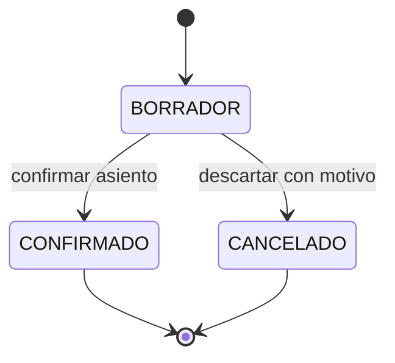
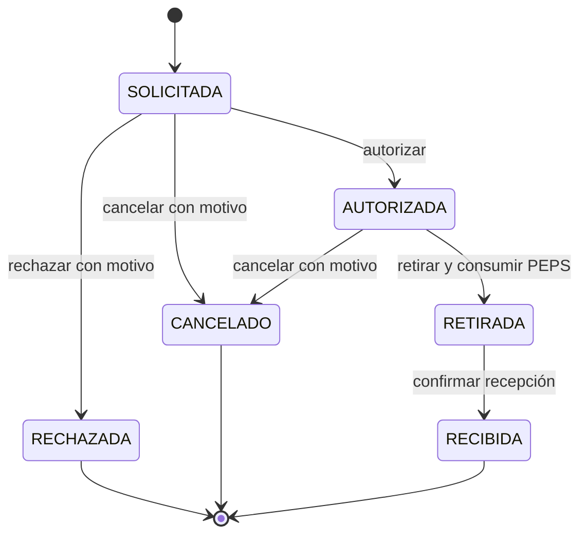

# BodeGasosur — contrato de la fase 7: Traspasos, devoluciones y conteo

**Estado:** fase 7 construida, documentada y publicada en `v0.7.0` (`2ac6ca3`); `v0.7.1` (`22c1146`) corrige lo que encontró su revisión. El selector recibió después una corrección de teclado en `afcea45`, sin nueva versión. La frontera SQL, los servicios transaccionales, las Server Actions y las pantallas están implementados y probados contra PostgreSQL real; §7 registra las decisiones que este contrato dejaba abiertas. Complementa el [modelo de datos](../02-modelo-de-datos.md), los contratos de [Entradas](02-fase-5-entradas.md) y [Salidas](04-fase-6-salidas.md), y el [expediente de la fase](../entregables-fases/07-traspasos-devoluciones-conteo.md). Las decisiones de este documento gobiernan la fase 7 cuando esos textos describan solo una intención anterior.

## 1. Resultado de la fase

Compras registra y consulta traspasos entre bodegas, devoluciones desde estaciones y diferencias de conteo físico. Cada operación confirmada produce un asiento auditable, conserva el origen de las piezas y sus costos conocidos o desconocidos, y deja `Existencia.cantidad = SUM(CapaCosto.cantidadRestante)` por artículo y bodega. Los préstamos muestran cuánto material falta por regresar. Un error de un movimiento que ya afectó inventario se corrige mediante un **nuevo asiento de reversa** ligado al original; el original y sus partidas no se borran ni se reescriben.

## 2. Alcance

1. **Traspasos.** Captura de bodega origen y destino diferentes, al menos una partida y cantidades enteras positivas. Confirmar consume capas PEPS y existencia en origen, crea en destino una capa por fragmento consumido con `origenId`, `fechaOriginal` y el par de costos idénticos, y suma la existencia de destino. La valuación total de ambas bodegas no cambia, incluso con costos nulos.
2. **Devoluciones.** Captura de estación y bodega receptora. Una devolución vinculada exige una salida `RETIRADA` o `RECIBIDA` de la misma estación y regresa a la bodega de la que salió esa salida; sin salida, la bodega receptora se elige libremente. Cada artículo y cantidad se limita al saldo todavía no devuelto de los `ConsumoCapa` de esa salida. La devolución parcial está permitida; puede haber varias devoluciones por salida. Se asignan las piezas a los consumos originales de forma determinista y las capas nuevas heredan costo y `fechaOriginal` de esas capas, con `origenId` como prueba. Una devolución sin salida vinculada se permite solo como ingreso de procedencia no comprobada, con costo nulo y `fechaOriginal = fecha` de la devolución; se identifica explícitamente en pantalla y no cierra préstamo alguno.
3. **Préstamos.** `SALIDA.esPrestamo` sigue siendo la fuente de la obligación. El saldo por artículo es cantidad retirada menos devoluciones vinculadas confirmadas y vigentes. El préstamo permanece abierto mientras exista cualquier saldo positivo y se cierra solo con el retorno completo. Una devolución no vinculada no reduce ese saldo. Una salida cancelada mediante reversa deja de contar como préstamo abierto.
4. **Conteo y ajustes.** Hoja de conteo por bodega con existencias visibles al abrirla, captura de cantidad física por artículo y cálculo de diferencia bajo transacción al confirmar. Una diferencia positiva crea un `AJUSTE` con bodega destino y capa de costo nulo; una negativa crea uno con bodega origen y consumo PEPS. Diferencia cero no crea movimiento. El folio, motivo obligatorio y actor permiten rastrear el ajuste. La hoja es una captura de trabajo, no un cierre de inventario: si el stock cambia desde que se abrió, se rechaza la confirmación y se exige revisar las diferencias actuales.
5. **Reversas.** Se puede revertir una entrada, salida retirada o recibida, traspaso, devolución o ajuste confirmado. La operación crea un nuevo movimiento ligado por `cancelaAId`, con motivo, actor, fecha y folio propios; el original conserva su estado y queda marcado como revertido por la relación. Solo se revierte una vez y no se revierte una reversa. Para un egreso se restauran las **capas exactas** registradas en sus consumos. Para un ingreso se retiran las **capas exactas** que creó: si alguna ya fue consumida o trasladada, se bloquea la reversa y se explica que deben corregirse primero los movimientos dependientes. La reversa de un traspaso retira sus capas hijas intactas y restaura sus capas origen. Ninguna reversa borra capas, consumos o movimientos históricos; registra explícitamente las variaciones inversas. Una devolución revertida vuelve a aumentar el saldo pendiente del préstamo correspondiente.
6. Permisos, repositorios, Server Actions, pantallas de lista, captura, detalle y hoja de conteo; validaciones PostgreSQL para escritores directos; pruebas de idempotencia, concurrencia, autorización y conciliación. Todo cambio de stock ocurre en una sola transacción.

### Fuera de alcance

Reportes completos, kardex exportable, alertas y tablero de la fase 8 o 9; órdenes de compra; números de serie trazables; valuación inventada para capas de costo desconocido; importación histórica de salidas; movimientos con fecha futura; y vale imprimible. La hoja de conteo no congela físicamente una bodega ni reserva existencias.

## 3. Estados y reglas de edición

### Traspasos, devoluciones y ajustes

### Salidas de la fase 6

Una reversa **no es una transición de estado del movimiento original**. Se crea otro movimiento confirmado, ligado mediante `cancelaAId`; el original permanece en `CONFIRMADO`, `RETIRADA` o `RECIBIDA`, según corresponda. La indicación «revertido» se deriva de esa relación y no añade un valor a `EstatusMovimiento`.

Los borradores de traspaso, devolución y ajuste no tienen folio ni efecto en stock; Compras puede corregir sus datos y partidas. Descartar un borrador exige motivo y lo deja terminal. Confirmar asigna folio, actor e instante y congela encabezado y partidas. Un confirmado no cambia a `CANCELADO`, no se edita y no se elimina. La única corrección es el asiento nuevo de reversa. Una salida en `SOLICITADA` o `AUTORIZADA` conserva las reglas de cancelación sin stock de la fase 6; `RETIRADA` y `RECIBIDA` usan reversa. La hoja de conteo puede corregirse antes de confirmar; al confirmar se convierte en uno o varios ajustes inmutables según el signo de las diferencias.

## 4. Seguridad, consistencia e idempotencia

- `SUPERADMIN` y `COMPRAS` leen y capturan; `JEFE` puede leer. Confirmar traspasos, devoluciones y ajustes requiere `SUPERADMIN` o `COMPRAS`. La reversa requiere `SUPERADMIN` y motivo obligatorio, dado su efecto sobre un asiento cerrado. El permiso `puedeAutorizar` sigue siendo exclusivo de la autorización de salidas y no reemplaza estos roles.
- Todas las lecturas pasan por `consultar()` y las mutaciones por `accionProtegida()`. El actor sale de la sesión, se vuelve a comprobar bajo candado antes del commit y queda ligado al JWT verificable por PostgreSQL. Identificadores, costos derivados, saldo de préstamo y cantidad esperada de conteo no se aceptan como autoridad desde el navegador.
- El alta usa `llaveIdempotencia` UUID única. Mismo actor y captura canónica con la misma llave devuelven el movimiento; datos distintos son conflicto. Confirmar, descartar y revertir son idempotentes bajo candado del encabezado: un reintento idéntico obtiene el mismo resultado y nunca duplica folio, capa o existencia.
- Se bloquean encabezados y después catálogos, artículos, existencias de ambas bodegas en orden estable `(bodegaId, articuloId)`, capas por `(fechaOriginal, id)` y folio al final. No se usa `SKIP LOCKED`. Para devoluciones y reversas se bloquea también el movimiento relacionado antes del cálculo de saldo; el orden entre varios encabezados es por `id`. Un conflicto, falta de stock, cambio de conteo o falla de conciliación revierte la transacción completa.
- Las restricciones SQL impiden transiciones ilegales, partidas editadas tras confirmar, capas inconsistentes, sobredevolución y una segunda reversa. La conciliación diferida verifica la igualdad exacta de existencia y capas al commit. Toda pieza de salida o ajuste negativo queda vinculada a la capa consumida; toda pieza ingresada por traspaso o devolución vinculada conserva el rastro de origen. El par de costos nulos se preserva sin convertirlo en cero.

## 5. Criterios de aceptación

1. Un traspaso de varias capas mantiene fecha original, costos y valuación total, y deja ambas existencias conciliadas; origen y destino iguales fallan.
2. Dos operaciones concurrentes por el último stock dejan solo una confirmada, sin negativos ni folios perdidos; movimientos con artículos en orden inverso terminan sin interbloqueo permanente.
3. Varias devoluciones parciales de un préstamo no exceden lo retirado, y el préstamo solo se cierra con el saldo completo. La devolución sin vínculo no afecta ese saldo.
4. Una hoja de conteo obsoleta no confirma diferencias basadas en stock anterior; diferencias positivas crean capa sin costo, negativas consumen PEPS y diferencias cero no generan asiento.
5. Repetir altas o confirmaciones no duplica efectos. La reversa restaura exactamente las capas consumidas o, para ingresos, se rechaza si una capa dependiente ya se usó. La reversa deja intacto el original y no puede duplicarse.
6. Acciones directas y escrituras SQL fuera de la frontera autorizada no pueden saltar permisos, estados, límites de devolución ni conciliación. La bitácora conserva actor e instante.
7. Listas y detalles permiten seguir folio, estado, partidas, capas, préstamos, conteos y relación original/reversa; la navegación ofrece las operaciones que corresponden al rol.

## 6. Construcción y cierre

La fase se construyó de forma integral: frontera SQL y pruebas contra PostgreSQL real; servicios transaccionales de traspasos, devoluciones, préstamos, conteos, ajustes y reversas; Server Actions y pantallas. El modelo de datos, la arquitectura, el expediente, el README y el CHANGELOG documentan el resultado implementado. El cierre de la fase es `v0.7.0`, en el commit `2ac6ca3`; las correcciones de su revisión se publicaron en `v0.7.1`, commit `22c1146`. El ajuste posterior del selector está en `afcea45`, sin etiqueta nueva.

## 7. Decisiones de implementación

Lo que el contrato dejaba abierto quedó así, y es lo que hacen el código y la base.

### Tipo de la reversa
La reversa de un traspaso es otro `TRASPASO` con las bodegas invertidas; la de cualquier otro movimiento es un `AJUSTE` que resta en la bodega donde el original sumó, o suma donde restó. Así el signo sigue viviendo en la bodega y las reversas toman los folios `T-` o `A-`. Se ligan por `cancelaAId`, llevan motivo, nacen y se confirman en la misma transacción, y no tienen llave de idempotencia: la unicidad de `cancelaAId` y el candado del original hacen el reintento idempotente, con el mismo motivo, o lo vuelven conflicto, con otro. La reversa de un traspaso no es una fila de la lista de traspasos: queda en el historial del revertido, con su folio y su motivo, y buscar su folio encuentra al revertido; al registrarla se vuelve a ese traspaso.

### Restitución exacta
Para devolver piezas a la capa exacta sin reescribir consumos se agregó `RestitucionCapa`: una fila por consumo del original (`consumoId` único), con la capa, la cantidad y el par de costos del consumo. La conciliación de una capa pasa a ser `inicial − restante = Σ consumos − Σ restituciones`. Retirar las capas de un ingreso se registra como consumos completos de la reversa; si una capa ya se usó, la resta la dejaría en negativo, la base la rechaza y el servicio nombra los movimientos que hay que revertir antes. Una salida con devoluciones vigentes tampoco se revierte hasta revertirlas.

### Devoluciones
Las piezas se asignan a los consumos de la salida en orden PEPS, por `(fechaOriginal, capa)`, descontando lo que ya volvió en devoluciones vigentes. Cada capa nueva hereda la fecha original y el par de costos del consumo, con `origenId` a la capa consumida; un índice único impide dos capas del mismo origen en un movimiento. Ligada a una salida, regresa a la bodega de la que salió: el formulario la fija, el servicio la exige al capturar, guardar y confirmar, y un trigger la exige en cada escritura. Sin salida, entra a cualquier bodega activa. El formulario no precarga salidas: el selector de la estación elegida lee bajo demanda las que aún tienen algo por volver, la más reciente primero y de 100 en 100, y se busca tecleando el folio (`S-000012`, `s12` o `12`), el número o el nombre. Si lo tecleado es el folio de una salida que no aparece, dice por qué: ya volvió todo, fue revertida o salió a otra estación. El enlace desde una salida o un préstamo (`?salida=…`) se consulta y valida dentro de `consultar()`; si la salida no admite devolución —no existe, no se ha retirado, fue revertida o ya volvió todo—, el formulario lo dice. Un borrador conserva su salida aunque ya no tenga saldo, con ese aviso, para que guardar no la desvincule. El selector lee con una Server Action de solo lectura que pasa por `consultar()` con `devoluciones:capturar` y valida la búsqueda con Zod ([`consultas.ts`](<../../src/app/(sistema)/devoluciones/consultas.ts>)). El saldo de préstamo se calcula siempre desde consumos y capas: no hay columna de saldo que pueda desviarse. La lista y el detalle de salidas marcan «Devuelto» cuando volvió todo lo retirado y «Devuelto parcial» cuando volvió una parte, préstamo o no.

### Hoja de conteo
`HojaConteo` y `RenglonConteo` guardan la captura. Al abrirla, el servidor agrega un renglón por artículo con existencia en la bodega y lee la cantidad esperada; un artículo agregado después toma la existencia del momento. Un renglón vacío no se contó y no ajusta. La hoja lleva `revision`, que sube con cada guardado o actualización; confirmar exige la revisión que la persona revisó y que la existencia de cada artículo contado siga siendo la esperada, o se rechaza como obsoleta y se ofrece actualizarla. Los ajustes toman el motivo de la hoja y quedan ligados por `conteoId`. Los ajustes no se capturan sueltos: nacen de una hoja o de una reversa.

### Permisos
`traspasos:*`, `devoluciones:*` y `ajustes:*` (leer, capturar y confirmar; los ajustes cubren la hoja de conteo), más `movimientos:revertir`, solo del Superadmin. Préstamos pide leer salidas y devoluciones.

### Listas
Entradas, salidas, traspasos, devoluciones y ajustes se ordenan por grupo: primero lo abierto (borradores; en salidas, las solicitadas y autorizadas), luego lo que tiene folio, del más alto al más bajo, y al final lo cerrado sin folio (descartado, rechazado o cancelado), lo más nuevo arriba. Orden, filtros, búsqueda, página y total se resuelven en una sola consulta ([`src/lib/movimientos/lista.ts`](../../src/lib/movimientos/lista.ts)); el id desempata, así que las páginas no se enciman. Toda pantalla con lista muestra hasta 100 registros y desde el 101 pagina con `?pagina=N`, que conserva los filtros; una página que ya no existe muestra la última ([`src/lib/paginacion.ts`](../../src/lib/paginacion.ts)). Así van también préstamos, hojas de conteo, catálogos, cada sección de pendientes de salidas y las dos listas de usuarios; donde hay varias listas en una pantalla, cada una lleva su parámetro. Dentro de un detalle, las listas de solo lectura (partidas, saldo y devoluciones de una salida, otras recepciones de la misma factura) paginan igual, con `?partidas=N` y un ancla a su sección. Las que se editan —partidas en captura y artículos de la hoja de conteo— paginan en el navegador: las filas de otras páginas siguen ocultas en el formulario y se envían completas, y un campo inválido en otra página la abre ([`paginacion-local.tsx`](../../src/components/ui/paginacion-local.tsx)). La búsqueda compara folios y claves con `clave_normalizada()` y los textos con `texto_buscable()` ([`992-busqueda-sin-acentos.sql`](../../prisma/sql/despues/992-busqueda-sin-acentos.sql)), sin acentos ni mayúsculas; los catálogos hacen lo mismo con `textoBuscable()`. Salidas filtra también solo préstamos, y las hojas de conteo por el día de México en que se abrieron. En cualquier pantalla, las insignias de estado van hasta tres por renglón.

### Hora de la base
Las columnas de instante ya eran `timestamptz`, así que guardaban el momento exacto; la sesión de la base estaba en UTC y por eso psql o TablePlus las mostraban seis horas adelante. [`993-hora-de-mexico.sql`](../../prisma/sql/despues/993-hora-de-mexico.sql) pone la base en `America/Mexico_City`, también para los registros anteriores, cuando quien migra es dueño de ella. En otro caso fija esa zona solo para las sesiones del usuario migrador y emite un aviso. Los clientes de Prisma fijan su sesión en UTC porque su adapter lee y escribe `timestamptz` suponiendo UTC. La función de la bitácora fija la hora de México solo mientras corre ([`994-bitacora-en-hora-de-mexico.sql`](../../prisma/sql/despues/994-bitacora-en-hora-de-mexico.sql)), así que sus copias en JSON también llevan `-06:00`.

### Frontera SQL
([`990-traspasos-devoluciones-conteo.sql`](../../prisma/sql/despues/990-traspasos-devoluciones-conteo.sql), [`991-devolucion-a-su-bodega.sql`](../../prisma/sql/despues/991-devolucion-a-su-bodega.sql) y [`995-entrada-con-sus-capas.sql`](../../prisma/sql/despues/995-entrada-con-sus-capas.sql)). Un trigger diferido por movimiento verifica al confirmar la transacción que capas, consumos y restituciones sean exactamente lo que dicen sus partidas según el tipo, que un movimiento sin efecto no tenga ninguno, que una reversa reproduzca al original en sentido contrario y que las devoluciones vigentes no excedan lo retirado. El candado del movimiento relacionado serializa esas comprobaciones aun para un escritor que no tomó los candados del servicio. Otro trigger diferido exige que una hoja confirmada sea exactamente sus ajustes y que la existencia quede en lo contado. Una entrada confirmada es exactamente una capa por partida, con su cantidad y su par de costos: ni capas ajenas ni partidas sin capa, así que no se confirma sin subir la existencia (995, que redefine `conciliar_movimiento()`). Una salida no crea capas. Las migraciones revisan lo existente con `inventario_sin_conciliar()` y `movimientos_sin_conciliar()` antes de terminar; desde 995, esta última revisa también las entradas sin capas. Códigos propios: `BG801` hoja de conteo, `BG802` reversa, `BG803` devolución o sobredevolución, `BG804` conciliación del movimiento y `BG805` conciliación de la hoja.
