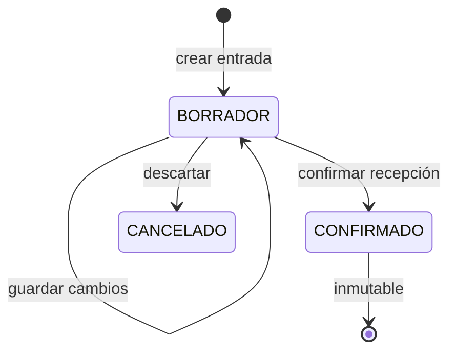

# BodeGasosur — Contrato de la Fase 5: Entradas

Este documento fija el comportamiento vigente de la Fase 5. Complementa el [modelo de datos](../02-modelo-de-datos.md), la [arquitectura](../01-arquitectura.md), los [hallazgos del levantamiento](../cimientos-word/05-hallazgos-levantamiento.docx) y las decisiones de concurrencia de la [auditoría](../cimientos-word/09-auditoria-arquitectura.docx). Si una descripción anterior contradice este contrato, manda este documento y el resumen de [entregables por fase](../entregables-fases/README.md).

**Estado de implementación:** los pasos 1 a 9 están construidos y verificados contra
PostgreSQL real. Las Server Actions de las pantallas pasan por las puertas de lectura y
escritura del sistema; su frontera real de autenticación y autorización cubre el criterio
de aceptación 13.

**Decisión operativa:** la migración vigente ya está aplicada tanto en la base aislada de
pruebas como en la base local de desarrollo. El paso 7 dejó el esquema Zod y el estado de
formulario compartido; el paso 8 agregó listado, filtros y paginación, captura, edición de
borradores y detalle de entradas, conservando en PostgreSQL los cálculos canónicos de dinero
y existencias.

## 1. Resultado de la fase

Compras puede crear un borrador de entrada y confirmar que el material fue recibido. La confirmación convierte el borrador, una sola vez y de forma atómica, en un asiento del libro de inventario: asigna folio, crea una capa de costo por partida e incrementa la existencia de la bodega.

Una entrada confirmada no se edita ni se borra. La cancelación mediante asiento inverso se construye en la fase 7; hasta entonces, la fase 5 debe impedir modificar el movimiento ya confirmado.

## 2. Alcance y fuera de alcance

La fase incluye:

- Listado, detalle y captura de entradas
- Borradores editables sin folio ni efecto en inventario
- Proveedor, referencia de factura o remisión, fecha y bodega destino
- Partidas con artículo, presentación (`UNIDAD` o `CAJA`), cantidad capturada, factor de
  conversión, costo, tasa de IVA y número de serie solamente informativo
- Moneda MXN o USD y tipo de cambio obligatorio solo para USD
- Confirmación de recepción con folio consecutivo
- Creación de capas de costo e incremento de existencias
- Recepciones parciales registradas como entradas independientes
- Permisos, auditoría, idempotencia y pruebas de concurrencia

Quedan fuera:

- Requisiciones y órdenes de compra
- Cálculo de cantidades pendientes por recibir
- Archivos adjuntos de facturas o remisiones; en esta fase solo se guarda la referencia
- Consumo de capas PEPS, que empieza con las salidas
- Cancelación con asiento inverso, que pertenece a la fase 7
- Migración del histórico de movimientos

## 3. Identidad de quienes intervienen

En una entrada, los actores significan:

| Campo | Significado |
|---|---|
| `creadoPorId` | Usuario que capturó el borrador |
| `confirmadoPorId` | Usuario que recibió o verificó el material y confirmó su ingreso al inventario |
| `confirmadoEn` | Instante en que la recepción quedó confirmada |

La acción visible debe llamarse **Confirmar recepción**. El usuario que la ejecuta se toma
de la sesión activa; nunca se acepta un identificador de usuario enviado por el formulario.
`recibidoPorId` se reserva para el flujo de salidas y no se usa en una entrada.

## 4. Estados y reglas de edición



Un `BORRADOR`:

- No tiene folio
- No crea capas
- No modifica `Existencia`
- Puede editarse mientras los catálogos relacionados sigan siendo válidos

Un `CONFIRMADO`:

- Tiene folio, `confirmadoPorId` y `confirmadoEn`
- Tiene al menos una partida
- Tiene una capa por cada partida
- Ya está reflejado en `Existencia`
- No se edita ni se elimina

## 5. Normalización a la unidad base

**Regla cerrada:** una partida puede capturarse como `UNIDAD` o `CAJA`, tanto en entradas
como en salidas, pero el libro, la existencia y las capas trabajan exclusivamente con la
**unidad base del artículo**. Para un artículo cuya unidad es `PZA`, la unidad base es una
pieza; para uno cuya unidad es `CUB`, es una cubeta. `UNIDAD` debe mostrarse en la interfaz
con la clave real del artículo, no como una etiqueta genérica.

La conversión canónica es condicional:

```text
factorConversion =
  1                         si presentacionCapturada = UNIDAD
  Articulo.piezasPorCaja    si presentacionCapturada = CAJA

cantidadBase = cantidadCapturada × factorConversion
```

`MovimientoPartida.cantidad` almacena `cantidadBase`, nunca cajas. Por ejemplo, para un artículo `PZA` con doce piezas por caja:

| Operación | Captura | Factor | `MovimientoPartida.cantidad` |
|---|---:|---:|---:|
| Entrada | 1 caja | 12 | 12 piezas |
| Salida futura | 5 piezas | 1 | 5 piezas |
| Salida futura | 1 caja | 12 | 12 piezas |

Así, una entrada de una caja crea una capa de 12 unidades y una salida posterior de cinco
unidades consume 5 de esa capa y deja 7. No se divide ni se intenta reconstruir una caja al
dar salida: PEPS consume unidades base.

### Datos originales y factor histórico

La fase 5 sustituye el texto libre `capturaOriginal` por un registro estructurado en cada
partida:

| Dato | Significado |
|---|---|
| `orden` | Posición en que se capturó la partida (1..n); las pantallas la respetan, no reordenan por artículo |
| `presentacionCapturada` | `UNIDAD` o `CAJA` |
| `cantidadCapturada` | Número entero positivo introducido por el usuario |
| `factorConversion` | `1` o la fotografía de `Articulo.piezasPorCaja` usada al convertir |
| `cantidad` | Cantidad canónica ya convertida a la unidad base |
| `costoUnitarioCapturado` | Solo en entradas: costo sin IVA por unidad o por caja, en la moneda de la factura |

El factor es una **fotografía histórica**: cambiar después `Articulo.piezasPorCaja` no
reinterpreta partidas confirmadas. Si el factor del catálogo cambia mientras una partida
sigue en borrador, la confirmación se rechaza con un error de dominio y exige volver a
guardar esa partida; nunca se recalcula silenciosamente.

No se admiten fracciones. Si se abre una caja y se entregan cinco piezas, se captura `5`
con presentación `UNIDAD`. Elegir `CAJA` exige que `Articulo.piezasPorCaja` sea un entero
positivo; si es nulo, esa presentación no se ofrece ni se acepta en el servidor.

## 6. Moneda, costos e impuestos

El encabezado y las partidas tienen unidades monetarias diferentes por decisión expresa:

| Dato | Moneda almacenada |
|---|---|
| `Movimiento.subtotal`, `iva`, `total` | Moneda original de la factura |
| `Movimiento.tipoCambio` | Pesos por dólar aplicados al confirmar; nulo en MXN |
| `MovimientoPartida.costoUnitario`, `costoUnitarioConIva` | Siempre MXN |
| `CapaCosto.costoUnitario`, `costoUnitarioConIva` | Siempre MXN |
| `ConsumoCapa.costoUnitario`, `costoUnitarioConIva` | Siempre MXN |

La interfaz recibe `costoUnitarioCapturado` en la moneda de la factura y por la presentación seleccionada. El servicio normaliza presentación y moneda antes de guardar los costos canónicos:

```text
tipoCambioAplicable = 1 si moneda = MXN; Movimiento.tipoCambio si moneda = USD

costoUnitarioBaseMxn = redondear4(
  costoUnitarioCapturado × tipoCambioAplicable ÷ factorConversion
)

costoUnitarioBaseMxnConIva = redondear4(
  costoUnitarioCapturado × (1 + tasaIva) × tipoCambioAplicable ÷ factorConversion
)
```

Si una caja de doce cuesta $120 MXN sin IVA, la partida y la capa guardan $10 MXN por
unidad base. Una salida de cinco unidades queda valuada en $50 MXN sin IVA. En las salidas
no se captura costo: PEPS hereda el costo base de las capas consumidas.

Los importes de factura se calculan con la captura original —cantidad por costo de la
presentación— y se conservan en su moneda original. No se reconstruyen multiplicando el
costo base ya redondeado, porque una división no exacta podría introducir centavos de
diferencia.

En MXN no hay conversión de moneda; en USD se utiliza el tipo de cambio del movimiento. El
tipo de cambio, el factor y los costos quedan congelados al confirmar.

Los costos unitarios se guardan con cuatro decimales. Los importes se redondean a dos
decimales por renglón, medio hacia arriba, y después se suman. El cálculo canónico se hace
con `numeric` en PostgreSQL, nunca con punto flotante de JavaScript.

## 7. Recepciones parciales

Cada entrega física es una entrada independiente. Varias entradas pueden compartir la
pareja `(proveedorId, referencia)`, y `referencia` no es única. La pantalla puede mostrar y
sumar las entradas relacionadas cuando la referencia no está vacía.

Esto registra lo efectivamente recibido, pero no determina cuánto falta. Sin una orden de
compra no existe una cantidad comprometida contra la cual comparar. Por tanto, la fase 5 no
usa estados como compra abierta, completa o excedida, ni presenta un saldo pendiente.

Cuando se construya el ciclo de compras, `OrdenCompra` y sus partidas serán la capa superior
que agrupe recepciones y calcule cumplimiento sin cambiar el libro de movimientos.

## 8. Idempotencia

Hay dos riesgos diferentes y cada uno tiene su defensa.

### Alta del borrador

Al renderizar un formulario nuevo se genera una llave de idempotencia UUID. La misma llave
se conserva durante errores de validación, reintentos de red y dobles clics, y se almacena
en `Movimiento` con unicidad de base de datos.

Repetir la solicitud con la misma llave devuelve el borrador existente. Si una llave ya
utilizada llega con datos incompatibles, la operación se rechaza como conflicto. La llave
no concede acceso: siempre se vuelve a verificar sesión, permiso y tipo de movimiento.

### Confirmación

El reclamo principal es el candado del encabezado: la confirmación toma `SELECT … FOR UPDATE`
sobre el `Movimiento` y solo entonces lee el estatus. Quien llega después espera, encuentra el
movimiento ya confirmado y recibe el mismo folio sin tomar otro ni mover inventario. La
transición final `UPDATE … WHERE estatus = 'BORRADOR'` es una defensa adicional: con el
candado tomado siempre afecta una fila; si no, alguien escribió sin respetar el orden de
bloqueo y la transacción se aborta completa. Una transición realmente incompatible —un
borrador descartado, un movimiento que no es entrada— produce error de dominio.

La búsqueda de la llave de idempotencia ocurre **antes** de validar catálogos, comparando una
representación canónica de la captura (todo lo que la persona escribió, incluidas
observaciones y número de serie; nada derivado como factor, cantidad base o costos). Así un
reintento después de que se dio de baja un artículo sigue encontrando su borrador. La
restricción única y un `SAVEPOINT` alrededor del `INSERT` cubren la carrera entre dos
solicitudes que llegan a la vez.

## 9. Transacción de confirmación

Toda la confirmación ocurre dentro de `accionProtegida()` y una sola transacción:

1. Verificar que el usuario activo tenga permiso para registrar entradas.
2. Reclamar el encabezado con `SELECT … FOR UPDATE`. Si ya está `CONFIRMADO`, devolver su folio y terminar; si no es entrada o fue descartado, error de dominio.
3. Bloquear con `SELECT … FOR SHARE`, primero el proveedor y después la bodega destino: ninguno puede darse de baja mientras se confirma.
4. Obtener los `articuloId` de sus partidas y bloquear los artículos con `SELECT … FOR SHARE ORDER BY id`: nadie cambia `piezasPorCaja` ni da de baja un artículo mientras se confirma.
5. Con todos los catálogos bloqueados, releer y validar partidas y catálogos: fecha operativa, proveedor y bodega activos, al menos una partida, costo y tasa en todas, factor de cada `CAJA` igual al `piezasPorCaja` vigente.
6. Recalcular los costos canónicos en MXN y los totales del encabezado desde la captura original.
7. Por cada artículo, ordenado por `articuloId`, asegurar la fila `Existencia` con `INSERT … ON CONFLICT DO NOTHING` y después bloquearla con `SELECT … FOR UPDATE`.
8. Tomar el folio de entrada con `UPDATE … RETURNING`; el consecutivo no se reinicia cada año.
9. Crear una `CapaCosto` por partida, con `cantidadInicial = cantidadRestante = cantidad` y `fechaOriginal = fecha`.
10. Incrementar `Existencia` por artículo y bodega.
11. Guardar folio, `confirmadoPorId` y `confirmadoEn` con `UPDATE … WHERE estatus = 'BORRADOR'` —la defensa adicional de §8— y confirmar la transacción.

El orden de bloqueo es siempre **encabezado → proveedor → bodega → artículos → existencias
→ folio**. El trigger de transición vuelve a solicitar el bloqueo de los artículos que el
servicio ya adquirió; por eso no introduce una inversión del orden. Si falla cualquier
paso, no queda folio consumido, capa creada, existencia modificada ni movimiento confirmado.

### Por qué se crea la fila antes de bloquearla

`SELECT … FOR UPDATE` no bloquea una fila inexistente. Como producción arranca sin inventario, dos primeras entradas simultáneas del mismo artículo/bodega podrían encontrar cero filas y competir por insertarla. El `INSERT … ON CONFLICT DO NOTHING` materializa el candado; el `SELECT … FOR UPDATE` posterior serializa la modificación. Ordenar los bloqueos evita que dos movimientos con varias partidas los tomen en orden inverso y formen un interbloqueo.

## 10. Fechas de negocio

La fase creó `src/lib/fechas.ts` como única frontera de fechas. Su contrato es:

- Calcular «hoy» con `America/Mexico_City`
- Validar entradas `YYYY-MM-DD` como fechas calendario reales
- Aceptar como fecha operativa únicamente el intervalo `2000-01-01` a «hoy» en México
- Convertirlas al valor que Prisma necesita para `@db.Date` sin cambiar el día
- Formatear `@db.Date` en UTC
- Formatear los instantes `…En` / `…At` en `America/Mexico_City`

`Movimiento.fecha` es el día del hecho y puede ser anterior al día de captura. Una entrada
retroactiva crea una capa en el pasado; el recálculo del libro verifica cantidades, no reinterpreta los costos históricos ya congelados.

El límite inferior se protege también con un `CHECK` de PostgreSQL. El límite superior se
valida en el servidor contra `hoyEnMexico()`; no usa `CURRENT_DATE`, porque la zona horaria
de la conexión no debe decidir qué día es hoy para el negocio.

Las pruebas del módulo cubren medianoche en México, cambio de mes y año, año bisiesto,
fechas inválidas y conversión de ida y vuelta sin desplazamiento.

## 11. Seguridad

- Las Server Actions nunca reciben ni crean un cliente Prisma directamente
- Leer movimientos pasa por `consultar()`; escribir o confirmar pasa por `accionProtegida()`
- `confirmadoPorId` sale de la sesión, no del cliente
- La validación del formulario se repite en el servidor
- Al guardar el borrador, el servidor deriva `factorConversion`, `cantidad` y costos
  canónicos desde la captura y el artículo; al confirmar compara el factor vigente con la fotografía guardada y rechaza una diferencia. Nunca confía en valores derivados enviados por el navegador ni recalcula silenciosamente un borrador
- La llave de idempotencia no sustituye autenticación ni autorización
- El SQL de locks, folios y dinero usa parámetros; ningún identificador se interpola
- La bitácora recibe el actor mediante `app.usuario_id`
- La traducción de errores falla cerrada: todo error de Prisma o PostgreSQL produce un
  mensaje seguro por omisión. Solo los SQLSTATE propios `BG501`–`BG506`, asignados a los
  `RAISE` controlados de esta fase, conservan su texto; el error original queda como `cause`
  y se registra exclusivamente en el servidor

## 12. Pruebas de aceptación

La fase no se considera terminada hasta verificar contra PostgreSQL real:

Los criterios 1–12 y 14 se prueban a través del servicio (`servicio.test.ts`). El 13 se
prueba sobre la Server Action real (`actions.test.ts`), con la sesión de Clerk sustituida y
todo lo demás —Zod, `accionProtegida()`, servicio y base— tal como corre en producción.

1. Un borrador no tiene folio ni cambia inventario.
2. Confirmar crea exactamente una capa por partida e incrementa la existencia exacta.
3. `SUM(CapaCosto.cantidadRestante)` coincide con `Existencia.cantidad`.
4. Dos primeras entradas simultáneas del mismo artículo/bodega conservan ambas cantidades.
5. Dos movimientos con partidas en orden inverso no producen interbloqueo permanente.
6. Repetir el alta con la misma llave no crea otro movimiento.
7. Repetir la confirmación no consume otro folio ni duplica capas o existencia.
8. Una factura USD conserva sus totales originales y crea partidas y capas en MXN.
9. `UNIDAD` usa factor 1 y `CAJA` usa la fotografía de `piezasPorCaja`; ambas producen la cantidad base exacta y conservan la captura estructurada.
10. Una caja de doce con costo $120 MXN crea doce unidades con costo base $10 MXN; el importe original no se reconstruye desde el costo base redondeado.
11. Cambiar `piezasPorCaja` no modifica partidas confirmadas y bloquea la confirmación de un borrador que conserve un factor obsoleto.
12. Una entrada confirmada no puede editarse ni eliminarse.
13. El usuario sin permiso no puede crear ni confirmar una entrada invocando directamente la Server Action.
14. Una fecha operativa está entre `2000-01-01` y hoy en México, y no cambia al cruzar la frontera formulario, Prisma y PostgreSQL.

## 13. Orden de implementación

1. Crear `src/lib/fechas.ts` y sus pruebas unitarias. ✅
2. Agregar permisos tipados de lectura, captura y confirmación de entradas. ✅
3. Completar el esquema con la llave de idempotencia y la captura estructurada (`presentacionCapturada`, `cantidadCapturada`, `factorConversion` y `costoUnitarioCapturado`); retirar `capturaOriginal`, documentar que los costos canónicos de `MovimientoPartida` son MXN y generar la migración con sus restricciones. ✅
4. Construir las primitivas PostgreSQL para bloquear proveedor, bodega y artículos, asegurar/bloquear `Existencia`, tomar folio y calcular/redondear dinero. ✅
5. Escribir las pruebas de integración de normalización, idempotencia, concurrencia, capas y existencias contra PostgreSQL real. ✅
6. Implementar el servicio de borradores y confirmación, sin UI, hasta satisfacer esas pruebas. ✅
7. Construir el esquema Zod —incluida la validación UUID de identificadores y llave de idempotencia— y el estado de formulario compartido. ✅
8. Ejecutar `npm run db:reset` para alinear desarrollo con la migración vigente y construir listado, captura, edición de borrador y detalle confirmado. ✅
9. Conectar las Server Actions exclusivamente mediante `consultar()` y `accionProtegida()`. ✅
10. Añadir navegación y verificar permisos, estados vacíos y diseño responsivo. ✅
11. Ejecutar la suite completa, lint y build; actualizar `CHANGELOG.md` y versión cuando se cumplan todos los criterios. ✅
