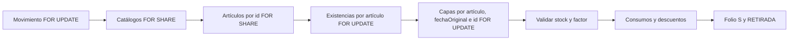
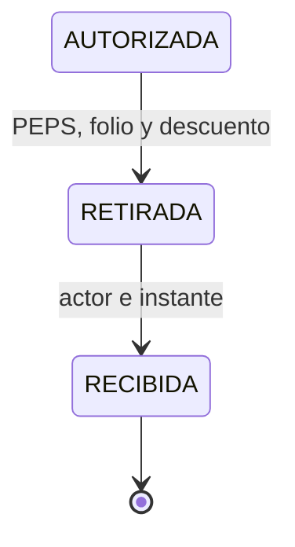

# Guía de construcción — `src/lib/salidas/`

Esta guía convierte el [contrato de la fase 6](04-fase-6-salidas.md) en pasos de código y pruebas. `RETIRADA` registra la salida física y descuenta inventario; `RECIBIDA` guarda quién y cuándo confirmó la llegada a la estación y cierra la salida. No se genera vale imprimible.

## 1. Estructura propuesta

| Archivo | Responsabilidad |
|---|---|
| `formulario.ts` | Zod y conversión de `FormData`; UUID, texto, cantidades y presentación. |
| `errores.ts` | Errores de dominio y traducción segura de `BG601`–`BG605`, `23514`, `40P01` y `40001`. |
| `repo.ts` | Lecturas para lista, detalle, bandeja y opciones de captura; solo recibe el `TransactionClient` de `consultar()`. |
| `primitivas.ts` | Bloqueos, verificación de stock, consumo PEPS, descuento y folio; SQL parametrizado. |
| `servicio.ts` | Solicitar, autorizar, rechazar, cancelar, retirar y confirmar recepción; recibe `tx` y `usuario` de `accionProtegida()`. |
| `*.test.ts` | Integración con PostgreSQL real, incluida concurrencia y acceso por Server Action. |

Extraer a un módulo compartido únicamente las primitivas de Entradas que ambos flujos
usen de verdad —por ejemplo, bloqueo ordenado de artículos y existencias y conversión a
unidad base—. Mantener las pruebas de Entradas verdes durante esa extracción. Salidas
no debe importar funciones privadas de `entradas/servicio.ts` ni calcular costos con
punto flotante de JavaScript.

## 2. Solicitud

1. Definir los datos capturados: bodega, estación, solicitante y área opcionales,
   préstamo, observaciones y una lista no vacía de partidas. El formulario genera un
   UUID de idempotencia y lo conserva durante reintentos.
2. Validar forma con Zod y repetir en el servicio las reglas de negocio. El servidor
   consulta artículos activos y deriva `factorConversion` y `cantidad` en unidad base;
   nunca acepta esos valores del cliente. `UNIDAD` usa 1 y `CAJA` necesita
   `piezasPorCaja` positivo. Un artículo aparece una sola vez; comprobar que el
   producto de cantidad y factor cabe en `integer`.
3. Crear encabezado `SOLICITADA` y partidas dentro de **una transacción**. El actor
   sale de la sesión. No crear folio, costos, consumo ni movimiento de existencia.
4. Repetir la misma llave devuelve la solicitud existente solo después de volver a
   comprobar permiso, tipo, creador y captura original. La misma llave con otra
   captura es conflicto. Cubrir la carrera del índice único con `SAVEPOINT`, como en
   Entradas. El servicio no ofrece edición de una solicitud creada.

## 3. Autorización, rechazo y cancelación

1. Cada operación toma `Movimiento FOR UPDATE` antes de leer su estado. Repetir una transición ya hecha devuelve el resultado original sin cambiar actor ni instante; repetirla con motivo distinto produce conflicto.
2. Para autorizar o rechazar, bloquear el `Usuario` actor con `FOR SHARE` y releer `activo` y `puedeAutorizar` **dentro de la transacción**. La lectura inicial de la sesión ocurre antes de la transacción; esta segunda comprobación cierra la carrera con la revocación de la facultad. Usar siempre `usuario.id`, nunca un ID del cliente.
3. Autorizar exige `SOLICITADA` y al menos una partida; guarda `autorizadoPorId`/`autorizadoEn`. Rechazar exige `SOLICITADA` y motivo no vacío; guarda `rechazadoPorId`/`rechazadoEn`. Cancelar exige `SOLICITADA` o `AUTORIZADA`, motivo y actor. Ninguna de estas operaciones mueve inventario.

## 4. Retiro y PEPS

`retirarSalida(tx, usuario, id, entregadoA)` debe completar estos pasos en una única
transacción abierta por `accionProtegida("salidas:retirar", ...)`:

1. Si el encabezado ya está `RETIRADA` o `RECIBIDA`, devolver su folio sin escribir. En cualquier
   otro estado distinto de `AUTORIZADA`, rechazar la operación.
2. Bloquear y comprobar bodega, estación, área/persona si existen, y artículos. Volver
   a comprobar el factor de cada `CAJA`; una solicitud aprobada no se reinterpreta.
   Fijar `fecha` al día de la entrega en `America/Mexico_City`.
3. Bloquear existencias por `articuloId` ascendente. Bloquear capas vivas por
   `(articuloId, fechaOriginal, id)` ascendente, con `FOR UPDATE` y **sin
   `SKIP LOCKED`**. Saltar la capa antigua alteraría PEPS.
4. Comprobar antes de descontar que `Existencia.cantidad` y la suma de capas vivas
   cubren cada partida y coinciden. Una discrepancia o insuficiencia aborta toda la
   transacción. Usar enteros para cantidades y `numeric` en PostgreSQL para importes.
5. Distribuir cada partida entre capas en ese orden; crear `ConsumoCapa` con cantidad
   y par de costos copiados de cada capa, incluso cuando ambos son nulos. Descontar
   `cantidadRestante` y `Existencia.cantidad` exactamente en la suma consumida.
   Comprobar las filas afectadas; ninguna capa ni existencia puede quedar negativa.
6. Tomar el folio `SALIDA` con `tomarFolio(tx, "SALIDA")` **después** de validar stock.
   Cambiar a `RETIRADA` con `UPDATE ... WHERE estatus = 'AUTORIZADA'`, guardando
   `entregadoA`, `entregadoPorId`, `entregadoEn` y `fecha`. Si el `UPDATE` no afecta
   una fila, fallar y revertir todo. El trigger ya exige consumos completos antes
   de permitir la transición.

La migración actual verifica que los consumos cubran las partidas y procedan de las
capas correctas. Aún permite a un escritor SQL privilegiado fabricar consumos sin
descontar capas y existencia. Antes de exponer la entrega, agregar defensas que
relacionen ambos cambios o limitar las credenciales de escritura a las rutas
transaccionales; añadir unicidad a `(partidaId, capaId)` para impedir duplicados.

## 5. Confirmación de recepción

`confirmarRecepcion(tx, usuario, id)` se ejecuta con `accionProtegida("salidas:recibir", ...)`. Bloquea el encabezado `FOR UPDATE` y exige `RETIRADA`; cambia a `RECIBIDA` con `UPDATE ... WHERE estatus = 'RETIRADA'`, `recibidoPorId = usuario.id` y `recibidoEn` del servidor. No cambia folio, fecha, partidas, consumos, capas ni existencia. Un reintento sobre `RECIBIDA` devuelve el resultado guardado sin reescribir quién confirmó ni cuándo. Otro estado es conflicto.
El actor debe ser un usuario activo con permiso; el formulario no envía su ID ni el instante. La estación de destino ya está fijada en la solicitud.

## 6. Orden de pruebas y conexión con la aplicación

1. Probar el servicio sin UI: alta idempotente, permisos, rechazo/cancelación,
   doble autorización y factor obsoleto.
2. Probar PEPS con dos capas de distinto costo, empate de fecha, capa de costo
   desconocido, stock insuficiente, ausencia de capa y discrepancia con existencia.
3. Probar dos entregas simultáneas sobre el último stock, doble clic sobre una misma
   salida, partidas en orden inverso y rollback tras un fallo entre consumo y folio.
   Al terminar, verificar `SUM(CapaCosto.cantidadRestante) = Existencia.cantidad` y
   que no haya importes ni cantidades duplicados.
4. Probar `RETIRADA → RECIBIDA`, reintento idempotente, actor/instante y estado
   terminal; comprobar que la recepción no vuelve a tocar inventario.
5. Crear Server Actions con `accionProtegida()` y páginas con `consultar()`.
   Invocar las acciones directamente en pruebas con sesión ausente, usuario inactivo,
   rol sin permiso y autorizador sin bandera. La UI se añade después del servicio.
6. Ejecutar `npm test`, `npm run lint`, `npx tsc --noEmit` y el build de producción.
   El cierre de la fase exige que `RECIBIDA` sea terminal tanto en el servicio
   como en SQL.
